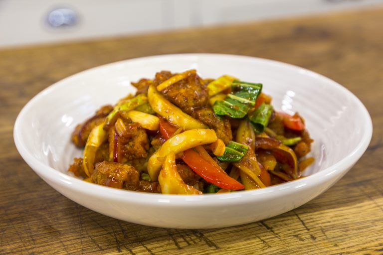

# Shapta

*The Tibetan stir-fry: thinly sliced beef flashed in a hot wok with onion, capsicum, soy and chilli. Served with rice or tucked into tingmo buns.*

**Serves:** 4

**Prep Time:** 20 minutes

**Cook Time:** 15 minutes

## Overview
Shapta is Tibet's stir-fry, thinly sliced beef seared screaming-hot in a wok with onion wedges, capsicum and fresh chilli, glazed in a soy-and-stock sauce and finished with a heavy handful of coriander. The Chinese influence shows in the wok-hei technique; the Tibetan signature is the simplicity (no five-spice or doubanjiang), the slit fresh green chillies, and the way it ends up either over plain steamed rice or stuffed into a soft tingmo bun. The cut and the slicing direction are the whole game; slice lean beef sirloin or rump as thinly as you can manage across the grain (a partial 30-minute freeze in the fridge makes thin slicing much easier) and marinate briefly in soy, Shaoxing, cornflour, sesame oil and pepper while you prep the vegetables. Get the wok smoking hot before adding oil, sear the beef in two batches so the meat browns instead of stewing (60 seconds untouched, 30 seconds tossing, lift onto a plate), then stir-fry onion wedges till charred at the edges, capsicums till just softened but still vivid, garlic, ginger and chillies, finally tomato wedges. Return the beef and any resting juices, pour in the soy-stock sauce mix and a cornflour slurry to glaze, toss for 30 seconds till everything is coated in a light glossy sauce. Tip onto a warm platter, shower generously with sliced spring onions and fresh coriander, serve with steamed rice or warm tingmo and a small dish of sepen chilli sauce on the side for heat.

## Ingredients

### Beef
- 600 g lean beef (sirloin, rump or flank), sliced very thinly across the grain
- 1 tablespoon light soy sauce
- 1 tablespoon Shaoxing rice wine (or dry sherry)
- 2 teaspoons cornflour
- 1 teaspoon toasted sesame oil
- ½ teaspoon ground black pepper

### Stir-fry
- 3 tablespoons vegetable oil (split)
- 1 onion (large, sliced into thick wedges)
- 2 capsicums (one red, one green; sliced)
- 4 garlic cloves (chopped)
- 4 cm fresh ginger (julienned)
- 2 fresh green chillies (slit lengthways)
- 1 tomato (cut into wedges)

### Sauce
- 2 tablespoons light soy sauce
- 1 tablespoon dark soy sauce
- 1 teaspoon soft brown sugar
- 100 ml beef stock (or water)
- 1 teaspoon cornflour mixed with 1 tablespoon cold water

### To serve
- 3 spring onions (sliced on the diagonal)
- A small bunch of coriander (chopped)
- [Steamed Rice](../chinese/side-dishes/steamed-rice.md) (or tingmo, Tibetan steamed buns)

## Method

### Stage 1 - Marinate the beef
1. Place the beef strips in a bowl with the soy, Shaoxing, cornflour, sesame oil and black pepper. Toss to coat.
2. Leave to marinate 15 minutes at room temperature while you prep the vegetables.

### Stage 2 - Prep the sauce and vegetables
1. Stir the sauce ingredients (light and dark soy, sugar and stock) together in a small bowl.
2. Have the chopped vegetables, garlic, ginger and chillies ready by the stove; once you start cooking it moves fast.

### Stage 3 - Sear the beef
1. Heat a wok or large heavy frying pan over high heat until it smokes lightly.
2. Add 2 tablespoons of the vegetable oil; swirl to coat.
3. Add half the beef in a single layer; sear 60 seconds without moving, then toss for 30 seconds. The meat should be browned but still slightly pink. Tip onto a plate.
4. Repeat with a touch more oil and the remaining beef. Set aside.

### Stage 4 - Stir-fry the vegetables
1. Add the last tablespoon of oil to the wok.
2. Tip in the onion wedges; stir-fry 1 minute until they start to char at the edges.
3. Add the capsicums; stir-fry 2 minutes until just softened but still vivid.
4. Add the garlic, ginger and chillies; toss 30 seconds.
5. Add the tomato wedges; toss 1 minute, just to warm through.

### Stage 5 - Bring it together
1. Return the beef and any resting juices to the wok.
2. Pour in the sauce mixture; toss to coat for 30 seconds.
3. Stir the cornflour slurry and pour in; toss 30 seconds until the sauce thickens to a light glaze that coats everything.
4. Taste; adjust salt or pepper.

### Stage 6 - Serve
1. Tip onto a warm serving platter.
2. Scatter spring onions and coriander generously over the top.
3. Serve immediately with steamed rice or tingmo.

## Notes
- **Slice thin, slice across:** Beef sliced thinly across the grain cooks in seconds and stays tender. Thick slices or with-the-grain cuts go chewy. A partial freeze of 30 minutes makes thin slicing easier.
- **Yak in Tibet, beef elsewhere:** Yak is the traditional meat and unavailable in UK or Western shops. Lean beef sirloin or rump is the closest practical substitute; mutton (lamb leg) works for a stronger-flavoured version.
- **Hot wok is non-negotiable:** Stir-fries fail when the pan isn't hot enough; the meat stews instead of searing. Get the wok smoking before adding oil.
- **Don't crowd the meat:** Sear in 2 batches. Piled-in meat releases liquid and steams.

## Variations
**Mutton shapta:** Use 600 g boneless lamb leg sliced thinly; otherwise identical.
**Vegetarian shapta:** Replace the beef with 400 g firm tofu (pressed and cubed, fried in batches) plus 200 g mushrooms. Lighter, but the chilli and capsicum carry it.

## Serving
Serve with: steamed jasmine rice, tingmo (Tibetan steamed buns) or warm flatbread, and a small dish of sepen chilli sauce on the side.
Garnish with: extra coriander leaves.

## Storage
- Best eaten fresh; the vegetables go soft on standing.
- Leftovers keep 2 days refrigerated; reheat in a hot wok briefly rather than the microwave.
