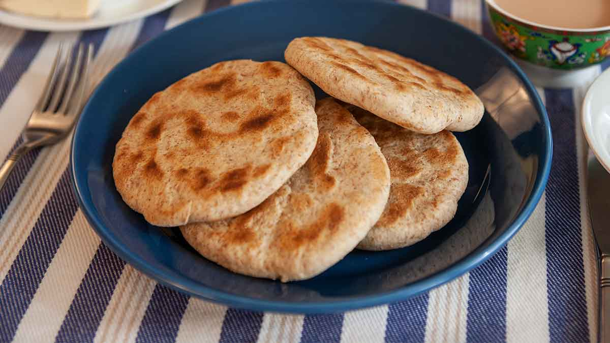

# Balep Korkun

*Tibet's everyday flatbread: a slightly chewy unleavened wheat-and-barley flour disc cooked dry in a hot pan till the outside crisps in patches and the inside stays soft. The Tibetan herder's bread that travels in a cloth bag for days without going stale.*

**Serves:** 6 (6 flatbreads)

**Prep Time:** 15 minutes (plus 20 minutes rest)

**Cook Time:** 25 minutes

## Overview
Balep korkun (literally "bread cooked in a pan" or "small bread"; balep = bread, korkun = small) is Tibet's everyday hearth flatbread: a simple unleavened wheat-and-barley disc cooked dry in a hot pan or on a flat stone. Across Tibet, what every household makes daily, what herders carry in cloth bags into the high pastures, what monks eat with butter tea, what travellers take on long journeys. Keeps for days at room temperature without refrigeration. Closely related to Indian chapati, Chinese bing and Mexican tortilla; the Tibetan version distinguishes itself with a half-barley half-wheat flour mix, a slightly chewy texture and the dry-pan cooking (no oil). The flour mix is the key: about half roasted barley flour (tsampa) and half wheat; the barley gives the nutty flavour and the proper heartiness. Outside Tibet, substitute with 50% wholewheat and 25% rye if barley flour isn't around. The pan must be hot and dry; no oil, no fat.

## Ingredients

- 250 g plain flour (or wholewheat flour, or a 50/50 mix)
- 250 g roasted barley flour (tsampa; or substitute with 200 g wholewheat + 50 g rye flour)
- 1 teaspoon fine sea salt
- 300 ml warm water (more or less depending on flour absorbency)

### Optional additions
- 1 tablespoon vegetable oil (for a slightly softer version; not traditional)
- 1 teaspoon sugar (for a slightly sweet version)
- Sesame seeds (for sprinkling)

## Method

### Stage 1 - Mix the dough
1. In a wide bowl, whisk together the plain flour, roasted barley flour and salt.
2. Add the warm water gradually; mix with a wooden spoon till a rough dough forms.
3. Turn onto a lightly floured surface; knead 5-7 minutes till smooth.
4. The dough should be firm but not stiff; if too stiff, add 1 tablespoon water at a time; if too sticky, add 1 tablespoon flour.

### Stage 2 - Rest the dough
1. Wrap in cling film or cover with a damp cloth; rest 20-30 minutes at room temperature.

### Stage 3 - Divide and shape
1. Divide the dough into 6 equal pieces (about 80 g each).
2. Roll each piece into a ball.
3. Working with one ball at a time, roll out on a lightly floured surface to a circle about 15 cm across and 4 mm thick.
4. The proper Tibetan balep korkun is slightly thicker than a chapati; aim for 4 mm rather than 2 mm.

### Stage 4 - Cook in a dry hot pan
1. Heat a heavy frying pan (cast-iron is ideal) over medium-high heat for at least 3 minutes (the pan must be properly hot).
2. Place one flatbread in the dry pan; cook 2-3 minutes on the first side till dark spots appear and the surface starts to puff in places.
3. Flip with a spatula; cook the second side 2-3 minutes till also dark-spotted.
4. The flatbread should be slightly chewy with crisp dark spots; not blackened, not raw.
5. Transfer to a clean cloth on a plate to keep warm.
6. Cook the remaining flatbreads the same way.

### Stage 5 - Serve immediately
1. Stack the warm flatbreads in a cloth napkin to keep warm.
2. Serve alongside any Tibetan stew, dal, butter, or just as bread for the table.
3. Tear with the hands; use to scoop up sauces and stews.

## Notes
- **Wheat and barley together is canonical:** the 50/50 mix is what gives the proper Tibetan flavour and texture. Pure wheat is too soft; pure barley is too crumbly.
- **Dry pan, no oil:** the proper Tibetan balep korkun is cooked dry; oil gives a different (more chapati-like) texture. The dry-pan method gives the proper slightly chewy character.
- **Hot pan first:** preheat the pan for at least 3 minutes before adding the first flatbread; a cool pan gives pale undercooked bread.
- **Don't overcrowd:** one at a time in the pan; the steam from one displaces the heat needed for the next.
- **Keep warm in a cloth:** the cloth holds the warm steam and keeps the bread soft.

## Variations
**Slightly enriched balep korkun:** add 1 tablespoon of oil and 1 teaspoon of sugar to the dough; gives a slightly softer sweeter bread. Less traditional but common in modern Tibetan kitchens.
**Sesame balep korkun:** sprinkle sesame seeds on each flatbread before cooking; press gently to make them stick. Gives a nuttier version.
**Spiced balep korkun:** add 1 teaspoon of ground Sichuan peppercorns to the dough; gives a properly numbing-aromatic version that's common in Lhasa.
**Stuffed balep korkun (filled bread):** roll out two thin circles; sandwich a small amount of mashed seasoned potato or chopped cooked vegetables between; press the edges to seal; cook in the dry pan as a stuffed flatbread. A bridge to sha balep.

## Serving
On a clean cloth napkin alongside the main dishes; torn with the hands to scoop up sauces and stews; or eaten with butter tea as breakfast. At the proper Tibetan table, balep korkun is always present.

## Storage
- Keeps wrapped in a clean cloth at room temperature 2 days; the bread stays soft for the first day, then firms up.
- Refrigerated 5 days; reheat in a hot dry pan for 30 seconds per side to refresh.
- Don't microwave; the bread goes rubbery.
- Freezes 3 months stacked with parchment between; defrost at room temperature and reheat in a hot pan.
- Day-old balep korkun is excellent split and used as a wrap for sliced cucumber, cheese and chilli sauce.
