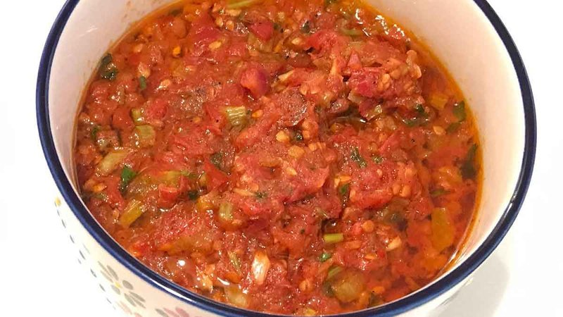

# Sepen

*A Tibetan tomato hot sauce: summer tomatoes with celery, cilantro and chilli pounded into a mild flavourful condiment. Spooned over momos and rice.*

**Serves:** Makes about 750 ml (4-6 servings)

**Prep Time:** 15 minutes

**Cook Time:** 1 hour 5 minutes

## Overview
A Tibetan tomato hot sauce that's about depth rather than burn. The base is summer-ripe Roma tomatoes cooked down for an hour with celery, garlic and a couple of fresh green chillies until everything reduces to a thick, slightly sweet paste; ground emma (Sichuan pepper) brings a quiet numbing tingle that gives the sauce its Himalayan signature. Fresh cilantro folded in at the end keeps it bright. Smell is sweet tomato concentrated into something almost ketchup-adjacent, with a faint pepperiness underneath. Genuinely easy, you blend, cook, walk away, stir every 15 minutes, finish. Lhasa families make it in summer when the tomatoes are cheap and stack jars of it in the fridge to spoon over momos, shabalep, and rice. Modest enough that it featured once in a New York Times dining-section profile of YoWangdu (a Tibetan cookery family) without much fanfare, but the kind of household sauce that is so quietly load-bearing in Tibetan cooking that meals feel incomplete without it.

## Ingredients

- 9 Roma tomatoes (~650 g)
- 3 celery stalks (diced)
- 2 hot green peppers (jalapeño or similar)
- 2 garlic cloves
- 60 ml vegetable oil (avocado or sunflower)
- ½ teaspoon salt
- ¼ teaspoon ground emma (Sichuan pepper) - optional
- A few sprigs fresh cilantro (roughly chopped, to finish)

## Method

### Stage 1 - Blend
1. Combine the tomatoes, garlic, hot peppers and emma (if using) in a food processor.
1. Pulse until smooth.

### Stage 2 - Cook
1. Heat the oil in a heavy pot over medium-high heat until hot.
1. Pour in the blended tomato mixture (it'll spit; stand back).
1. Add the diced celery and salt.
1. Bring to a boil, then reduce to a medium simmer.
1. Cook 5 minutes at a gentle boil.

### Stage 3 - Reduce
1. Reduce heat to medium-low.
1. Simmer 45 minutes, stirring every 15 minutes so the bottom doesn't catch.
1. Reduce heat further to low.
1. Simmer another 15 minutes (or longer for thicker) until most of the watery juice has gone.

### Stage 4 - Finish
1. Off heat.
1. Fold in the chopped cilantro.
1. Serve warm or at room temperature.

## Notes
- **No food processor?** Boil the tomatoes 5 minutes until the skins loosen; peel and chop fine. The texture is rougher but the flavour is the same.
- **Heat is restrained:** this is a hot sauce that's about depth, not burn. To turn the heat up, add another fresh chilli or a teaspoon of red chilli flakes.
- **Emma (Sichuan pepper) is optional but distinctive:** the citrus-numbing note is what gives the sauce its Tibetan/Himalayan character.

## Storage
- Keeps 1 week refrigerated in a sealed jar.
- Freezes 3 months. Thaw and stir to re-emulsify.
