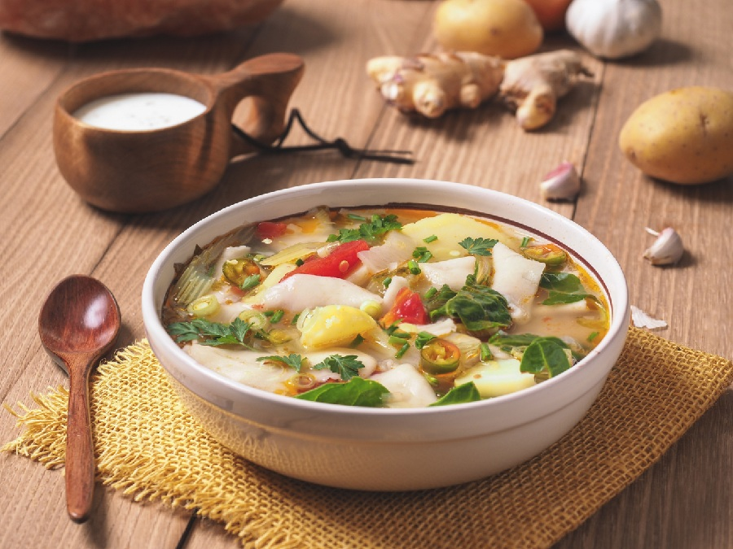

# Thenthuk

*Tibet's pulled-noodle soup: rough flat squares of dough torn from a sheet into a simmering broth at the moment of cooking. Hearty and chewy.*

**Serves:** 4

**Prep Time:** 25 minutes (plus 30 minutes dough rest)

**Cook Time:** 40 minutes

## Overview
A firm wheat dough rests while you build a clear, ginger-forward broth with beef, tomato and warming spices. When the broth is ready, the dough is rolled into a thick sheet, brushed with oil and cut into long strips. At the moment of cooking, each strip is held over the simmering broth and pinched into rough 3-4 cm squares that drop in. The noodles cook in 2-3 minutes. Greens and coriander finish.

## Ingredients

### Noodle dough
- 280 g plain flour, plus extra for dusting
- ½ teaspoon salt
- 150 ml warm water
- 1 tablespoon vegetable oil (for brushing the sheet)

### Broth
- 2 tablespoons vegetable oil
- 400 g lean beef (sirloin, rump or shin), sliced thinly across the grain
- 1 onion (large, sliced)
- 5 garlic cloves (chopped)
- 5 cm fresh ginger (chopped)
- 1 tomato (chopped)
- 1 teaspoon Sichuan peppercorns (lightly crushed)
- 1 teaspoon ground cumin
- ½ teaspoon ground coriander
- ½ teaspoon turmeric
- 1 ½ litres beef stock
- 1 tablespoon soy sauce
- salt
- pepper

### Vegetables
- 1 carrot (medium, sliced into half-moons)
- 1 daikon (small, or a handful of radishes, sliced)
- 100 g cabbage (shredded)
- 150 g spinach
- 2 spring onions (sliced)

### To serve
- A small bunch of coriander (chopped)
- 1-2 fresh green chillies (sliced) or sepen on the side
- Lemon wedges

## Method

### Stage 1 - Make the dough
1. Combine the flour and salt in a bowl. Stir in the warm water gradually until it comes together into a stiff, dryish dough.
2. Tip onto the counter and knead 8 minutes until smooth and firm. It should be tighter than a bread dough.
3. Wrap and rest at room temperature for 30 minutes minimum (an hour is better).

### Stage 2 - Build the broth
1. Heat the oil in a heavy pot over medium-high heat.
2. Add the beef in a single layer; sear 3-4 minutes until browned. Lift out.
3. Reduce heat to medium. Add the onion; cook 5 minutes until soft.
4. Add the garlic, ginger and tomato; cook 4 minutes until the tomato collapses.
5. Stir in the Sichuan peppercorns, cumin, coriander and turmeric; toast 1 minute.
6. Return the beef. Pour in the stock; add the soy. Season.
7. Bring to a simmer; cook 25 minutes uncovered, until the meat is tender.

### Stage 3 - Roll and cut the dough
1. While the broth simmers, divide the rested dough in half. Roll each piece on a lightly floured counter into a thick sheet, about 5 mm thick.
2. Brush both sides lightly with oil. Cut the sheet into long strips about 3 cm wide.
3. Stack the strips loosely; the oil keeps them from sticking. Cover with a tea towel until needed.

### Stage 4 - Vegetables in
1. Add the carrot, daikon and cabbage to the simmering broth; cook 4 minutes until just tender.

### Stage 5 - Pull the noodles
1. Bring the broth back to a brisk simmer.
2. Hold one strip of dough over the pot. Use your fingers to pinch off 3-4 cm pieces, flattening each between thumb and finger as you go, and let them drop straight into the broth.
3. Work through all the strips. Try not to throw them in a pile - spread them out as they go.
4. Once all the dough is in, stir gently; cook 2-3 minutes until the noodles float and look glossy.

### Stage 6 - Finish and serve
1. Stir in the spinach and spring onions; cook 1 minute until wilted.
2. Taste and adjust salt.
3. Ladle into deep bowls.
4. Top with coriander and fresh chilli.
5. Serve a lemon wedge on the side.

## Notes
- **Stiff dough is the goal:** Thenthuk dough should be tighter than bread or pasta dough. Soft dough tears unevenly and dissolves in the broth. If it feels too dry, wet your hands and knead in droplets.
- **Brush with oil:** Oiling the cut strips keeps them from gluing together while you work.
- **Pinch over the pot:** Some cooks cut squares with a knife instead, but the irregular hand-torn shape is the whole point of thenthuk.
- **Yak substitution:** Yak is the traditional meat and unavailable outside Tibet and the Himalayas. Lean beef shin or chuck is the closest substitute; mutton works for a stronger version.
- **Sichuan peppercorn:** Black pepper is not a substitute; the mild numbing fragrance is part of Tibetan flavour.

## Variations
**Vegetarian thenthuk:** Skip the beef; use vegetable stock, add 150 g cubed firm tofu or 200 g mushrooms with the onion, and a teaspoon of butter at the end for body.
**Sour thenthuk:** Add a splash of vinegar and a spoon of chilli oil to each bowl at the table - a popular Lhasa restaurant style.

## Serving
Serve with: sepen (Tibetan chilli sauce) or fresh chilli, lemon wedges, and Tibetan butter tea on the side.

## Storage
- Broth keeps 3 days refrigerated and freezes 2 months without the noodles.
- The torn noodles are best the day they're made; they soak up the broth quickly on standing.
