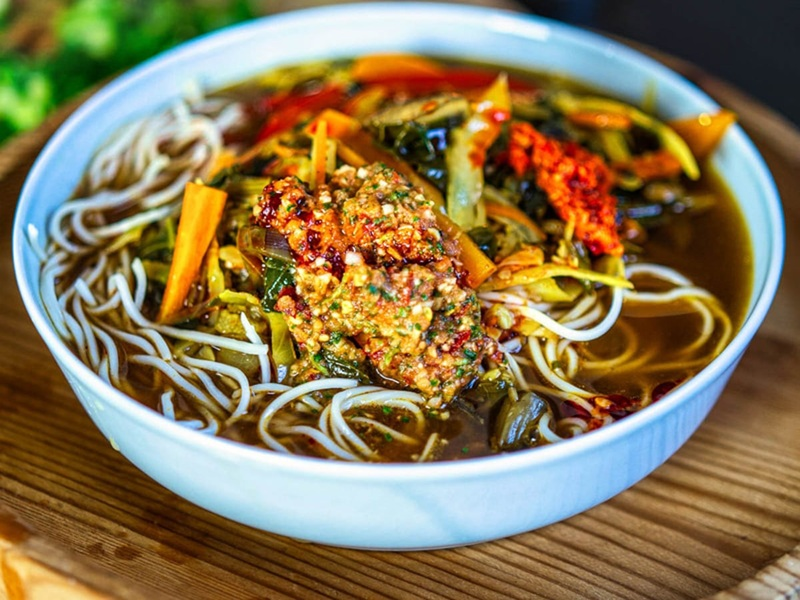

# Thukpa

*Tibet's hand-pulled noodle soup: a clean, gingery broth with fresh wheat noodles, vegetables and yak (or beef). The winter dish of the high plateau.*

**Serves:** 4

**Prep Time:** 30 minutes (plus 30 minutes dough rest)

**Cook Time:** 40 minutes

## Overview
A simple wheat-flour dough rests while a clear, ginger-and-garlic-forward broth simmers with beef (standing in for yak), Sichuan peppercorn and a tomato. The dough is rolled and cut into thin noodles, or, if you prefer, store-bought egg noodles. Vegetables and greens go in at the end; fresh coriander and chilli on top. Honest, restorative, not fancy.

## Ingredients

### Noodles
- 250 g plain flour, plus extra for dusting
- 130-150 ml warm water
- ½ teaspoon salt
- (Or substitute: 300 g fresh egg noodles or thin udon)

### Broth and meat
- 2 tablespoons vegetable oil
- 400 g lean beef (or mutton), sliced thinly across the grain into 4 cm strips
- 1 onion (large, sliced)
- 6 garlic cloves (chopped)
- 5 cm fresh ginger (chopped)
- 1 tomato (chopped)
- 1 teaspoon Sichuan peppercorns (lightly crushed)
- 1 teaspoon ground cumin
- 1 teaspoon ground coriander
- ½ teaspoon turmeric
- 1 ½ litres beef (or chicken stock)
- 1 tablespoon soy sauce
- salt
- pepper

### Vegetables
- 1 carrot (medium, julienned)
- 1 daikon (small, or 6 radishes, julienned)
- 100 g cabbage (shredded)
- 100 g spinach (or other dark greens)
- 2 spring onions (sliced)

### To serve
- A small bunch of coriander (chopped)
- 1-2 fresh green chillies (sliced; or sepen, Tibetan chilli sauce)
- Lemon wedges

## Method

### Stage 1 - Make the noodle dough
1. Mix the flour and salt in a bowl. Stir in the warm water gradually until it forms a shaggy mass.
2. Tip onto the counter and knead 6-8 minutes until smooth and elastic.
3. Wrap and rest at room temperature for at least 30 minutes. (Skip this stage if using shop-bought noodles.)

### Stage 2 - Sear the meat and build the broth
1. Heat the oil in a heavy pot over medium-high heat.
2. Add the beef strips in a single layer; sear 3-4 minutes until browned. Lift out.
3. Reduce heat to medium. Add the onion; cook 5 minutes until soft.
4. Add the garlic, ginger and tomato; cook 4-5 minutes until the tomato collapses.
5. Stir in the Sichuan peppercorns, cumin, coriander and turmeric; cook 1 minute.

### Stage 3 - Simmer
1. Return the beef to the pot.
2. Pour in the stock; add the soy sauce. Season with salt and pepper.
3. Bring to a simmer; cook 25-30 minutes until the meat is tender.

### Stage 4 - Roll the noodles
1. While the broth simmers, divide the dough in two. Roll each piece on a lightly floured counter into a thin sheet, about 2 mm thick.
2. Dust the sheet with flour and roll loosely. Slice into 5 mm wide ribbons. Shake out and dust again.

### Stage 5 - Cook the vegetables and noodles
1. Add the carrot, daikon and cabbage to the broth; simmer 4 minutes.
2. Drop the noodles into the broth; cook 3-4 minutes until just tender (1-2 minutes for shop-bought egg noodles).
3. Stir in the spinach and spring onion; cook 1 minute more until wilted.
4. Taste and adjust salt.

### Stage 6 - Serve
1. Ladle into deep bowls, making sure each bowl gets noodles, broth, meat and vegetables.
2. Top with coriander and fresh chilli.
3. Serve a lemon wedge on the side; squeeze in to taste.

## Notes
- **Yak substitution:** Yak is the traditional meat and is not available in UK or Western shops. Lean beef shin or chuck is the closest substitute in texture and flavour; mutton works for a richer version.
- **Hand-pulled noodles are forgiving:** They don't need to be even. Tibetan and Bhutanese cooks make them rustic on purpose.
- **Sichuan peppercorn, not black:** The mild numbing fragrance is what gives thukpa its character. Black pepper is not a substitute.
- **Sepen on the side:** If you can source or make Tibetan chilli sauce (sepen), serve it on the side rather than adding to the pot - everyone seasons their own bowl.

## Variations
**Vegetarian thukpa:** Skip the meat; use vegetable stock, add 150 g cubed tofu or 200 g mushrooms with the onion, and a teaspoon of butter at the end for body.
**Chicken thukpa:** Replace beef with sliced chicken thigh; reduce simmer time to 20 minutes.

## Serving
Serve with: a small dish of fresh chilli or sepen, and lemon wedges. Tibetan butter tea on the side is traditional.

## Storage
- Broth and meat keep 3 days refrigerated; freeze 2 months without the noodles.
- Noodles soak up the broth on standing; cook fresh batches as needed.
