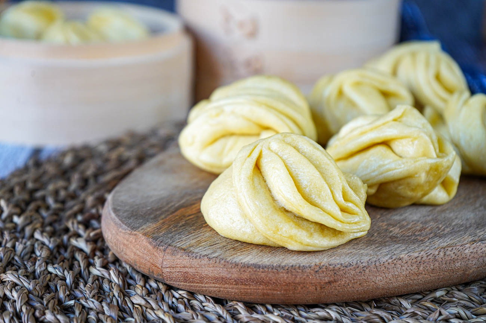

# Tingmo

*Tibet's pillowy steamed rosette bun: a soft white yeasted flour bread shaped into a swirled rosette and steamed till the surface goes glossy and the inside stays pillowy. The Tibetan steamed bread eaten alongside fiery curries and stews, soaking up the sauces with a tender torn crumb.*

**Serves:** 6 (12 tingmo)

**Prep Time:** 30 minutes (plus 1 hour 30 minutes rising + 30 minutes proving)

**Cook Time:** 20 minutes

## Overview
Tingmo (ཏིང་མོ) is Tibet's signature steamed bread and a Sunday-table favourite across the Himalayan plateau: a soft white yeasted flour bread, leavened with both yeast and baking powder for the proper double rise, rolled into a sheet, brushed with oil, rolled into a long sausage, sliced and twisted into the iconic rosette shape, then steamed till the surface goes glossy and the inside stays pillowy and tender. The soft starchy counterpart to the fiery Tibetan stews; tear pieces and use them to sop up the sauces of shapta, shamu datshi or anything else with a wet sauce. The dough is enriched only slightly: sugar for the yeast feed, milk for tenderness, a small amount of oil. No butter, no egg, no heavy enrichment; heavier doughs give a too-bread-like result. Both yeast and baking powder do work: yeast for the long rise and flavour, baking powder for the second lift during steaming. The swirled rosette shape is what makes tingmo distinct from generic Chinese steamed bread.

## Ingredients

- 500 g plain flour
- 7 g instant dried yeast (1 sachet)
- 2 tablespoons caster sugar
- 1 teaspoon fine sea salt
- 1 teaspoon baking powder
- 220 ml warm milk
- 60 ml warm water
- 3 tablespoons vegetable oil (plus 2 more tablespoons for brushing)

## Method

### Stage 1 - Make the dough
1. In a wide bowl, whisk together the flour, yeast, sugar, salt and baking powder.
2. In a smaller bowl, whisk together the warm milk, warm water and 3 tablespoons of oil.
3. Pour the wet ingredients into the flour; stir to combine.
4. Knead for 8-10 minutes till smooth and elastic.

### Stage 2 - First rise
1. Place in an oiled bowl; cover with a damp cloth; let rise 1.5 hours at room temperature till doubled.

### Stage 3 - Shape the tingmo
1. Knock back the risen dough.
2. Divide into 2 equal pieces.
3. Working with one piece, roll out on a lightly floured surface into a rectangle about 35 cm × 20 cm and 4 mm thick.
4. Brush the surface generously with 1 tablespoon of oil.
5. Starting from the long edge, roll the dough into a long sausage (like a Swiss roll). The seam should be at the bottom.
6. Use a sharp knife to cut the sausage into 6 equal sections (each about 5-6 cm wide).
7. Take each section: stand it on its end so the swirl shows; gently flatten one open side with a chopstick or your finger to create a small dimple in the middle (this lets the rosette puff outward during steaming).
8. Repeat with the second piece of dough; you should have 12 tingmo total.

### Stage 4 - Second prove
1. Place the shaped tingmo on small squares of parchment paper (one piece per tingmo; gives easy handling for the steamer).
2. Cover loosely with a damp cloth; let prove 30 minutes at room temperature till slightly puffed.

### Stage 5 - Steam
1. Set up a large steamer with at least 5 cm of water in the base.
2. Bring the water to a rolling boil.
3. Place the tingmo (on their parchment squares) in the steamer basket; leave 3 cm between each (they expand during steaming).
4. Work in batches if your steamer can't fit 12 at once.
5. Cover with the lid tightly.
6. Steam 15-18 minutes till the tingmo are puffed and the surface is glossy.
7. Don't lift the lid during steaming; the steam pressure is what makes the tingmo rise properly.

### Stage 6 - Cool briefly and serve
1. Turn off the heat; wait 2-3 minutes before lifting the lid (sudden temperature change can deflate the bread).
2. Lift out the tingmo; place on a warm plate.
3. Serve immediately alongside a Tibetan stew, curry or fiery sauce.

## Notes
- **Two leavenings:** yeast and baking powder both contribute. The yeast gives the long rise and flavour; the baking powder gives the second lift during steaming. Skipping either gives a denser bread.
- **Don't skip the second prove:** the 30-minute prove after shaping gives the tingmo their final puff. Skipping it gives flat dense bread.
- **Steam, don't bake:** the steaming gives the proper pillowy texture; baked tingmo would be like Chinese buns (which are good but different).
- **Don't lift the lid:** every glance during steaming releases steam pressure and gives uneven cooking. 15-18 minutes covered; let stand 2-3 minutes before lifting.
- **Serve immediately:** tingmo are best fresh and hot; they go off-texture (denser and slightly drier) as they cool.

## Variations
- **Plain disc tingmo:** skip the rosette shape; just shape the dough into small balls, flatten slightly into 3 cm thick discs, prove and steam. Easier; equally Tibetan.
- **Sesame tingmo:** sprinkle the top of each tingmo with sesame seeds before steaming; gives a nuttier version.
- **Sweet tingmo (golden tingmo):** double the sugar in the dough; serve as a tea-time bread alongside butter tea. Common Tibetan variation.
- **Stuffed tingmo (savoury):** fill with a small amount of finely chopped cooked vegetables before twisting; gives a stuffed Tibetan bread that bridges tingmo and momo.

## Serving
- On a warm plate alongside Tibetan stews, curries or any wet sauce; the tingmo is meant to be torn and used to scoop up sauce. With butter tea, sweet milky chai, or Tibetan beer (chang). Often part of a multi-dish Tibetan meal.

## Storage
- Best eaten warm and fresh.
- Keeps in a sealed container at room temperature 1 day; refrigerated 3 days.
- Reheat by steaming for 5-7 minutes till warm; or in a microwave with a damp paper towel over (20-30 seconds per tingmo).
- Freezes 2 months in a sealed bag; reheat from frozen by steaming for 12-15 minutes.
- Day-old tingmo are excellent split, fried in oil with garlic, and used as a base for tofu or beef stir-fry.
