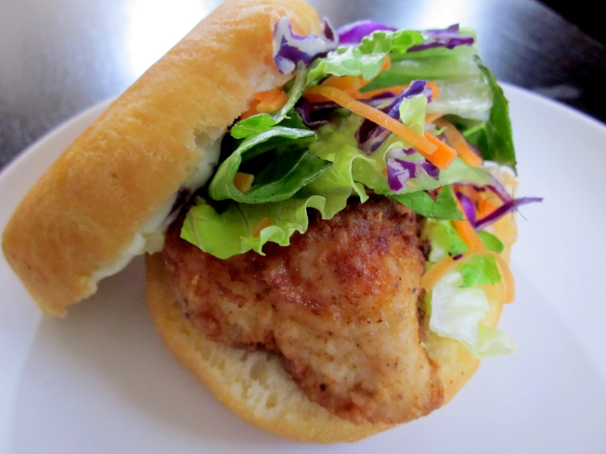

# Bake and Shark

*Trinidad's iconic beach sandwich: fried "bake" (a yeasted flatbread fried golden) folded around a tender battered shark fillet, with shadon beni chutney, garlic sauce, tamarind sauce, fresh lettuce, tomato, cucumber and a slice of pineapple. The Maracas Beach staple that travellers from across the Caribbean stop for.*

**Serves:** 4

**Prep Time:** 45 minutes (plus 1 hour for the bake dough to rise + 30 minutes shark marination)

**Cook Time:** 30 minutes

## Overview
Bake and shark is Trinidad's most famous beach food and one of the great sandwiches of the Caribbean: a piece of "bake" (a yeasted lightly-sweet flatbread fried in oil till puffed and golden, between fry-bread and pita in texture) split open and stuffed with a fillet of fresh shark, seasoned with garlic, lime and herbs, dredged in seasoned flour and shallow-fried till just cooked, then dressed with the Maracas Beach toppings: shadon beni chutney (culantro, lime, garlic, chilli), garlic sauce, tamarind sauce, lettuce, tomato, cucumber and a slice of fresh pineapple. The mixture of textures is what makes the dish unforgettable; Trinidadians and visitors drive to Maracas Beach just for this. Shark is the canonical fish (specifically blacktip); outside Trinidad it is hard to find and ethically debatable, so swordfish, mahi-mahi, kingfish, tilapia or sea bass substitute. The bake must be the yeasted flatbread, puffed and soft inside; a regular bread roll changes the dish entirely. All three sauces and the salad toppings are non-negotiable.

## Ingredients

### Bake dough
- 500 g plain flour
- 1 tablespoon caster sugar
- 1 teaspoon fine sea salt
- 7 g instant dried yeast (1 sachet)
- 50 g butter (softened)
- 250 ml warm water
- 1 large egg
- Vegetable oil for frying (about 1 litre)

### Shark fillets (or substitute)
- 4 shark fillets (about 150 g each; or substitute with swordfish, mahi-mahi, king fish, sea bass, or any firm white fish)
- Juice of 2 limes
- 4 garlic cloves (crushed)
- 1 tablespoon green seasoning (or 2 tablespoons chopped fresh herbs: parsley, thyme, shadon beni or coriander)
- 1 teaspoon salt
- 1 teaspoon black pepper

### Dredge for the fish
- 200 g plain flour
- 1 tablespoon paprika
- 1 teaspoon salt
- 1 teaspoon black pepper
- ½ teaspoon ground turmeric

### Shadon beni chutney
- 1 large bunch shadon beni (culantro; or substitute with double the fresh coriander)
- 1 small bunch fresh coriander
- 4 garlic cloves
- 1 small Scotch bonnet pepper (or habanero; deseed for milder)
- 2 spring onions
- 1 thumb fresh ginger
- 3 tablespoons fresh lime juice
- 2 tablespoons water
- 1 teaspoon salt

### Garlic sauce
- 6 garlic cloves (crushed)
- 200 ml mayonnaise
- 2 tablespoons fresh lime juice
- 1 teaspoon salt
- 2 tablespoons milk

### Tamarind sauce
- 80 g tamarind paste (or 100 g tamarind concentrate from a jar)
- 50 g brown sugar
- 100 ml water
- 1 small Scotch bonnet pepper (or to taste)
- 1 teaspoon salt
- ½ teaspoon ground cumin

### Toppings
- 1 small head iceberg or romaine lettuce (shredded)
- 2 large tomatoes (sliced)
- 1 cucumber (sliced)
- 1 small fresh pineapple (peeled, cored, sliced into thin rings)

## Method

### Stage 1 - Marinate the fish
1. Pat the fish fillets dry; place in a wide bowl.
2. Add the lime juice, crushed garlic, herbs, salt and pepper.
3. Toss to coat; cover and refrigerate 30 minutes.

### Stage 2 - Make the bake dough
1. In a wide bowl, whisk together the flour, sugar, salt and yeast.
2. Rub in the softened butter with your fingertips till the mixture resembles coarse crumbs.
3. Whisk together the warm water and egg; pour into the flour.
4. Stir to combine; knead in the bowl or on a lightly floured surface for 5-7 minutes till smooth and elastic.
5. Place in an oiled bowl; cover with a damp cloth; let rise 1 hour at room temperature till doubled.

### Stage 3 - Make the shadon beni chutney
1. Combine all chutney ingredients (shadon beni, coriander, garlic, Scotch bonnet, spring onions, ginger, lime juice, water, salt) in a food processor or blender.
2. Blitz to a vivid green sauce; it should be slightly chunky but mostly smooth.
3. Taste; adjust salt and lime juice.
4. Transfer to a small bowl; cover.

### Stage 4 - Make the garlic sauce
1. Combine crushed garlic, mayonnaise, lime juice, salt and milk in a bowl.
2. Whisk to a smooth pourable sauce.
3. Refrigerate; the garlic flavour develops as it sits.

### Stage 5 - Make the tamarind sauce
1. Combine tamarind paste, brown sugar and water in a saucepan; bring to a simmer.
2. Cook 5 minutes till the sugar dissolves and the sauce thickens slightly.
3. Add the Scotch bonnet (finely chopped), salt and cumin; cook 1 minute more.
4. Take off the heat; strain through a sieve if you want a smoother sauce.

### Stage 6 - Shape and fry the bake
1. Knock back the risen dough; divide into 4 equal pieces.
2. Roll each piece into a ball; flatten into a circle about 12 cm across and 1 cm thick.
3. Let rest covered for 10 minutes.
4. Heat 3 cm of oil in a wide heavy pan to 175°C (350°F).
5. Fry each bake 2-3 minutes per side till deep golden and puffed; the bake should rise and become buoyant.
6. Drain on kitchen paper; keep warm.

### Stage 7 - Fry the shark
1. Combine the dredge ingredients in a wide plate.
2. Lift each fish fillet from the marinade; dredge in the seasoned flour, pressing to coat.
3. Heat 1 cm of oil in a heavy frying pan to 180°C (350°F).
4. Fry the fish 3-4 minutes per side till deep golden and just cooked through.
5. Drain on kitchen paper.

### Stage 8 - Assemble
1. Split each warm bake horizontally (don't cut all the way through; leave a hinge).
2. Smear garlic sauce inside.
3. Lay a few shredded lettuce leaves on the bottom half.
4. Place a fried shark fillet on top.
5. Drizzle with shadon beni chutney and tamarind sauce.
6. Add tomato slices, cucumber slices and a pineapple ring.
7. Fold the bake over the filling.
8. Serve immediately while hot.

## Notes
- **Shark or substitute:** real shark is the canonical choice but ethically debatable outside Trinidad (where it's harvested locally and managed). Swordfish, mahi-mahi, king fish are the best substitutes; sea bass and tilapia also work.
- **The bake is essential:** the yeasted fried flatbread is what makes the sandwich. Don't substitute with bread rolls; the texture and flavour are wrong.
- **All three sauces:** Maracas Beach bake and shark traditionally has all three (shadon beni, garlic, tamarind) plus all four toppings (lettuce, tomato, cucumber, pineapple). Don't skip any; the experience is the layering.
- **Don't overcook the fish:** 3-4 minutes per side at 180°C is right; longer and the fish goes dry. The fish should be just cooked through with a slight moistness inside.
- **Make sauces ahead:** all three sauces can be made the day before; the flavours develop overnight.

## Variations
**Chicken bake:** swap the fish for marinated chicken thigh; cook the same way. Common variation at Maracas Beach.
**Vegetable bake:** swap the fish for a thick portobello mushroom or a slice of fried halloumi; vegetarian variation.
**Spicier:** double the Scotch bonnet in all three sauces; pile in fresh chillies. Properly Trinidadian.
**Mini bake-and-shark:** make smaller bakes (8 cm) and bite-sized fish pieces for a party-canapé version.

## Serving
On a square of greaseproof paper or in a folded napkin (the proper Maracas Beach style); eat with your hands; the sandwich is meant to be messy. A cold local beer (Carib or Stag); or a fresh coconut water (the canonical Trinidadian beach drink).

## Storage
- Best eaten immediately while the bake is warm and crisp.
- The fried bakes keep refrigerated 1 day; reheat in a hot oven 5 minutes to refresh.
- All three sauces keep refrigerated 1 week.
- The fish doesn't reheat well; cook fresh each time.
- Day-old bakes are best in another form: split, fill with cold leftover curry, and griddle till hot.
