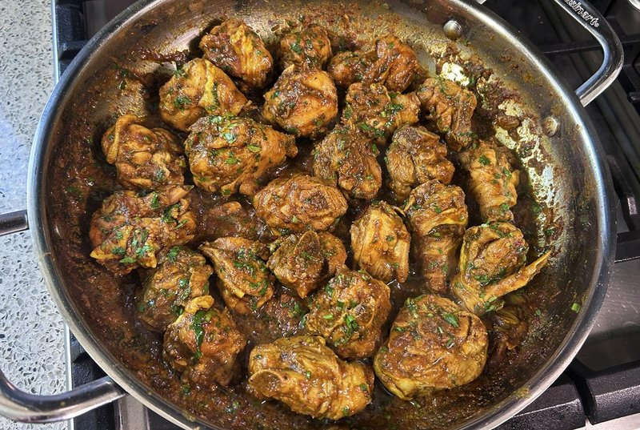

# Bunjay-Style Curry Chicken

*"Bunjay" - "fry-down" in Trinidad and Tobago. A dry curry technique where bone-in, skin-on chicken cooks down with concentrated spices and its own juices until the gravy disappears and the meat carries the curry on its surface. No water, no sauce, no coconut milk. Eats with rice and dhal.*

**Serves:** 6

**Prep Time:** 15 minutes (plus 2 hours marinating)

**Cook Time:** 35 minutes

## Overview
A dry curry rather than a saucy one, "bunjay" is Trinidadian patois for "fry-down", the technique of cooking meat in its own juices until the gravy completely disappears and the spices coat the surface of the meat in a sticky, glaze-like crust. The flavour is concentrated rather than diluted; nothing's been thinned with water or coconut milk, so what you taste is bone-in chicken, rendered chicken fat, and toasted spice. The spice mix is the East Indian Trinidadian signature: turmeric for colour and earth, roasted geera (toasted cumin, ground) for nuttiness, anchar masala for tang, regular curry powder for breadth. The pan oil splits and separates around the chicken at the end, which is the visual cue you're looking for. Smell when the curry powder hits hot oil is deeply aromatic, almost incense-like. Not difficult but it requires attention during the cook-down phase; if you walk away the curry burns onto the bottom of the pan. A Trinidadian household staple, eaten across the country with white rice and dhal, and a clean example of how Indian indentured labourers' descendants in the Caribbean evolved a distinct curry tradition over 150 years.

## Ingredients

- 1.4 kg (3 lbs) chicken legs (bone-in, skin-on, halved at joint)
- 1 lime (or lemon, juiced)
- ¾ tablespoon salt
- ½ teaspoon black pepper
- 3 tablespoons [Curry Powder](../indian/Spice-Mixes/curry-powder.md) (divided)
- 1 ½ tablespoons Caribbean green seasoning
- 3 tablespoons vegetable oil
- 1 onion (medium, diced)
- 6 garlic cloves (smashed)
- 1 Scotch bonnet (whole, optional)
- 1 teaspoon ground turmeric
- ¾ tablespoon ground roasted geera (cumin)
- ¾ tablespoon anchar masala (or garam masala)
- 1 tomato (small, grated)
- 2 tablespoons water
- 2 tablespoons chopped cilantro

## Method

### Stage 1 - Marinate
1. Wash the chicken with lime/lemon juice and cool water; pat dry.
1. Season in a bowl with the salt, black pepper, green seasoning and 1 tablespoon of the curry powder.
1. Refrigerate at least 2 hours.

### Stage 2 - Bloom the curry
1. Heat the oil in a wide pan over medium heat.
1. Add the onion, garlic and whole Scotch bonnet; cook 2-3 minutes.
1. Add the turmeric, roasted geera, anchar masala and remaining 2 tablespoons of curry powder.
1. Stir 3 minutes - the spices should darken and release fragrance.

### Stage 3 - Build flavour
1. Add the grated tomato and 2 tablespoons of water.
1. Cook until the liquid reduces and the oil starts to separate at the bottom of the pan.

### Stage 4 - Sear the chicken
1. Increase heat to medium-high.
1. Add the marinated chicken to the pan; sear 2 minutes.
1. Reduce to medium; cover; cook 3-4 minutes - this releases the chicken's natural juices.

### Stage 5 - Cook down
1. Remove the lid; stir well to coat the chicken with the curry.
1. Continue cooking 15-20 minutes, stirring occasionally, until the chicken is fully cooked through and no liquid remains in the pan.
1. The dish should be completely dry - bunjay means no sauce.
1. Taste; adjust salt.

### Stage 6 - Serve
1. Discard the whole Scotch bonnet (or chop it in for the brave).
1. Scatter cilantro over.
1. Serve with rice and dhal.

## Notes
- **Bone-in, skin-on is mandatory:** the skin renders fat that the dry-curry technique needs. Boneless skinless gives a different (drier) dish.
- **No water in the cook-down stage:** the chicken's own juices are the only liquid. The point is to concentrate everything.
- **Watch the heat:** the cook-down phase wants moderate heat. Too hot and the curry burns; too cool and it never fully dries down.

## Storage
- Keeps 3 days refrigerated; reheats in a covered pan with a splash of water if needed.
- Freezes 2 months. Thaw overnight.
