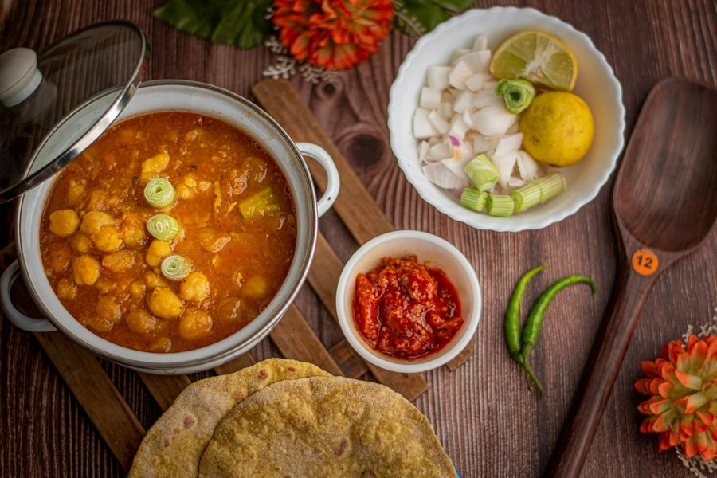

# Buss-Up-Shut Roti with Curry

*Trinidad's torn paratha: a soft flaky flatbread beaten straight off the heat till it bursts into rough fluffy pieces. Served with a quick channa-and-aloo.*

**Serves:** 4

**Prep Time:** 30 minutes (plus 1 hour resting)

**Cook Time:** 45 minutes

## Overview
Buss-up-shut, also called paratha roti, is the flaky-layered Trinidadian roti that takes its English name from "burst-up shirt" - a buss-up-shut roti is one that has been beaten the moment it comes off the tawa until it explodes into soft, irregular shreds. It is descended from the South Asian paratha, brought by indentured Indian labourers in the 19th century and rebuilt in Trinidad with a softer, more elastic dough and a finishing technique that is uniquely local. The recipe here covers the roti itself, which is the demanding part, with a short Trini channa-aloo curry on the side so you have a proper plate to scoop with. The layering technique (rolling, brushing with oil, coiling, resting, rolling out) is what creates the laminated, flaky structure. The beating step uses two wooden spatulas (called "klappers" in some roti shops) and looks dramatic but is straightforward. Difficulty is moderate; the dough is forgiving but the rolling-and-coiling step needs a little practice. Once you have a feel for it, you will make this every fortnight.

## Ingredients

### Dough
- 500 g plain flour, plus extra for dusting
- 1 ½ tsp baking powder
- 1 tsp salt
- 2 tbsp neutral oil, plus 4-5 tbsp for brushing
- 280-300 ml warm water

### Channa and aloo curry (filling)
- 1 can (400 g) chickpeas, drained and rinsed
- 2 medium potatoes (about 400 g, peeled and cut into 2 cm cubes)
- 3 tbsp neutral oil
- 1 medium onion (finely chopped)
- 5 garlic cloves (minced)
- 1 tbsp Caribbean green seasoning
- 2 tbsp Caribbean curry powder
- ½ tsp ground turmeric
- ¾ tsp ground roasted geera (cumin)
- 1 Scotch bonnet (whole, pricked, optional)
- 1 sprig fresh thyme
- 500 ml water or stock
- 1 tsp salt, or to taste
- Small handful chopped chadon beni or coriander
- 1 lime, cut in wedges

## Method

### Stage 1 - Mix and rest the dough
1. Combine the flour, baking powder and salt in a wide bowl. Stir in the 2 tbsp oil.
2. Add the warm water gradually, mixing as you go, until you have a soft, slightly sticky dough. Adjust with extra flour or water as needed; the dough should feel slightly tackier than a pizza dough.
3. Knead 6-8 minutes until smooth and very elastic.
4. Cover with a damp cloth and rest 1 hour at room temperature. This long rest is essential for the layering to work.

### Stage 2 - Start the curry
1. Heat the oil in a heavy saucepan over medium heat.
2. Add the onion and cook 4-5 minutes until soft.
3. Stir in the garlic, green seasoning and thyme. Cook 1 minute.
4. Mix the curry powder, turmeric and roasted geera with 4 tbsp water to make a paste. Tip into the pan and bunjay (fry, stirring) 2-3 minutes until the paste darkens and the oil starts to separate.
5. Add the potatoes and stir to coat in the curry. Cook 2 minutes.
6. Add the chickpeas, Scotch bonnet, water and salt. Bring to a simmer.
7. Cover and cook 20-25 minutes until the potatoes are tender and beginning to break down at the edges, thickening the gravy. Crush a few of the chickpeas with the back of a spoon for body. Taste for salt and discard the Scotch bonnet and thyme stem. Keep warm.

### Stage 3 - Divide and roll
1. Turn the rested dough onto a lightly floured surface. Divide into 4 equal pieces (loyahs); each should weigh around 200 g. Roll each into a smooth ball.
2. Working with one ball at a time, dust with flour and roll out to a thin round about 25 cm across.
3. Brush the surface generously with oil (about 1 tsp per roti).
4. Make a single straight cut from the centre of the round to the edge.
5. Starting from one side of the cut, roll the dough tightly into a cone shape, finishing at the other side of the cut. Press the tip of the cone down into the wide end to form a compact spiral. This is the lamination.
6. Cover the spirals with a damp cloth and rest 20 minutes.

### Stage 4 - Final roll-out
1. Flatten one spiral with the palm of your hand, dust with flour, and roll out very gently to a thin round about 28-30 cm across. Use light pressure; pressing too hard squeezes out the layers.
2. Set aside on a dusted surface. Repeat with the remaining spirals. Do not stack them.

### Stage 5 - Cook on the tawa
1. Heat a wide tawa, crepe pan or large flat frying pan over medium-high heat for 2 minutes.
2. Lay a rolled roti onto the dry pan. Cook 30-40 seconds until it lifts easily and the underside has light brown spots.
3. Flip with a wide spatula. Brush the top with oil and the edges. Cook 30-40 seconds.
4. Flip again, brush the other side with oil, and cook 20-30 seconds. The roti should be soft and pliable with brown spots, never crisp.

### Stage 6 - Buss it up
1. Slide the cooked roti straight off the pan onto a clean cloth or sheet of greaseproof paper.
2. Using two wooden spatulas, immediately beat and clap the roti from the edges towards the centre while it is still hot. Within 15-20 seconds the layers will burst apart into soft, fluffy shreds.
3. Pile the buss-up-shut into a covered bowl or wrap in a clean cloth to keep warm and soft. Repeat with the rest.

## Notes
- **Long rest, soft dough:** the hour-long rest after kneading and the 20 minutes after coiling are what let the gluten relax. Skipping either gives you a tough roti.
- **The cut-and-coil is the lamination:** the cut and spiral is what creates the layered structure. Roll the cone tightly but not so tight you tear it.
- **Light hand on the final roll:** press too hard and you squeeze the layers shut, which means no buss-up-shut. Long, light passes with a rolling pin from centre out.
- **Beat it hot:** the roti has to be beaten the moment it comes off the tawa, while it is still hot enough for the steam between the layers to do the work. A cool roti will not buss.
- **Two spatulas, not hands:** the roti is too hot for hands. Two wooden spatulas, or one spatula and a clean cloth, work best.

## Variations
**Dhalpuri filling:** Stuff each dough ball with a tablespoon of seasoned ground split-pea powder (see the Mauritian dholl puri for the technique) before the cone-and-coil step.
**Sada roti:** Skip the oil-brushing and coiling for plain, thicker sada roti; cook longer per side.
**Curry duck or curry chicken alongside:** Channa-aloo is the everyday roti shop pairing, but Trinidadian curry chicken or curry duck both work brilliantly.

## Serving
Lay a buss-up-shut on each plate. Spoon the channa-aloo curry alongside (not on top; the roti is for scooping). A wedge of lime, a scatter of chadon beni or coriander, and a small dish of pepper sauce. Tear the roti by hand to scoop up the curry.

## Storage
- Roti is best eaten fresh from the cloth. Will keep soft 3-4 hours wrapped.
- Refrigerated roti goes stiff; reheat 15-20 seconds per side on a dry tawa to soften.
- Channa-aloo keeps 3 days refrigerated and reheats well with a splash of water.
- Freeze cooked (but un-bussed) roti between sheets of greaseproof for up to 1 month. Defrost, reheat and beat to buss.
