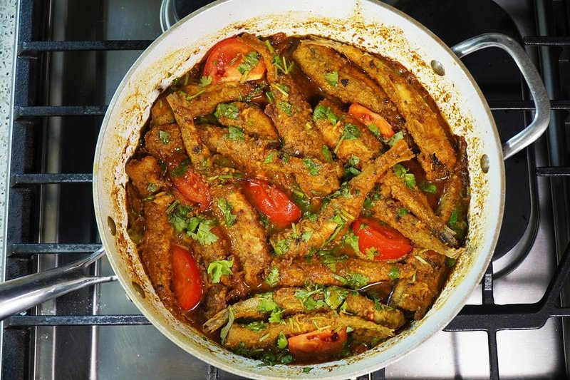

# Curry Smelts

*Trinidad's comfort dish: small whole fish seasoned with green seasoning, lightly floured, fried crisp, then dropped into a Caribbean curry of roasted geera and chilli.*

**Serves:** 5

**Prep Time:** 20 minutes

**Cook Time:** 30 minutes

## Overview
Trinidadian comfort food that brings together the East Indian and Afro-Caribbean strands of Trini cookery in one pan: small whole fried fish (a West African and Caribbean coastal habit) drowned in a Trinidadian East Indian curry sauce. The fish are smelts, sardines or whitebait, whole, head-on, eaten with a small bite to remove the spine. Once fried they sit crisp; when the curry sauce hits, the outer crust softens slightly and absorbs the gravy while the centre stays meaty. The sauce is the dish's signature: roasted geera (dry-toasted cumin) gives a smoky, nutty depth that pre-ground supermarket cumin can't touch, anchar masala adds a fermented-tangy edge (it's the Trinidadian pickled-mango spice mix), and Caribbean curry powder rounds the warmth. Whole pierced Scotch bonnet scents without flooring. Smell when the spices bloom in hot oil is heavy and pungent in the best possible way. Not difficult but it's a two-pan dance, so timing matters. A daily-cookery dish across Trinidad and Tobago and the Indo-Trinidadian diaspora, eaten with steamed rice or with sada roti torn and used as a scoop.

## Ingredients

- 700 g (1 ½ lbs) smelts (or sardines, anchovies, whitebait)
- 1 lime (or lemon, juiced)
- 1 teaspoon salt
- 1 teaspoon black pepper (divided)
- 1 ½ tablespoons Caribbean green seasoning
- ¾ cup plain flour
- 500 ml vegetable oil (for frying)
- 1 ½ tablespoons vegetable oil (for sauce)
- 1 onion (small, diced)
- 6 garlic cloves (smashed)
- 1 Scotch bonnet (whole, pierced)
- ¾ tablespoon anchar masala
- ¾ tablespoon ground roasted geera (cumin)
- 2 tablespoons curry powder
- 480 ml water
- 2 tablespoons chopped cilantro

## Method

### Stage 1 - Prep the fish
1. Wash the smelts with lime/lemon juice and cool water; pat dry.
1. Season in a wide bowl with salt, half the black pepper and the green seasoning. Toss to coat.

### Stage 2 - Fry the fish
1. Dust the seasoned smelts lightly with flour.
1. Heat the frying oil in a heavy pan to 175°C / 350°F.
1. Fry in batches 5-7 minutes until golden and crisp.
1. Drain on paper towels.

### Stage 3 - Curry sauce
1. Pour the water into the bowl that held the seasoned fish - the residual marinade flavours the sauce.
1. Heat the 1 ½ tablespoons of oil in a wide saucepan over medium heat.
1. Add the onion, garlic and whole pierced Scotch bonnet. Cook 1 minute until fragrant.
1. Reduce heat to low.
1. Add the roasted geera, anchar masala, remaining black pepper and curry powder. Stir 4 minutes - the spices should darken and release their oils.
1. Pour in the seasoned water; increase to medium-high.
1. Reduce by ~25% until the sauce deepens in colour.

### Stage 4 - Combine
1. Return the fried smelts to the pan.
1. Spoon the sauce over to coat.
1. Simmer 3-4 minutes until the sauce thickens and the fish absorbs the curry.
1. Loosen with a splash of water if too thick.

### Stage 5 - Serve
1. Taste; adjust salt.
1. Scatter chopped cilantro over.
1. Serve with coconut rice or sada roti.

## Notes
- **Roasted geera is the heart:** the dry-toasted cumin gives the dish its deep nutty character. Pre-ground supermarket cumin is a poor substitute - roast whole seeds dry and grind.
- **Anchar masala specifically:** a Trinidadian spice mix for pickled mangoes; gives a tangy, fermented edge to the curry. Garam masala is the closest substitute.
- **Fry first, then curry:** the pre-frying lets the fish hold shape through the curry simmer. Skip it and the fish disintegrates.

## Storage
- Best eaten fresh.
- Keeps 2 days refrigerated; the fish softens but flavour deepens.
- Don't freeze - the fish texture suffers.
