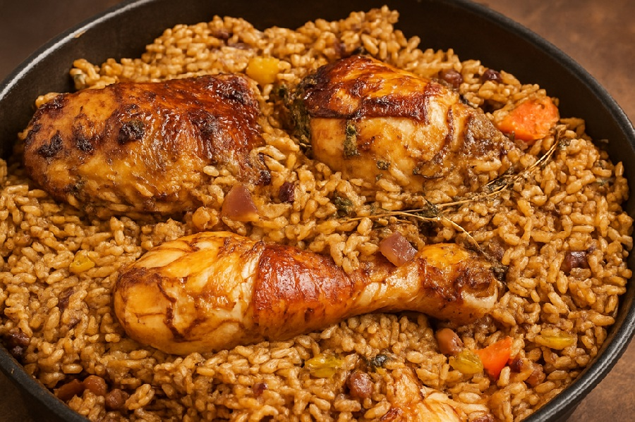

# Pelau

*Trinidad's one-pot national dish: chicken browned in burnt sugar till mahogany, then cooked down with rice, pigeon peas and coconut milk into a bronze pot.*

**Serves:** 6

**Prep Time:** 20 minutes (plus 30 minutes marinating)

**Cook Time:** 50 minutes

## Overview
Pelau is the Trinidadian one-pot, a meld of West African jollof technique with South Asian pilau influence and a uniquely Caribbean step: caramelising brown sugar in hot oil until it foams and turns dark mahogany, then dropping the seasoned chicken straight in so the meat takes on the colour and the slightly bitter-sweet edge of burnt sugar. This is the signature move of Trinidadian "browning" and it is what makes pelau pelau and not pilaf. Coconut milk, pigeon peas (gungo peas in some other islands), thyme, garlic and a whole Scotch bonnet finish the build. The rice cooks through the whole pot so it absorbs the chicken juices, coconut and burnt sugar, and the finished dish is mid-brown, glossy, mildly sweet, slightly spicy and packed with chicken on the bone. It is not difficult but the burnt-sugar step requires nerve: the sugar needs to go well past caramel into something that smells almost burnt, otherwise the pelau will be too sweet rather than savoury-deep. Cook in a heavy pot with a tight lid and resist stirring once the rice is in. Serve with coleslaw or a sharp green salad, a slick of pepper sauce and a slice of fried plantain.

## Ingredients

### Chicken and seasoning
- 1 kg bone-in, skin-on chicken thighs and drumsticks (cut into smaller pieces if large)
- 3 tbsp Caribbean green seasoning (or 2 tbsp blended garlic, thyme, parsley, chives and culantro)
- 1 tbsp soy sauce
- 1 tsp salt
- ½ tsp freshly ground black pepper
- ½ tsp ground allspice (pimento)

### Burnt sugar and aromatics
- 3 tbsp neutral oil
- 3 tbsp soft brown sugar
- 1 onion (medium, finely chopped)
- 4 garlic cloves (minced)
- 2 sprigs fresh thyme
- 1 Scotch bonnet pepper (whole, pricked once)

### Rice and beans
- 1 can (400 g) pigeon peas, drained and rinsed (or 200 g dried, soaked and cooked until tender)
- 400 g parboiled long-grain rice (rinsed until water runs clear)
- 400 ml coconut milk
- 400 ml chicken stock (or water)
- 1 carrot (medium, diced, optional but classic)
- 1 tsp salt (or to taste)
- 1 tbsp ketchup (optional, but traditional for colour and tang)

### To finish
- 2 spring onions (sliced)
- Small handful chopped fresh chadon beni (or coriander)

## Method

### Stage 1 - Season the chicken
1. Pat the chicken pieces dry. In a bowl, combine the chicken with the green seasoning, soy sauce, salt, pepper and allspice.
2. Mix well, rubbing the seasoning into the meat.
3. Leave to marinate 30 minutes at room temperature (or up to overnight in the fridge).

### Stage 2 - Burn the sugar
1. Heat the oil in a heavy, lidded pot (a Dutch oven is ideal) over medium-high heat.
2. Sprinkle the brown sugar evenly across the oil. Do not stir.
3. Watch carefully. The sugar will melt, foam and bubble. After 60-90 seconds it will turn from amber to deep mahogany brown and the foam will start to subside. The smell will go from caramel to slightly toasty-bitter. This is the moment.
4. Immediately add the marinated chicken pieces, skin-side down, with all their seasoning. Stand back; the pot will hiss aggressively.

### Stage 3 - Brown the chicken
1. Stir the chicken to coat in the burnt sugar. The pieces will take on a deep brown colour within 30-60 seconds.
2. Continue cooking 4-5 minutes, turning, until the chicken is browned all over.
3. Add the onion, garlic, thyme sprigs and whole Scotch bonnet. Cook 2-3 minutes until the onion softens.

### Stage 4 - Add rice and liquid
1. Stir in the drained pigeon peas and the carrot.
2. Add the rinsed rice; stir well so every grain is coated in the brown sauce.
3. Pour in the coconut milk and the stock. Add the salt and ketchup if using.
4. Bring to a vigorous simmer. Taste the liquid; it should taste slightly over-seasoned, as the rice will absorb it. Adjust salt now.

### Stage 5 - Cook the rice
1. Reduce heat to low. Cover with a tight-fitting lid.
2. Cook 25 minutes without lifting the lid. Do not stir.
3. After 25 minutes, lift the lid. The liquid should be absorbed; the rice should be tender and the pot should smell sweet and toasty. If there is still liquid pooling, cover and cook another 5 minutes.
4. Remove the Scotch bonnet (or chop it back in for the brave). Discard the thyme stems.

### Stage 6 - Rest and serve
1. Cover the pot with a clean tea towel under the lid and rest 10 minutes off the heat. The steam will redistribute and the rice will firm up.
2. Fluff gently with a fork. Scatter the spring onions and chadon beni or coriander across the top.
3. Serve straight from the pot.

## Notes
- **Burnt sugar is not caramel:** classic caramel stops at amber. For pelau, you want to take it past that point into the dark mahogany, just-before-acrid stage. If you stop at caramel the pelau will be too sweet; if you take it too far it will be bitter. Practice once or twice and you will know the smell.
- **Parboiled rice holds up best:** long-grain parboiled (sometimes labelled "easy-cook") is what most Trinidadian cooks use. It keeps separate grains under a long cook. Basmati works but will go slightly softer.
- **Don't pierce the Scotch bonnet hard:** one small prick or just dropping it in whole gives perfume without searing heat. A burst Scotch bonnet in the pot is a different (much hotter) dish.
- **Coconut milk:** full-fat tinned coconut milk gives the right richness; light coconut milk leaves the pelau watery.

## Variations
**Beef pelau:** Replace chicken with 800 g diced beef chuck. Add an extra 15-20 minutes' braise before adding the rice so the beef has time to tenderise.
**Lentil pelau:** Replace pigeon peas with cooked brown lentils, omit the meat, and use vegetable stock for a vegetarian version. Add a tablespoon of soy sauce for the umami the chicken would have provided.

## Serving
Serve with coleslaw or a sharp green salad with cucumber, a wedge of avocado, and fried sweet plantain on the side. A bottle of homemade pepper sauce on the table is non-negotiable. Macaroni pie often appears alongside on Sundays.

## Storage
- Keeps 3 days refrigerated. The flavour deepens overnight.
- Reheat in a covered pan with 2-3 tbsp of water to revive the rice; do not microwave for long or the rice dries out.
- Freezes up to 2 months. Defrost overnight in the fridge and reheat gently.
