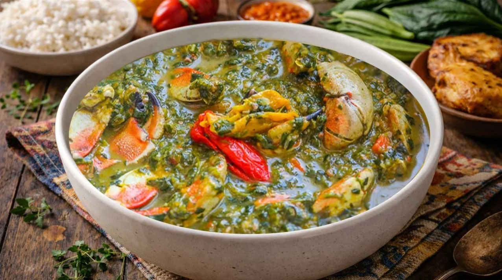

# Trinidadian Callaloo

*Trinidad's signature greens: a thick green soup-stew of dasheen bush (or spinach) cooked down with okra, coconut milk, garlic, onion, thyme, Scotch bonnet and crab or salt meat. The Sunday-lunch staple alongside macaroni pie, stewed chicken and rice that defines the Trini midday table.*

**Serves:** 6

**Prep Time:** 25 minutes

**Cook Time:** 50 minutes

## Overview
Callaloo is Trinidad's most beloved Sunday-lunch side: dasheen leaves cooked down with sliced okra, coconut milk, garlic, onion, fresh thyme, Scotch bonnet and either crab or salt meat into a thick green stewed-down side. Spooned over rice or served in a small bowl alongside macaroni pie, stewed chicken and the rest of the Trini Sunday spread. Related to but distinct from Jamaican callaloo (amaranth, breakfast side) and Haitian lalo (sometimes jute leaves); the Trinidadian version is properly thick, coconut-rich and umami-heavy. Dasheen bush is traditional; taro leaves, Caribbean amaranth or fresh spinach substitute. Don't use kale or collards; the texture is wrong. The okra is the natural thickener and the slime is part of the dish's character; skipping it gives thin watery callaloo. Crab is the celebration version, salt meat the everyday one.

## Ingredients

### Greens and aromatics
- 500 g fresh dasheen leaves (or 500 g fresh spinach, or 400 g frozen taro leaves)
- 200 g fresh okra (sliced into 1 cm rounds)
- 1 large onion (finely chopped)
- 6 garlic cloves (crushed)
- 1 large bunch fresh thyme (8 sprigs; or 1 tablespoon dried)
- 1 small bunch fresh chive or scallion (about 6 spring onions; finely sliced)
- 1 small Scotch bonnet pepper (whole, pricked once with a fork; remove after cooking)
- 1 large green seasoning bouquet (or 2 tablespoons of mixed chopped herbs: parsley, shadon beni, coriander)

### Protein (choose one or both)
- 200 g salt pork or salt beef (rinsed, cubed; soaked in cold water 1 hour to remove excess salt, drained); OR
- 1 small whole crab (about 400 g, cleaned, broken into pieces); OR
- 300 g smoked turkey wings (chopped into 4 cm pieces)

### Liquid
- 400 ml coconut milk (1 tin)
- 400 ml chicken stock (or water)

### Cooking
- 3 tablespoons vegetable oil
- 1 teaspoon fine sea salt (taste before adding; salt pork is already salty)
- ½ teaspoon ground black pepper
- 30 g butter (to finish)

## Method

### Stage 1 - Prepare the greens
1. Wash the dasheen leaves (or spinach) thoroughly; the leaves often hold sand.
2. Strip the central rib from each dasheen leaf (the rib is fibrous; spinach has tender ribs and can be left).
3. Roughly chop the leaves into 4 cm pieces.
4. Set aside.

### Stage 2 - Render the salt meat (if using)
1. Place the soaked cubed salt pork (or beef) in a large heavy saucepan.
2. Cover with cold water; bring to a boil.
3. Boil 10 minutes to draw out excess salt; drain.

### Stage 3 - Sauté the aromatics
1. Heat the vegetable oil in the same pan over medium heat.
2. Add the chopped onion; cook 5-6 minutes till soft.
3. Add the crushed garlic; cook 30 seconds.
4. Add the salt pork (if using), the smoked turkey (if using) and the bunch of thyme; cook 3 minutes till the meat starts to brown and the pan is fragrant.

### Stage 4 - Add the okra and greens
1. Tip in the sliced okra; cook 2 minutes (the okra starts to release its mucilage; this is the thickener).
2. Add the chopped dasheen (or spinach); tip into the pan in batches if needed. The greens will quickly wilt down.
3. Add the chopped chives, the green seasoning and the whole Scotch bonnet.

### Stage 5 - Add liquid and simmer
1. Pour in the coconut milk and chicken stock.
2. Bring to a simmer.
3. If using crab: add the crab pieces now.
4. Cover with the lid slightly ajar.
5. Simmer 35-40 minutes till the greens have broken down completely and the callaloo is thick and stew-like.

### Stage 6 - Finish and adjust
1. Lift out the Scotch bonnet (discard).
2. Lift out the thyme sprigs (discard the woody stems; pick off any remaining leaves into the pan).
3. If you want a smoother callaloo (the Trinidadian preference is for some texture, not fully smooth): use an immersion blender briefly to break down the greens further; or leave as is for chunkier texture.
4. Taste; add salt and pepper as needed.
5. Stir in the butter for a glossy finish.

### Stage 7 - Serve
1. Spoon into a serving bowl or alongside rice and a main dish.
2. Serve warm; callaloo is a side, not a main course.

## Notes
- **Dasheen leaves are traditional; spinach is the workable substitute:** if you can find frozen taro leaves at an Asian market or fresh dasheen at a Caribbean market, use them. Spinach is a thoroughly acceptable substitute; the flavour is slightly different but the dish is good.
- **Don't skip the okra:** sliced okra is the natural thickener; without it, callaloo is thin and watery. The slight slime is part of the dish.
- **Coconut milk gives the proper Trinidadian profile:** the coconut adds richness and a faint tropical note; don't substitute with cream or milk.
- **Salt meat or smoked turkey for umami:** both give the traditional umami backbone. Vegetarians can substitute with 2 tablespoons of dark soy sauce and 1 teaspoon of smoked paprika for a similar profile.
- **Stew it down properly:** Trinidadian callaloo is not just-wilted greens; it's a properly stewed-down side, cooked 35-40 minutes till the greens break down completely. Don't undercook.

## Variations
- **Crab callaloo:** the celebration version, often made with 2-3 small whole blue crabs cleaned and broken into pieces; gives proper marine sweetness.
- **Vegan callaloo:** swap the meat for 2 tablespoons of dark soy sauce, 1 teaspoon of smoked paprika and a teaspoon of mushroom seasoning; cook the same way. The umami profile is different but the dish works.
- **Pumpkin callaloo:** add 200 g of cubed pumpkin (West Indian pumpkin or butternut squash) along with the okra; the pumpkin breaks down into the callaloo and adds sweetness.
- **Coconut-heavier version:** double the coconut milk; gives a richer creamier callaloo. Common variation in southern Trinidad.

## Serving
- In a small bowl alongside the Trini Sunday lunch: stewed chicken, macaroni pie, peas-and-rice, fried plantain. Or spooned over plain white rice as a quick lunch. Sometimes served as a thick soup with a piece of crusty bread. Drink: a tall glass of sorrel; or cold Carib beer.

## Storage
- Keeps refrigerated 4 days; the flavour deepens noticeably overnight.
- Reheat gently in a covered pan with a splash of water (or in the microwave covered).
- Freezes 3 months in portioned containers; defrost in the fridge and reheat gently.
- Don't reheat aggressively; the coconut milk can split.
- Day-old callaloo is excellent stirred through rice or used as a filling for fish wraps.
