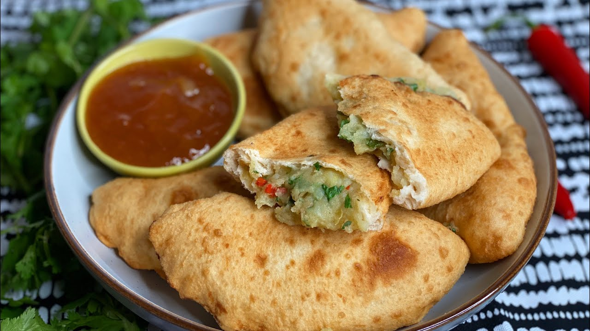

# Aloo Pie

*Trinidad's street empanada: a fried turnover of yeasted flour-dough filled with spiced curried potato mash, served warm with shadon beni chutney and tamarind sauce. The pocket-friendly portable snack from every Trini doubles stall, eaten standing up with a paper napkin and zero plates.*

**Serves:** 6 (makes 12 aloo pies)

**Prep Time:** 50 minutes (plus 1 hour dough rise)

**Cook Time:** 40 minutes

## Overview
Aloo pie is Trinidad's beloved street empanada: a close cousin of the Indian samosa but distinctively Trini in its bread-like fried outer shell and its spiced potato filling. A yeasted bread-flour dough is rolled into circles, filled with a spiced curried potato mash (boiled potato mashed with sautéed onion, garlic, ginger, geera, turmeric, Scotch bonnet, shadon beni and lime), folded into half-moons and deep-fried till the outside puffs golden and the inside stays soft. Turns up at every doubles cart and Indian-Trini snack stall in Port of Spain, San Fernando and across the islands; the slightly more substantial sibling of doubles, eaten with the same sauces. The dough is yeasted but only briefly risen, which gives a slightly puffy fried shell that sits between bread and pastry. The potato filling wants some texture (slightly chunky mash rather than smooth purée). Fried hot at 175°C so the pies puff and turn deep golden without absorbing oil. Served with shadon beni chutney, tamarind and a dot of pepper sauce.

## Ingredients

### Dough
- 500 g plain flour
- 7 g instant dried yeast (1 sachet)
- 1 teaspoon caster sugar
- 1 teaspoon fine sea salt
- 30 g butter or shortening (softened)
- 280 ml warm water
- Vegetable oil for deep-frying

### Aloo filling
- 700 g potato (peeled, cubed; floury varieties like Russet or Maris Piper are best)
- 2 tablespoons vegetable oil
- 1 medium onion (finely chopped)
- 4 garlic cloves (crushed)
- 1 thumb (2 cm) fresh ginger (finely grated)
- 1 small Scotch bonnet pepper (deseed for milder; finely chopped)
- 1 tablespoon ground geera (toasted cumin)
- 1 teaspoon ground turmeric
- 1 teaspoon garam masala
- ½ teaspoon ground coriander
- 1 ½ teaspoons fine sea salt
- 1 large handful fresh coriander (finely chopped)
- 1 large handful shadon beni (or extra coriander; finely chopped)
- 2 spring onions (finely sliced)
- 1 tablespoon fresh lime juice

### To serve
- Shadon beni chutney ([doubles](doubles.md))
- Tamarind sauce (see doubles recipe)
- Mango chutney (optional)
- Hot pepper sauce (optional)

## Method

### Stage 1 - Make the dough
1. In a wide bowl, whisk together the flour, yeast, sugar and salt.
2. Rub in the butter (or shortening) till the mixture resembles coarse crumbs.
3. Pour in the warm water; stir to combine.
4. Knead for 5-7 minutes till smooth and elastic.
5. Place in an oiled bowl; cover with a damp cloth; let rise 1 hour at room temperature till doubled.

### Stage 2 - Cook the potatoes
1. Place the cubed potato in a saucepan with cold water and 1 teaspoon of salt.
2. Bring to a boil; cook 15-18 minutes till soft but not falling apart.
3. Drain thoroughly; tip back into the warm pan.
4. Let dry out over very low heat for 1 minute (removes excess moisture).
5. Mash with a fork or potato masher to a slightly chunky consistency; don't go smooth.

### Stage 3 - Make the aloo filling
1. Heat the vegetable oil in a wide frying pan over medium heat.
2. Add the chopped onion; cook 5-6 minutes till soft.
3. Add the crushed garlic, grated ginger and chopped Scotch bonnet; cook 1 minute.
4. Add the geera, turmeric, garam masala and ground coriander; toast 30 seconds till fragrant.
5. Add the mashed potato; stir to coat in the spiced onion mixture.
6. Add the salt; mix well.
7. Take off the heat; stir in the chopped coriander, shadon beni, sliced spring onions and lime juice.
8. Taste; adjust salt and lime.
9. Let cool to room temperature; the filling firms up as it cools.

### Stage 4 - Shape the aloo pies
1. Knock back the risen dough; divide into 12 equal pieces (about 65 g each).
2. Roll each piece into a ball.
3. Working one at a time (keep the rest covered with a damp cloth), flatten one ball with your hand into a circle about 12 cm across and 4 mm thick.
4. Place 1 heaping tablespoon of the aloo filling in the centre.
5. Fold the dough over to make a half-moon shape.
6. Pinch the edges together to seal; you can crimp with a fork.
7. Place on a tray lined with parchment.
8. Repeat with the remaining dough and filling.

### Stage 5 - Heat the oil
1. Pour vegetable oil into a deep heavy saucepan to a depth of 7-8 cm.
2. Heat to 175°C (350°F).

### Stage 6 - Deep-fry
1. Lower 3-4 aloo pies into the hot oil; don't overcrowd.
2. Fry for 2-3 minutes per side till deep golden and slightly puffed.
3. Lift out with a slotted spoon; drain on kitchen paper.
4. Fry the remaining pies in batches.

### Stage 7 - Serve immediately
1. Pile the warm pies on a plate.
2. Serve with small bowls of shadon beni chutney and tamarind sauce.
3. Eat with the hands; dip each bite in the sauces.

## Notes
- **Yeasted dough, not pastry:** the proper aloo pie has a bread-like dough that puffs slightly when fried; this is different from samosa pastry (which is more biscuit-like). The 1-hour rise gives the puffy character.
- **Chunky potato, not smooth:** slightly chunky mash gives the proper filling texture. Smooth purée gives a mushy filling.
- **Cool the filling before assembling:** warm filling melts the dough seam and the pies open during frying. Properly cool (room temperature or fridge-cold) filling holds the seam.
- **175°C oil, not hotter:** too hot and the outside browns before the filling warms; too cool and the dough absorbs oil. 175°C with the dough-drop test is right.
- **Make the filling ahead:** the filling is better the day after; the spices develop and the herbs infuse.

## Variations
**Channa-and-aloo pie:** mix 100 g of cooked chickpeas into the potato filling; gives extra protein and texture. Common Trinidadian variation.
**Spinach aloo pie:** add 100 g of cooked drained spinach (squeezed dry, chopped) to the filling; gives a green-flecked version with extra freshness.
**Baked aloo pie:** brush with beaten egg and bake at 200°C / 400°F for 20 minutes till golden; less traditional but lower-fat. The texture is more bread-roll than fried.
**Mini aloo pies:** make 20 smaller pies (35 g each); gives bite-sized canapés.

## Serving
On a paper plate or in a paper napkin (the proper Trini street-stall style); 2 per person as a snack; 3-4 as a meal. Drink: cold mauby; sorrel; or Carib beer. Eaten standing up at the doubles cart; or sitting at a kitchen table with a cup of strong sweet tea.

## Storage
- Best eaten warm and fresh; the dough hardens as it cools.
- Keeps refrigerated 3 days; reheat in a hot oven (180°C / 350°F) for 6-8 minutes till the outside crisps again, or in an air fryer at 180°C for 4 minutes.
- Don't microwave; the dough goes rubbery.
- The filling keeps refrigerated 4 days; flavour deepens.
- The unfried pies freeze 2 months; freeze flat on a tray, then transfer to a bag. Fry from frozen at 170°C for 5-6 minutes.
