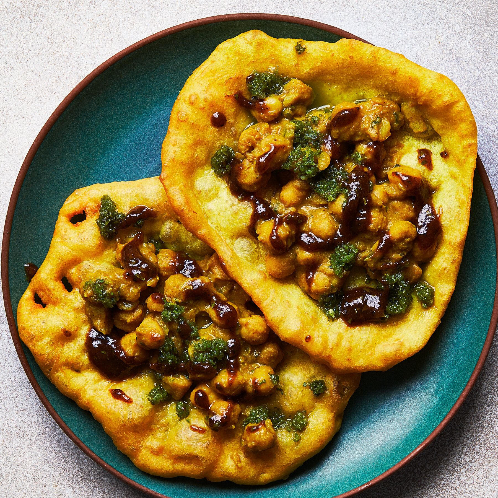

# Doubles

*Trinidad's iconic street breakfast: two soft yellow turmeric-spiced fried flatbreads (bara) sandwiching a curried chickpea filling (channa), with shadon beni chutney, mango chutney and Scotch bonnet pepper sauce. The Trini classic eaten morning-of from every street corner cart in Port of Spain.*

**Serves:** 4 (2 doubles per person)

**Prep Time:** 35 minutes (plus 2 hours for the bara dough to rise)

**Cook Time:** 45 minutes

## Overview
Doubles is the iconic Trinidadian breakfast and one of the most popular street foods of the Caribbean: two soft, yellow, turmeric-spiced fried flatbreads (called "bara") sandwiching a generous spoonful of spiced curried chickpea filling (called "channa"), dressed with the canonical Trinidadian condiments of shadon beni chutney (green herby), tamarind sauce (sweet-sour), mango chutney (sweet-spicy) and hot pepper sauce (fiery Scotch bonnet); the whole sandwich is folded in greaseproof paper and eaten from the hand. The dish was brought to Trinidad by Indian indentured workers in the 19th century and has evolved into a thoroughly Trinidadian breakfast eaten by everyone on the island regardless of background. The name comes from the fact that two bara are used per serving (rather than one); a "single" with one bara would be unusual. Three details define proper doubles. First, the bara. The flatbread is soft (not crispy), yellow from turmeric, slightly puffy, and goes pillowy when split. The dough is yeasted and leavened with both yeast and baking powder, fried briefly in hot oil. Don't substitute with regular bread or roti; the doubles experience is the soft turmeric bara. Second, the channa. The chickpea filling is properly spiced (cumin, coriander, turmeric, garlic, ginger, Scotch bonnet) and properly textured (the chickpeas are partially mashed, partially whole, giving a chunky-soft consistency). It's not a dry curry; the channa should be slightly wet, with the sauce clinging to the chickpeas. Third, all the condiments. Shadon beni chutney (vivid green, herby), tamarind sauce (dark, sweet-sour), mango chutney (orange, sweet-tart) and pepper sauce (red, fiery). A Trinidadian asks "with everything" or names specific ones; the proper experience uses all of them.

## Ingredients

### Bara (the flatbread)
- 500 g plain flour
- 7 g instant dried yeast (1 sachet)
- 1 teaspoon caster sugar
- 1 teaspoon fine sea salt
- 1 ½ teaspoons ground turmeric
- 1 teaspoon ground cumin
- 2 teaspoons baking powder
- 30 g unsalted butter (or shortening; softened)
- 280 ml warm water
- Vegetable oil for frying (about 1 litre)

### Channa (the chickpea filling)
- 400 g dried chickpeas (soaked overnight, drained); or 2 large cans cooked chickpeas (drained, rinsed)
- 2 tablespoons vegetable oil
- 1 large onion (finely chopped)
- 6 garlic cloves (crushed)
- 1 thumb (3 cm) fresh ginger (finely grated)
- 1 small Scotch bonnet pepper (deseed for milder; whole if you want to remove later)
- 1 tablespoon ground cumin
- 1 tablespoon ground coriander
- 1 tablespoon ground turmeric
- 1 teaspoon garam masala
- 1 teaspoon ground fenugreek (optional but very Trini)
- 1 ½ teaspoons fine sea salt
- 600 ml water (more or less to taste)
- 2 tablespoons fresh coriander (chopped, to finish)

### Shadon beni chutney (see bake-and-shark for fuller version; quick version here)
- 1 large bunch shadon beni or coriander
- 4 garlic cloves
- 1 small Scotch bonnet pepper
- 3 tablespoons fresh lime juice
- 3 tablespoons water
- 1 teaspoon salt

### Tamarind sauce
- 60 g tamarind paste
- 40 g brown sugar
- 80 ml water
- ½ small Scotch bonnet pepper
- ½ teaspoon salt

### Mango chutney (or use shop-bought)
- 1 ripe mango (peeled, finely diced)
- 30 g caster sugar
- 1 tablespoon fresh lime juice
- 1 small Scotch bonnet pepper (deseeded, finely chopped)
- ¼ teaspoon ground cumin

### Hot pepper sauce
- 4 Scotch bonnet peppers (deseed for milder; whole for fierce)
- 6 garlic cloves
- 4 tablespoons fresh lime juice
- 100 ml white vinegar
- 1 teaspoon salt
- 1 teaspoon sugar

## Method

### Stage 1 - Cook the chickpeas
1. If using dried, drained-soaked chickpeas: place in a large pot; cover with cold water by 5 cm.
2. Bring to a boil; reduce to a simmer; cook 1 hour till the chickpeas are tender but not falling apart.
3. Drain (reserve 200 ml of the cooking water).
4. If using canned chickpeas, skip this step; drain and rinse and proceed.

### Stage 2 - Make the channa
1. Heat the vegetable oil in a large saucepan over medium heat.
2. Add the chopped onion; cook 5-6 minutes till soft and translucent.
3. Add the crushed garlic and grated ginger; cook 1 minute.
4. Add the Scotch bonnet (whole or chopped); cook 30 seconds.
5. Add the cumin, coriander, turmeric, garam masala and fenugreek; toast 1 minute till fragrant.
6. Add the chickpeas; stir to coat in the spices.
7. Add the salt and 600 ml of water (use the reserved chickpea cooking water if you have it).
8. Bring to a low simmer.
9. Cook 30 minutes, stirring occasionally; partially mash some of the chickpeas with the back of a wooden spoon to thicken the sauce.
10. The channa should be slightly wet and chunky-soft.
11. Take off the heat; stir in the chopped coriander.

### Stage 3 - Make the bara dough
1. In a wide bowl, whisk together the flour, yeast, sugar, salt, turmeric, cumin and baking powder.
2. Rub in the softened butter till the mixture resembles coarse crumbs.
3. Pour in the warm water; stir to combine.
4. Knead in the bowl or on a lightly floured surface for 5-7 minutes till smooth and elastic.
5. Place in an oiled bowl; cover with a damp cloth; let rise 1.5-2 hours at room temperature till doubled.

### Stage 4 - Make the condiments
1. Blitz all the shadon beni chutney ingredients in a food processor; transfer to a bowl.
2. Make the tamarind sauce: combine all ingredients in a saucepan; simmer 5 minutes till thickened.
3. Make the mango chutney: combine all ingredients in a saucepan; cook 8-10 minutes till the mango breaks down and the mixture thickens.
4. Make the pepper sauce: blitz all ingredients in a food processor till smooth; pour into a jar.

### Stage 5 - Shape and fry the bara
1. Knock back the risen dough.
2. Divide into 16 equal pieces (about 50 g each); these are smaller than bake-and-shark bakes.
3. Shape each piece into a small ball; flatten gently with your hand into a thin disc about 12 cm across and 3 mm thick.
4. Heat 2 cm of oil in a heavy frying pan to 175°C (350°F).
5. Fry each bara 30-45 seconds per side till lightly golden and puffed; you want soft and slightly puffed, not crispy.
6. Drain on kitchen paper; keep warm.

### Stage 6 - Assemble each doubles
1. Place one warm bara on a square of greaseproof paper.
2. Spoon 2-3 tablespoons of the warm channa onto the bara.
3. Drizzle with shadon beni chutney, a smaller drizzle of tamarind, a smaller drizzle of mango chutney, and a tiny dot of pepper sauce (or to taste).
4. Top with a second warm bara.
5. Fold the greaseproof paper around it like a small package.
6. Serve immediately.

## Notes
- **Soft bara, not crispy:** doubles bara is meant to be soft and slightly puffy. Fry briefly (30-45 seconds per side) and don't go for deep brown colour. Crispy fried bara is wrong for doubles.
- **Channa slightly wet, not dry:** the chickpea filling should have some liquid still clinging to it. Partially mashing some chickpeas thickens the sauce and gives the proper chunky-soft texture.
- **All four condiments:** the proper Trinidadian doubles uses all four (shadon beni, tamarind, mango, pepper). Trinidadians ask "with everything" or specify quantities; the experience is the layering.
- **Smaller dough portions than for bake-and-shark:** doubles bara is about 50 g per piece (vs. 125 g for bake-and-shark). The smaller size means thinner faster-frying bread that goes pillowy soft.
- **Make the channa the day before:** the spices develop and the chickpeas absorb more flavour overnight. Doubles is often made by the cart vendor the day before and served fresh in the morning.

## Variations
**Aloo doubles:** swap the chickpea filling for spiced curried potato; common Trini variation.
**Beans doubles:** swap chickpeas for cooked red kidney beans (Trinidad-style); slightly different flavour.
**Cucumber and lettuce doubles:** add a few thin cucumber slices and shredded lettuce inside; some street vendors do this.
**Curried channa-and-aloo:** mix half chickpeas and half cubed potato in the channa; common in northern Trinidad.

## Serving
Wrapped in greaseproof paper, eaten from the hand. 2 per person for breakfast; 1 per person as a snack. Drink: cold mauby (a Trinidadian bittersweet bark drink); Sorrel (hibiscus drink); or strong sweet black tea.

## Storage
- The channa keeps refrigerated 5 days; the flavour deepens noticeably overnight. Freezes 3 months.
- The bara is best eaten fresh and warm; doesn't reheat well (it goes leathery).
- All condiments keep refrigerated 1-2 weeks.
- The unfried bara dough keeps refrigerated 24 hours after the first rise; shape and fry as needed.
- Day-old fried bara can be re-warmed briefly in a hot oven (180°C / 350°F) for 2-3 minutes if you must.
