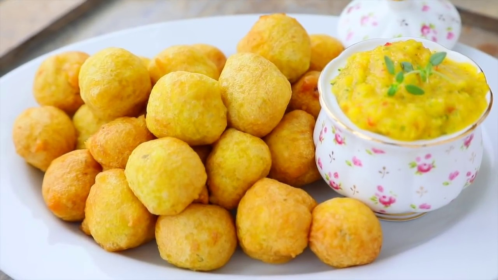

# Pholourie

*Trinidad's spiced fritter: small golden balls of split-yellow-pea or chickpea-flour batter, fried till crisp outside and tender inside, served with mango chutney and tamarind sauce. The classic Trinidadian street snack and party-table appetiser eaten by the dozen at every Indo-Trini family gathering.*

**Serves:** 6 (makes about 30 fritters)

**Prep Time:** 20 minutes (plus 30 minutes batter rest)

**Cook Time:** 25 minutes

## Overview
Pholourie is one of Trinidad's most beloved snacks, brought to the island by Indian indentured workers in the 19th century from the bhajia and pakora tradition of South Asia, and now thoroughly Trinidadian: small golden balls of batter (typically a mix of chickpea flour and split pea flour, with garlic, ginger, scallions, turmeric, cumin and ground geera) deep-fried till crisp outside and tender inside, served piping hot with the canonical Trini dipping sauces of mango chutney and tamarind sauce. The dish turns up at every Indo-Trinidadian wedding, Hindu prayer ceremony, christening party, lime (informal social gathering) and big family Sunday; bowls of pholourie with the orange and brown sauces appear on the table and disappear in 20 minutes. Three details define proper pholourie. First, the batter must rest properly. The 30-minute rest allows the chickpea flour to hydrate fully and the leavening (baking powder or yeast) to start working; skipping it gives dense doughy fritters. Second, the spice mix is key: turmeric for colour, geera (toasted ground cumin) for warmth, garlic and ginger for aromatic base, scallions for sharp green notes, and Scotch bonnet for the canonical Trini heat. Third, the dipping sauces are non-negotiable. Mango chutney (sweet-sour-spicy, vivid orange) and tamarind sauce (sweet-sour, dark brown) provide the two flavour bridges that make pholourie work. Without them, the fritters are pleasant but unremarkable.

## Ingredients

### Pholourie batter
- 250 g chickpea flour (besan; also called gram flour)
- 150 g split-yellow-pea flour (or use more chickpea flour if you can't find split pea)
- 1 teaspoon baking powder
- ½ teaspoon baking soda
- 1 ½ teaspoons fine sea salt
- 1 teaspoon ground turmeric
- 1 tablespoon ground geera (toasted cumin)
- ½ teaspoon ground black pepper
- 4 garlic cloves (finely crushed)
- 1 thumb (3 cm) fresh ginger (finely grated)
- 4 spring onions (finely sliced, white and pale green parts)
- 1 small Scotch bonnet pepper (deseeded, finely chopped; or 2 finely chopped jalapeños)
- 1 large handful fresh coriander (finely chopped)
- 3 tablespoons green seasoning (or 2 tablespoons of chopped parsley + thyme)
- 350-400 ml warm water (start with 350, add more if needed)
- Vegetable oil for deep-frying

### Mango chutney
- 2 ripe mangoes (peeled, finely diced)
- 80 g caster sugar
- 2 tablespoons fresh lime juice
- 1 small Scotch bonnet (deseeded, finely chopped)
- ½ teaspoon ground cumin
- 1 teaspoon salt
- 2 tablespoons water

### Tamarind sauce
- 80 g tamarind paste (or 100 g concentrate)
- 50 g brown sugar
- 120 ml water
- 1 small Scotch bonnet (deseeded)
- 1 teaspoon salt
- ½ teaspoon ground cumin

## Method

### Stage 1 - Mix the batter
1. In a wide bowl, whisk together the chickpea flour, split pea flour, baking powder, baking soda, salt, turmeric, geera and black pepper.
2. Stir in the crushed garlic, grated ginger, sliced spring onions, chopped Scotch bonnet, chopped coriander and green seasoning.
3. Add 350 ml of warm water; whisk to a smooth batter. The consistency should be like a thick pancake batter; thick enough to drop from a spoon but not heavy.
4. If the batter is too stiff, add more water 1 tablespoon at a time.
5. Cover with a damp cloth; let rest 30 minutes (the chickpea flour hydrates and the leavening starts working; the batter goes lighter and slightly bubbly).

### Stage 2 - Make the mango chutney
1. Combine all chutney ingredients in a saucepan over medium heat.
2. Cook 10-12 minutes, stirring frequently, till the mango breaks down and the chutney thickens to a jammy consistency.
3. Taste; adjust salt and lime.
4. Transfer to a serving bowl; cool to room temperature.

### Stage 3 - Make the tamarind sauce
1. Combine tamarind, brown sugar and water in a saucepan; bring to a simmer.
2. Cook 5 minutes till the sugar dissolves and the sauce thickens slightly.
3. Add the Scotch bonnet (finely chopped), salt and cumin; cook 1 minute more.
4. Strain through a sieve for a smoother sauce (optional).
5. Transfer to a serving bowl.

### Stage 4 - Heat the oil
1. Pour vegetable oil into a deep heavy saucepan to a depth of 7-8 cm.
2. Heat over medium-high heat till 175°C (350°F).
3. Test with a small spoonful of batter: it should rise immediately to the surface and brown in 90 seconds.

### Stage 5 - Fry the fritters
1. Using a wet spoon or wet hands, drop heaping teaspoons of batter into the hot oil; don't overcrowd.
2. The batter balls should puff up and float to the surface; turn them gently with a slotted spoon so they brown evenly.
3. Fry for 3-4 minutes till deep golden-brown all over.
4. Lift out with a slotted spoon; drain briefly on kitchen paper.
5. Continue with the remaining batter in batches.

### Stage 6 - Serve immediately
1. Pile the hot fritters in a serving bowl.
2. Place the mango chutney and tamarind sauce alongside.
3. Eat while hot and crisp; pholourie loses its texture rapidly as it cools.
4. Dip into both sauces; the proper Trini way is to dip one fritter in mango and the next in tamarind.

## Notes
- **Rest the batter:** 30 minutes is essential. The chickpea flour needs to hydrate, the leavening needs to start working, and the spices need to infuse. Don't try to skip.
- **Don't overcrowd the oil:** dropping too many fritters at once drops the oil temperature and gives greasy under-cooked pholourie. Fry in batches of 8-10.
- **Crisp outside, tender inside:** properly fried pholourie has a crisp golden shell and a tender slightly fluffy interior. Underfried gives raw centres; overfried gives dry hard fritters.
- **Both sauces:** mango (sweet) and tamarind (sour) is the canonical pairing. One sauce alone is half the experience.
- **Use both flours if you can:** the chickpea flour is the base; the split pea flour adds a slightly different texture and depth. Pure chickpea flour works but is less.

## Variations
**Pumpkin pholourie:** add 100 g of finely grated raw pumpkin to the batter; gives orange-flecked pholourie with extra moisture.
**Sahina (related leafy version):** swap the batter approach for callaloo leaves dipped in seasoned chickpea batter and fried; called sahina, a related Trinidadian fritter.
**Mini pholourie:** make smaller balls (½ teaspoon batter each); gives bite-sized canapés. Common at parties.
**Spicier:** double the Scotch bonnet in both the batter and the chutney; serve with extra-hot pepper sauce. Properly fierce Trini version.

## Serving
In a bowl with toothpicks (or just hands); two small bowls of mango chutney and tamarind sauce alongside. As a snack, appetiser, or party food. Drink: Carib beer, sorrel juice, or strong sweet black tea. Often appears at the start of a Trini Sunday meal alongside curried-channa-and-aloo and roti.

## Storage
- Best eaten immediately while hot and crisp.
- Keep refrigerated 2 days in a sealed container; reheat in a hot oven (180°C / 350°F) for 5-6 minutes or in an air fryer at 180°C for 3-4 minutes to refresh.
- Don't microwave; they go limp and rubbery.
- The unfried batter keeps refrigerated 24 hours; whisk to redistribute before frying.
- Both sauces keep refrigerated 2 weeks.
- Frozen pholourie don't refresh well; eat fresh.
