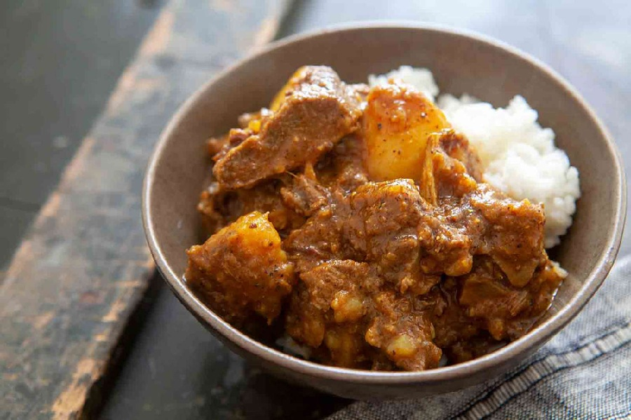

# Trinidadian Curry Goat

*The Sunday curry, the wedding curry, the rum-shop curry. Bone-in goat marinated in Caribbean green seasoning, then bunjayed down with Trinidadian curry powder and a whole Scotch bonnet until the meat slides off the bone and the gravy clings dark and golden. Roti on one side, white rice on the other.*

**Serves:** 6

**Prep Time:** 20 minutes (plus 2 hours marinating)

**Cook Time:** 1 hour 45 minutes

## Overview
Trinidadian curry goat sits in a quiet rivalry with Jamaican curry goat, but the two are different dishes. Jamaican curry goat is built on Madras-style curry powder, scotch bonnet and allspice with little coconut and a wetter finish. Trinidadian curry goat is built on a fresh blend of green seasoning (a herb-and-aromatic puree of culantro, thyme, garlic, chives and onion), Caribbean curry powder (which leans heavily on amchar masala and roasted geera), and the bunjay technique of frying the curry paste in oil until it splits before the meat goes in. The result is a darker, herbier, drier curry that hugs the bone rather than pooling around it. Kid goat is the preferred meat; older mutton-goat works but takes longer. UK home cooks can usually find kid goat at Caribbean butchers, Halal butchers and many Asian supermarkets in the chilled or frozen section. Bone-in pieces are essential for flavour and gelatin. Lamb shoulder on the bone makes an honest substitute. Difficulty is low to moderate; the cook is mostly long and passive once the curry is bunjayed. Serve with paratha-style "buss-up-shut" roti, dhalpuri roti, white rice, or coconut rice.

## Ingredients

### Goat and marinade
- 1.3 kg bone-in kid goat (or lamb shoulder), cut into 4-5 cm pieces
- 1 lime (juiced)
- 3 tbsp Caribbean green seasoning
- 1 tsp salt
- ½ tsp freshly ground black pepper

### Curry paste
- 4 tbsp Caribbean curry powder (Chief or Turban brand if available)
- 1 tsp ground turmeric
- 1 tsp ground roasted geera (cumin)
- 1 tsp anchar masala (or garam masala)
- 6 tbsp water

### Pot
- 4 tbsp neutral oil
- 1 onion (large, finely chopped)
- 8 garlic cloves (minced)
- 25 g fresh ginger (grated)
- 2 sprigs fresh thyme
- 1 Scotch bonnet (pricked once, whole)
- 1 tomato (medium, grated, optional)
- 600-800 ml water (or light stock)
- 2 potatoes (medium, peeled and quartered, optional)
- Salt, to taste
- Small handful chopped chadon beni (or coriander), to finish

## Method

### Stage 1 - Wash and marinate
1. Place the goat pieces in a large bowl. Pour over the lime juice and add enough cold water to cover. Swish and drain. This is the Caribbean wash; it removes any blood and game.
2. Pat the meat dry and return to the bowl. Add the green seasoning, salt and pepper. Mix well, rubbing the seasoning into every piece.
3. Cover and refrigerate at least 2 hours, ideally overnight.

### Stage 2 - Mix the curry paste
1. In a small bowl, stir the curry powder, turmeric, roasted geera and anchar masala with the 6 tbsp water to make a loose paste. Set aside.

### Stage 3 - Bunjay the curry
1. Heat the oil in a heavy, lidded pot over medium heat.
2. Add the onion and cook 4-5 minutes until soft.
3. Stir in the garlic, ginger, thyme and whole Scotch bonnet. Cook 1 minute.
4. Pour in the curry paste. Stir constantly for 2-3 minutes. The paste will sputter, then the oil will start to separate around the edges and the colour will darken from yellow to a deeper rust-orange. This is the bunjay step and it is the most important moment in the cook.
5. Add the grated tomato if using and cook another minute.

### Stage 4 - Sear the goat
1. Increase the heat to medium-high. Add the marinated goat with all its seasoning.
2. Stir to coat every piece in the curry paste. The meat will release its juices.
3. Cook 5-6 minutes, stirring, until the meat changes colour all over and the pan juices reduce by half.

### Stage 5 - Braise
1. Add enough water (600-800 ml) to come about ¾ of the way up the meat. Bring to a simmer.
2. Cover and braise on low heat for 1 ¼ to 1 ½ hours, stirring every 20-25 minutes, until the goat is fork-tender and pulls easily from the bone. Kid goat usually takes 1 ¼ hours; older goat or mutton wants 1 ¾ to 2 hours.
3. If you are adding potatoes, drop them in for the final 25 minutes.

### Stage 6 - Finish
1. Uncover and check the gravy. It should cling rather than swim; if too loose, raise the heat and reduce 5-10 minutes. If too thick, splash in more water.
2. Discard the thyme stems and Scotch bonnet (or chop a little of it back in if you want extra heat).
3. Taste for salt. Scatter chadon beni or coriander over the top.

## Notes
- **Bone-in goat:** the bones are where the flavour and the body of the gravy come from. Boneless goat curry is a different (thinner) dish. Lamb shoulder is the closest substitute if goat is unavailable.
- **Bunjay properly:** if you add the meat before the curry paste has split (oil separating, colour darkened), the curry will taste raw and chalky no matter how long it cooks. Two to three minutes of patient stirring at the start saves you everything later.
- **Scotch bonnet whole, not chopped:** a whole pricked scotch bonnet gives perfume and modest heat. A chopped one turns this into a fire-eating contest.
- **Roasted geera (cumin):** dry-toast whole cumin seeds in a pan until almost burnt then grind. The slightly bitter, smoky note is a Trinidadian curry signature and you cannot fake it with plain ground cumin.

## Variations
**Curry mutton:** Same recipe with adult mutton goat; cook 1 ¾ to 2 hours.
**Curry duck:** Replace goat with bone-in duck pieces; cook 1 ¼ hours. A rum-shop classic.
**No-potato version:** Trinidadian curry goat is often served without potatoes when paired with roti; keep them in only if you are serving with rice.

## Serving
Serve with buss-up-shut paratha roti, dhalpuri, or plain white rice. A simple cucumber-and-tomato chow salad, a spoon of mango chutney and a bottle of homemade pepper sauce complete the plate. A cold beer or a sorrel drink alongside.

## Storage
- Improves dramatically overnight; the gravy thickens and the flavour deepens. Keeps 3-4 days refrigerated.
- Reheat in a covered pan with a splash of water.
- Freezes well up to 3 months. Defrost overnight in the fridge and reheat slowly.
