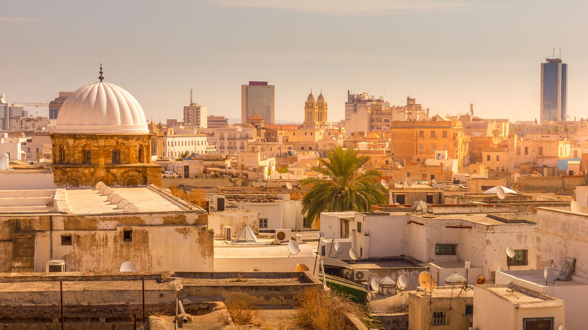

# Tunisian Cuisine

Tunisia's kitchen sits where the Mediterranean meets the Sahara: olive oil, ripe tomato, garlic and harissa on one side; couscous, lamb, dried fruit and warm spice on the other. The national table relies on a small set of building blocks (the fiery red harissa paste, the chunky red-pepper salad mechouia, the dough-and-tomato shakshuka cousin ojja, the brik with its molten-egg surprise) and lifts them into countless small variations. Tunisians eat couscous on Friday, lablabi (the spiced chickpea soup with a torn-bread base) at every roadside stop, and merguez sausages over coals at any family gathering. The patisserie side leans on semolina, almond, orange-blossom water and date, the same Maghrebi sweetness that anchors the wider region, sharpened here by a love of citrus.
