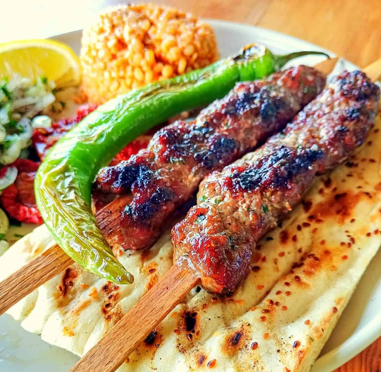

# Adana Kebab

*Turkey's most defended kebab: hand-minced lamb shoulder kneaded with hot pepper, pressed onto wide flat skewers and grilled over charcoal.*

**Serves:** 4

**Prep Time:** 30 minutes (plus 2 hours chilling)

**Cook Time:** 12 minutes

## Overview
Adana kebab is the most fiercely defended kebab in Turkey: hand-chopped fatty lamb kneaded with hot Maraş or Aleppo pepper, pressed onto a wide flat skewer in a long flat sausage with finger-dimples down its length, grilled hard over white-ashed charcoal till the surface is deeply charred and the fat is rendering. The signature is the cut. Real Adana is hand-chopped with a zırh (a curved Turkish blade) on a wooden board till fine but pea-sized pieces of meat and fat are still visible; machine mince is too uniform and gives a different dish. Lamb tail fat (kuyruk yağı) is the second non-negotiable; without at least 20% fat the kebab dries on the grill. Wide flat skewers only; round skewers spin and the meat falls into the coals. Slides off onto warm lavash with a sumac-onion-and-parsley salad piled on top, a blistered green pepper and tomato alongside, and a glass of cold salty ayran to chase it.

## Ingredients

### Meat
- 800 g lamb shoulder mince (or hand-chopped from shoulder if you have the time)
- 200 g lamb tail fat OR very fatty lamb breast (the fat is non-negotiable, at least 20% fat content)
- 1 tablespoon salt
- 1 ½ tablespoons mild pepper flakes
- 1 teaspoon sweet paprika
- 2 teaspoons ground sumac
- 4 garlic cloves (crushed to a paste with the salt)
- 1 teaspoon ground cumin

### Sumac onion
- 2 red onions (very thinly sliced)
- 2 tablespoons ground sumac
- 1 tablespoon lemon juice
- ½ teaspoon salt
- 20 g flat-leaf parsley (chopped)

### Grilled accompaniments
- 4 long Turkish green peppers (sivri biber) or banana peppers
- 4 tomatoes (small, on the vine)
- 2 tablespoons olive oil
- Salt

### To serve
- 4-8 fresh lavash sheets (large, warm; substitute large soft flatbreads)
- Salt-water-and-lemon ayran (yogurt drink) on the side

### Equipment
- 4-8 wide flat metal skewers (the flat blade is essential, round skewers spin and the meat falls off)

## Method

### Stage 1 - Meat
1. If hand-chopping (best): cube the lamb shoulder and tail fat; chop together with a heavy knife on a wooden board for 15 minutes until the texture is fine but distinct pieces remain visible. Aim for a coarse mince with pea-sized fat flecks.
1. If using ready mince: ensure 20%+ fat content. Add tail fat or fatty trim chopped fine if your mince is too lean.
1. Place in a wide bowl.

### Stage 2 - Season and knead
1. Add the salt, garlic paste, hot pepper flakes, paprika, sumac and cumin.
1. Knead and slap the meat against the bowl for 6-8 minutes.
1. The texture transforms: loose at first, then increasingly tacky, until the meat clings to the bowl when you pull your hand away. This protein development is what makes the meat grip the flat skewer.

### Stage 3 - Chill
1. Cover; refrigerate 2 hours minimum.

### Stage 4 - Sumac onion
1. Toss the thinly sliced red onion with sumac, lemon juice and salt; rest 20 minutes; mix in parsley just before serving.

### Stage 5 - Skewer
1. Take a fistful of meat (about 200 g for a full-size kebab).
1. Squeeze around the centre of a wide flat skewer.
1. Work the meat outward toward the tip and the handle end, pressing firmly with wet fingers so it grips the flat sides.
1. Final shape: a flat sausage 25 cm long, 3 cm wide, 2 cm thick.
1. Use thumb and forefinger to make shallow indentations every 3 cm down the length (helps even cooking).
1. Repeat for all skewers.

### Stage 6 - Grill
1. Heat charcoal until it's covered with white ash (no flames).
1. Brush the peppers and tomatoes with olive oil; salt them.
1. Lay skewers across the grill bars (so the meat dangles in the heat, doesn't touch the grate).
1. Add the peppers and tomatoes to one side of the grill.
1. Cook the kebabs 5-6 minutes; turn once; cook 4-5 more minutes.
1. The meat should be deeply charred outside, just-cooked inside (medium).
1. Pepper skins should blister; tomatoes should split.

### Stage 7 - Serve
1. Lay warm lavash on warm plates.
1. Slide each kebab off its skewer onto a sheet of lavash (the bread soaks the juices).
1. Top with a heap of sumac onion.
1. Place a grilled long pepper and tomato alongside.
1. Serve with cold ayran.

## Notes
- **Tail fat is the defining ingredient:** Turkish lamb tail fat (kuyruk yağı) is what gives Adana its richness. Without it, the kebab dries out on the grill. If unavailable, the fattiest lamb breast or shoulder trim is the best substitute.
- **Flat skewers only:** Adana literally cannot be made on round skewers, the meat won't grip and falls into the coals. Wide flat metal skewers are sold at any Turkish grocer or kitchen-supply.
- **Hand-chopped vs machine-minced:** real Adana is hand-cut with a zırh (a heavy crescent blade) so the texture has visible meat and fat pieces. Machine-mince is too uniform. If pressed for time, ask a butcher for the coarsest mince setting.
- **Don't grill over flame:** flames burn the surface before the inside cooks. Wait for the charcoal to be covered in white ash, the radiant heat is what you want.

## Storage
- Best straight from the grill.
- Raw kneaded meat keeps 2 days refrigerated; skewer just before grilling.
- Cooked kebabs don't reheat well; the iconic crisp char goes leathery.
- Leftover meat is excellent crumbled into a pilaf the next day.
