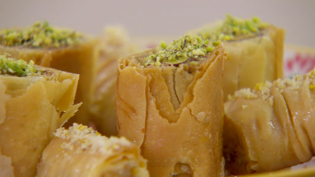

# Baklava with Rose, Cardamom and Pistachio

*The Levantine-leaning baklava. Filo cylinders filled with pistachio crushed with cardamom and icing sugar, baked to a deep gold, and drenched in a rose-scented sugar syrup. Floral, warm, light. The version that lands closest to the dessert tray at a Beirut bakery.*

**Serves:** 12

**Prep Time:** 25 minutes

**Cook Time:** 30 minutes

## Overview
Where classical Turkish baklava layers walnut or pistachio between many sheets of filo, this version rolls each sheet around a generous spoon of pistachio-and-cardamom filling, into cylinders that pack onto a tray. The bake is short and hot; the syrup is the heart of the dessert - sugar and water boiled to a single thread, stirred off the heat with a tablespoon of rose essence so the perfume stays bright. The hot baklava meets the cool syrup; the syrup soaks the cylinders to their cores. Cut into 5 cm pieces while warm, served on small plates with strong coffee.

## Ingredients

### The syrup
- 225 g granulated sugar
- 150 ml water
- 2 tablespoons clear honey
- 1 teaspoon lemon juice
- 1 tablespoon rose essence (or 2 tablespoons rose water)

### The filling
- 200 g shelled pistachios (toasted lightly, then 100 g blitzed coarse, 100 g left whole)
- 75 g icing sugar
- ½ tablespoon ground cardamom (from green pods, freshly ground)

### The pastry
- 6 sheets ready-rolled filo pastry
- 75 g unsalted butter (melted)

## Method

### Stage 1 - Make the syrup
1. In a small saucepan, combine the sugar, water, honey and lemon juice. Heat gently, stirring until the sugar dissolves.
2. Bring to a steady simmer for 5 minutes. The syrup should coat the back of a spoon with a faint thread.
3. Off the heat, stir in the rose essence. Pour into a heatproof jug and leave to cool completely. Cool syrup on hot baklava gives the best soak.

### Stage 2 - Make the filling
1. In a food processor, pulse the 100 g of pistachios designated "coarse" into rough crumbs - stop while there's still texture.
2. Combine the blitzed pistachios with the icing sugar and cardamom in a bowl. Stir well - the icing sugar should coat every piece of nut.

### Stage 3 - Shape the cylinders
1. Heat the oven to 160°C fan / 180°C / 350°F. Line a large baking tray with baking paper and brush lightly with melted butter.
2. Cover the filo with a damp tea towel as you work - it dries out fast.
3. Lay one sheet of filo on the worktop. Brush all over with melted butter.
4. Spread a generous strip of the pistachio filling along one long edge, about 2 cm from the edge and along the full length.
5. Scatter a small handful of the whole pistachios over the filling.
6. Roll the filo tightly into a long cylinder, starting from the filling edge.
7. Lift onto the tray and brush the top with more butter. Press gently flat with your palms - flat cylinders cut cleanly later.
8. Repeat with the remaining 5 sheets, leaving 1 cm between cylinders on the tray.

### Stage 4 - Bake
1. Bake for 25-30 minutes, until the tops are deep golden and the cylinders feel crisp when tapped. Rotate the tray halfway for even colour.

### Stage 5 - Cut and soak
1. While the baklava is still hot from the oven, cut each cylinder at an angle into 5 cm pieces with a sharp knife. Don't separate them - leave them in place on the tray.
2. Pour the cooled syrup slowly and evenly over the hot baklava, getting into the cuts so it soaks every face. Use all of it.
3. Leave to cool completely on the tray, at least 1 hour. The syrup continues to soak inward.

### Stage 6 - Serve
1. Lift the pieces onto a serving plate with a thin spatula. Scatter a few extra crushed pistachios on top for colour.

## Notes
- Rose essence is much more concentrated than rose water; 1 tablespoon essence equals roughly 2 tablespoons rose water. Use whichever you have and adjust to taste - the rose should be present but not overpowering.
- For a Persian leaning, replace half the cardamom with ¼ teaspoon ground saffron threads bloomed in 1 tablespoon warm water, added to the filling.
- The whole-pistachio scatter inside each cylinder gives the slices their visible bright green flecks. Don't skip it.

## Serving
Two pieces on a small plate after a meal, with strong unsweetened coffee or mint tea. Stored cool but not cold - fridge dries the pastry out.

## Storage
In a covered container at room temperature for up to 5 days. The syrup keeps the baklava moist for longer than a dry baklava, but the pastry softens slightly after day 2.
