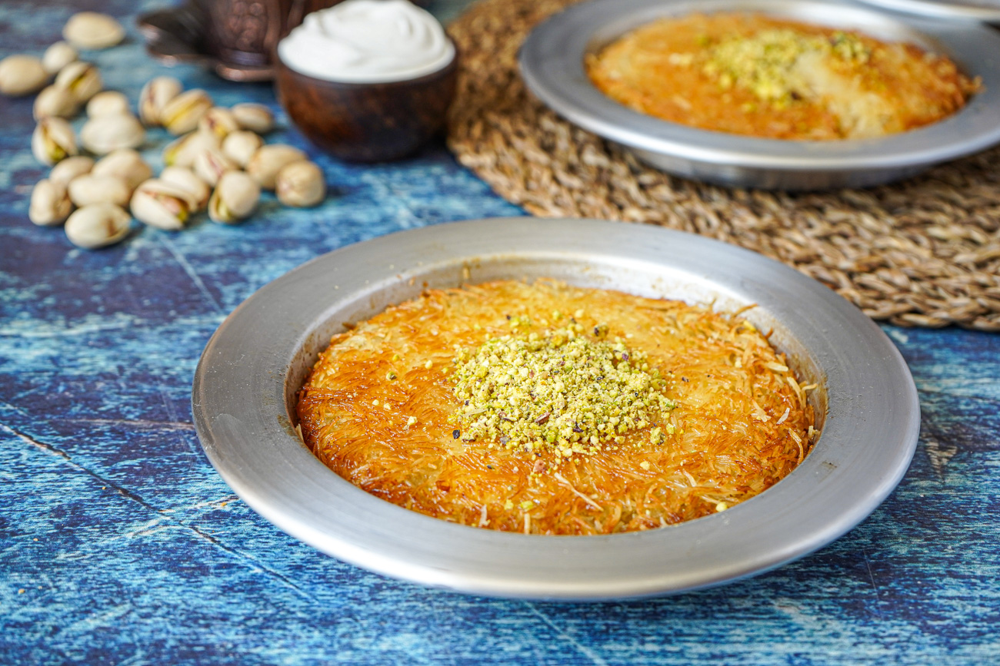

# Knafeh

*The Turkish-Levantine dessert that closes Ramadan iftars from Istanbul to Beirut. Shredded kataifi pastry baked over a layer of soft cheese, soaked in orange-blossom syrup, served warm and dusted with crushed pistachios. The cheese stretches.*

**Serves:** 8

**Prep Time:** 25 minutes

**Cook Time:** 35 minutes

## Overview
A round shallow pan is lined with melted-butter-soaked kataifi (shredded filo), tossed until every strand is gilded. A layer of fresh, lightly salted cheese (akkawi, mozzarella or a blend with ricotta) goes in the middle, then another layer of buttered kataifi on top. Baked hot until the pastry crisps deep golden, then flipped onto a serving plate and drenched in warm sugar syrup scented with orange-blossom water. Scattered with crushed pistachios. Sliced and served while the cheese is still warm and pulling.

## Ingredients

### The syrup
- 200 g caster sugar
- 200 ml water
- 1 tablespoon lemon juice
- 1 tablespoon orange-blossom water
- 1 teaspoon rose water (optional)

### The pastry
- 400 g kataifi pastry (thawed if frozen)
- 200 g unsalted butter (melted)
- 1 tablespoon orange zest (optional)

### The cheese layer
- 250 g akkawi cheese (or low-moisture mozzarella, soaked overnight in cold water to remove some saltiness)
- 150 g ricotta (drained)
- 1 tablespoon caster sugar
- 1 tablespoon orange-blossom water

### To finish
- 50 g shelled pistachios (roughly crushed)

## Method

### Stage 1 - Make the syrup
1. In a small pan, combine the sugar, water and lemon juice. Heat gently, stirring until the sugar dissolves, then bring to a steady simmer for 8-10 minutes until the syrup coats the back of a spoon with a faint thread.
2. Off the heat, stir in the orange-blossom water and rose water if using. Cool to lukewarm; you want the syrup warm but not hot when it meets the hot knafeh, for the best soak.

### Stage 2 - Prepare the cheese
1. Shred or coarsely chop the akkawi (or drained mozzarella). Mix in a bowl with the ricotta, sugar and orange-blossom water. The mixture should be soft and spreadable. If using salty akkawi straight from the brine, taste — if too salty, soak in cold water for another hour.

### Stage 3 - Prepare the kataifi
1. Tip the kataifi into a wide bowl. With your fingertips, gently pull the strands apart so they are fluffy rather than packed. Some people cut the pastry through with kitchen shears 4-5 times to shorten the strands.
2. Pour over the melted butter (and orange zest if using). Toss with both hands, lifting and turning, until every strand is buttered. Some recipes blitz the buttered kataifi briefly in a food processor for a finer, sandier base; texture preference.

### Stage 4 - Assemble
1. Heat the oven to 200°C fan / 220°C / 425°F.
2. Press half the buttered kataifi into a 24 cm round baking dish or oven-safe shallow non-stick pan, going up the sides slightly to form a low rim. Press down firmly with the back of a measuring cup so the base is compacted.
3. Spread the cheese mixture evenly over the base, leaving a 1 cm border.
4. Cover with the remaining kataifi, pressing down again, this time more gently — you want the top to crisp rather than pack.

### Stage 5 - Bake
1. Bake for 30-35 minutes until the top is deep golden and the edges are visibly crisp. Halfway through, peek and rotate the dish if it is colouring unevenly.
2. The cheese should be melted and visible bubbling at the edge. If the top has set but is still pale, finish under a hot grill for 1-2 minutes — watch like a hawk.

### Stage 6 - Soak and finish
1. Take the knafeh out and immediately pour the lukewarm syrup all over, evenly. It will hiss. Let it rest for 5 minutes so the syrup soaks through.
2. Invert onto a serving plate (or serve straight from the pan if you prefer). Scatter generously with crushed pistachios.
3. Cut into wedges and serve warm; the cheese will pull in long strands when sliced.

## Notes
- Akkawi is the traditional cheese; it is salty, semi-firm, and pulls when melted. If you cannot find it, a low-moisture mozzarella (soaked overnight to wash out some moisture and salt) is the most common substitute. Some shops sell a "knafeh cheese" blend ready to use.
- Bright orange knafeh nablusi (the Palestinian version, common in London) gets its colour from a pinch of red food colouring added to the kataifi butter. Skip if you prefer.
- The pour-syrup-on-hot-pastry rule is non-negotiable. Cold syrup on cold pastry sits on top and never soaks through; hot syrup on hot pastry shatters the crisp.

## Serving
In wedges, warm, with a small cup of strong unsweetened coffee or mint tea. After a long Ramadan iftar, this is the dish that lets everyone linger.

## Storage
Best eaten the day it is made. Reheats in a 160°C oven for 10 minutes to refresh the crisp, but the cheese hardens after a day in the fridge.
