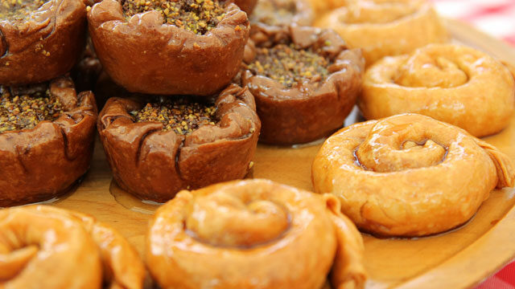

# Masala Chai Baklava

*The Turkish dessert with an Indian breath. Crisp filo cylinders filled with a cardamom-scented almond-and-cashew paste, then drenched in a sticky syrup steeped with black tea, fresh ginger and more cardamom. The chai infusion changes the whole landscape: less floral, warmer, deeper.*

**Serves:** 12

**Prep Time:** 30 minutes

**Cook Time:** 50 minutes (plus syrup time)

## Overview
Classical baklava holds the geometry: layered filo, nut filling, sugar syrup. This version trades the usual rose or orange-blossom syrup for one infused with three breakfast tea bags, a knob of fresh ginger, and a generous pinch of cardamom seeds, the spice profile of masala chai distilled into a sugar bath. The nuts shift too: a mix of toasted almond and cashew (not pistachio) carries the chai notes better. The pastry rolls into tight little cylinders rather than the conventional layered sheets, packed onto a tray, and bakes hot until deeply golden. The cooled syrup goes over in two pours, half first, rest after 5 minutes, so the soak penetrates to the core.

## Ingredients

### The syrup
- 300 g granulated sugar
- 100 g clear honey
- 200 ml water
- 3 breakfast tea bags (English breakfast, Assam, or strong builder's tea)
- ¼ teaspoon cardamom seeds (from green pods, lightly bruised)
- 2 ½ cm piece fresh ginger (peeled, finely chopped)

### The filling
- 100 g toasted flaked almonds
- 100 g cashew nuts
- ½ teaspoon ground cardamom (from green pods, freshly ground)

### The pastry
- 12 sheets ready-rolled filo pastry
- 75 g unsalted butter (melted)

## Method

### Stage 1 - Make the syrup
1. In a wide saucepan, combine the sugar, honey, water, tea bags, bruised cardamom seeds and chopped ginger.
2. Heat gently, stirring until the sugar dissolves, then bring to a steady simmer for 15-20 minutes. The syrup should reduce by about a third and turn a deep amber. The kitchen will smell strongly of chai.
3. Strain through a fine sieve into a clean jug, pressing the tea bags and spices to extract every drop. Discard the solids.
4. Cool the syrup completely, at least 30 minutes, ideally chilled. Cold syrup on hot baklava gives the best penetration; the temperature gap drives the absorption.

### Stage 2 - Make the filling
1. In a food processor, pulse the toasted almonds, cashews and ground cardamom until finely chopped, stop at the consistency of coarse breadcrumbs, not a paste. Some bite is what you want.
2. Tip into a bowl.

### Stage 3 - Shape the cylinders
1. Heat the oven to 160°C fan / 180°C / 350°F. Line a large baking tray with baking paper.
2. Keep the filo covered with a damp tea towel while you work, it dries out in minutes once exposed.
3. Lay one sheet of filo on the worktop, brush all over with melted butter, then fold in half along the long edge (a double-layer rectangle).
4. Spoon a generous tablespoon of the nut filling along one short edge, leaving a 2 cm border at top and bottom.
5. Fold the short sides in over the filling, then roll up tightly from the filling edge to form a cylinder about 12 cm long and 2 cm wide.
6. Place seam-side down on the tray. Brush the top with more melted butter.
7. Repeat with the remaining 11 filo sheets, leaving a small gap between cylinders on the tray.

### Stage 4 - Bake
1. Bake for 50 minutes, until the cylinders are deep golden and visibly crisp. Rotate the tray halfway through for even colour.

### Stage 5 - Soak
1. Take the tray straight from the oven. Pour half the cold syrup slowly and evenly over the hot cylinders, they will hiss and drink it in.
2. Wait 5 minutes, then pour the remaining syrup over. The pastry should now be glossy and visibly damp.
3. Leave to cool to room temperature on the tray, at least 1 hour. The syrup continues to soak inward as it cools.

### Stage 6 - Serve
1. Lift cylinders onto a serving plate with a palette knife. The bottoms will be sticky.

## Notes
- The chai profile here is deliberately warm and not floral. For a more aromatic version, add a 2 cm cinnamon stick and 2 cloves to the syrup as it simmers. Strain them out with the tea.
- For a stronger chai hit, brew the syrup with 4 tea bags and reduce slightly longer; the colour deepens to mahogany.
- Toasted pistachios scattered on top of the cooled baklava add a colour-and-flavour bridge to classical baklava without being on-the-nose.

## Serving
- Two cylinders on a small plate after a meal, with strong unsweetened tea or coffee, the syrup is heavily sweet and wants something bitter alongside.

## Storage
In a covered container at room temperature for up to a week. The syrup keeps the baklava moist; refrigeration is not needed and dries it out.
