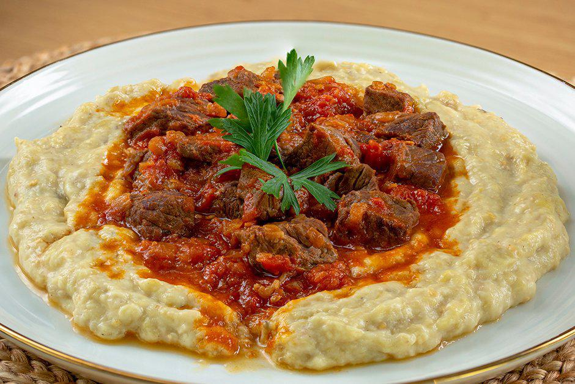

# Hünkar Beğendi

*Turkey's "Sultan's Delight": tender cubed lamb shoulder slow-braised in tomato, onion and warm spices, served over a silky creamy bed of smoked-eggplant purée enriched with butter, flour and grated kashar cheese. The Ottoman-imperial classic, famously created for Empress Eugénie's visit to the palace in the 1860s.*

**Serves:** 4-6

**Prep Time:** 40 minutes

**Cook Time:** 1 hour 30 minutes

## Overview
Hünkar beğendi (literally "the sultan loved it"; or sometimes translated as "Sultan's Delight") is one of Turkey's most iconic dishes and a piece of Ottoman culinary history: tender cubes of lamb shoulder (or beef) slow-braised with onion, garlic, tomato, tomato paste, the Levantine seven-spice baharat and a splash of stock till the meat falls apart and the sauce reduces to a glossy mahogany; served over a silky bed of "beğendi" - a smoked eggplant purée made by charring whole eggplants over an open flame till the skin blackens and the flesh goes silky, then peeling the flesh and folding it into a butter-and-flour roux with grated kashar cheese (the Turkish hard cheese; or substitute with Italian Pecorino or aged Gruyère) and milk to create a creamy béchamel-style sauce-mash hybrid. The combination is a study in contrasts: the rich tender lamb against the smoky creamy eggplant. The dish was famously created at the Topkapi Palace in the 1860s for the visit of Empress Eugénie of France, wife of Napoleon III, on her way to the opening of the Suez Canal; the empress reportedly asked for the recipe but was told by the chef that he wouldn't share it. Three details define proper hünkar beğendi. First, the eggplants must be properly charred. The smoky character of the beğendi comes from blackening the skins over an open gas flame (or under a hot grill) till the eggplant collapses and the skin is properly burnt. Skipping this gives a generic creamed-eggplant that lacks the dish's identity. Second, the lamb must be properly slow-braised. 60-75 minutes minimum till the cubes are fork-tender. Under-cooked lamb is chewy. Third, the beğendi roux is essential. The flour-and-butter base is a traditional French béchamel technique adapted by Ottoman palace chefs; without the roux, the eggplant purée is wet and unstructured.

## Ingredients

### Lamb braise
- 800 g boneless lamb shoulder (cut into 3 cm cubes; or stewing beef)
- 4 tablespoons olive oil
- 2 large onions (finely chopped)
- 6 garlic cloves (crushed)
- 4 medium tomatoes (chopped); or 1 tin (400 g) of chopped tomatoes
- 3 tablespoons tomato paste
- 2 tablespoons Turkish red pepper paste (biber salçası)
- 1 tablespoon Levantine baharat (or substitute mix)
- 1 tablespoon ground cumin
- 1 tablespoon dried oregano
- 2 teaspoons Aleppo pepper (pul biber)
- 1 teaspoon ground cinnamon
- 1 teaspoon ground allspice
- 1 ½ teaspoons fine sea salt
- 1 teaspoon ground black pepper
- 600 ml hot beef or lamb stock
- 2 bay leaves
- 1 cinnamon stick

### Beğendi (smoked eggplant purée)
- 4 large eggplants (about 1.2 kg total)
- 50 g butter
- 4 tablespoons plain flour
- 400 ml whole milk (warmed)
- 150 g grated kashar cheese (or Pecorino, aged Gruyère, or hard Cheddar)
- 2 tablespoons fresh lemon juice
- 1 teaspoon fine sea salt
- ½ teaspoon ground white pepper
- ¼ teaspoon ground nutmeg

### To finish
- 2 tablespoons fresh flat-leaf parsley (finely chopped)
- 1 tablespoon dried mint
- Aleppo pepper for sprinkling
- Lemon wedges

### To serve
- Pide bread or warm Turkish flatbread
- Pilav or bulgur pilav
- Fresh salad

## Method

### Stage 1 - Brown the lamb
1. Heat 2 tablespoons of olive oil in a heavy casserole over medium-high heat.
2. Pat the lamb cubes dry; brown in batches for 3-4 minutes per side till deeply golden. Don't overcrowd.
3. Lift out and set aside.

### Stage 2 - Build the braise base
1. Reduce heat to medium; add the remaining 2 tablespoons of oil.
2. Add the chopped onions; cook 8-10 minutes till deeply soft and starting to caramelise.
3. Add the crushed garlic; cook 1 minute.
4. Add the tomato paste and red pepper paste; cook 2 minutes till deepened.
5. Add the chopped tomatoes; cook 5 minutes till they break down.
6. Add the baharat, cumin, oregano, Aleppo pepper, cinnamon, allspice, salt and pepper; cook 1 minute till fragrant.

### Stage 3 - Slow-braise the lamb
1. Return the browned lamb to the pot.
2. Pour in the hot stock; add the bay leaves and cinnamon stick.
3. Bring to a low simmer.
4. Cover with the lid slightly ajar.
5. Cook 60-75 minutes till the lamb is fork-tender and the sauce has reduced to a thick gravy.
6. Stir occasionally; the sauce should be glossy and rich.

### Stage 4 - Char the eggplants
1. While the lamb cooks, char the eggplants.
2. Pierce each eggplant with a knife in several places (this lets steam escape; otherwise they can burst).
3. Place each eggplant directly over a gas flame (or under a hot grill) on medium-high heat.
4. Cook 12-15 minutes, turning regularly with tongs, till the skin is blackened all over and the flesh feels collapsed and soft when pressed.
5. Transfer to a wide bowl; cover with a lid or foil; let stand 10 minutes (the steam helps loosen the skin).

### Stage 5 - Peel and chop the eggplants
1. Once cool enough to handle, peel off the charred skin completely (rinse your hands; the skin is bitter).
2. Place the flesh in a colander; gently squeeze out excess liquid.
3. Chop the flesh roughly.
4. Toss with the lemon juice to prevent darkening.

### Stage 6 - Make the beğendi
1. Melt the butter in a wide saucepan over medium heat.
2. Add the flour; whisk constantly for 2 minutes to make a pale roux (don't let it brown).
3. Pour in the warm milk gradually, whisking constantly to prevent lumps.
4. Cook 4-5 minutes, whisking continuously, till the sauce thickens to a thick béchamel.
5. Add the chopped charred eggplant flesh; stir to combine.
6. Cook 3-4 minutes till the eggplant is integrated into the sauce.
7. Use a wooden spoon or whisk to break down any large pieces of eggplant for a smoother purée (or pulse briefly with an immersion blender for a silkier result).
8. Add the grated kashar cheese; stir till melted and the sauce is glossy and smooth.
9. Season with salt, white pepper and nutmeg.
10. Taste; adjust seasoning.
11. Keep warm.

### Stage 7 - Finish
1. Once the lamb is tender, taste and adjust seasoning.
2. Lift out the bay leaves and cinnamon stick.

### Stage 8 - Plate and serve
1. Spoon a generous mound of warm beğendi onto each plate; spread into a circle to make a creamy base.
2. Top with a generous portion of the lamb braise and its sauce.
3. Scatter chopped parsley, a sprinkle of dried mint and a small pinch of Aleppo pepper over.
4. Serve immediately with pide bread, lemon wedges and a fresh salad.

## Notes
- **Char the eggplants properly:** the skin must be properly blackened all over for the smoky character. Open flame is best; a hot grill works. Don't skip; this is the dish's identity.
- **Slow-braise the lamb:** 60-75 minutes minimum till fork-tender. Don't rush; tough lamb ruins the dish.
- **Roux first, then milk, then eggplant:** the order is essential for the proper béchamel-style smoothness. Cold milk added to hot roux gives lumps.
- **Kashar cheese gives the proper Turkish flavour:** the local hard cheese is irreplaceable in flavour; Pecorino or aged Gruyère are the closest substitutes. Generic cheddar works but is less.
- **Pierce the eggplants:** unpierced eggplants can burst spectacularly during charring.

## Variations
**Beef hünkar beğendi:** swap the lamb for beef chuck or shin; cook 90-110 minutes for proper tenderness. Common modern variation.
**Chicken hünkar beğendi:** swap the lamb for chicken thigh; reduce cooking to 35-40 minutes. Lighter version.
**Vegan beğendi:** make the eggplant base without dairy (substitute butter with olive oil, milk with oat milk or warm vegetable stock, skip the cheese); top with a mushroom-and-walnut ragu instead of meat. Less traditional but works.
**With pomegranate molasses:** add 2 tablespoons of pomegranate molasses to the lamb braise; gives a sweet-sour Aleppo-Antakya style.

## Serving
On warm plates with the meat over the creamed eggplant. Pide bread for mopping up the sauce. Pilav or bulgur pilav on the side. Fresh salad. Drink: rakı with ice and water (the canonical pairing), a glass of Turkish red wine, or Türk kahvesi after.

## Storage
- Both components keep separately. The lamb braise keeps refrigerated 4 days and freezes 3 months; flavour deepens overnight.
- The beğendi keeps refrigerated 3 days; reheat gently with a splash of milk to loosen.
- Reheat the lamb in a covered pan with a splash of stock; reheat the beğendi in a saucepan, stirring constantly to prevent sticking.
- Don't freeze the beğendi; the dairy can split.
- Day-old hünkar beğendi makes excellent stuffing for fresh peppers or aubergines (a kind of dolma cross).
