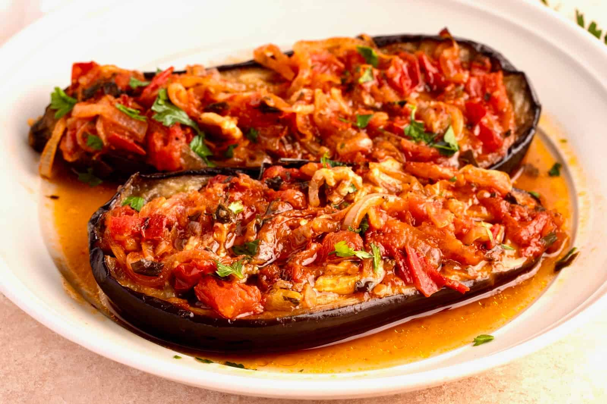

# İmam Bayıldı

*Turkey's "the imam fainted" eggplant: whole baby aubergines slit lengthwise, pre-fried then stuffed with a thick onion-and-garlic-and-tomato paste rich with olive oil, slow-cooked in even more olive oil till the eggplants collapse and the filling melts together. The iconic vegetarian Ottoman-court dish, the cousin of karnıyarık but without meat and with a glorious amount of olive oil.*

**Serves:** 4-6

**Prep Time:** 25 minutes

**Cook Time:** 1 hour

## Overview
İmam bayıldı ("the imam fainted") is one of Turkey's most iconic vegetarian dishes and a legendary recipe with several origin stories: most retellings have an imam (Muslim clergy) fainting from the dish's deliciousness when his wife served it to him, or fainting from shock at how much olive oil she'd used. Whatever the truth of the legend, the dish is one of the great achievements of Ottoman cooking and a staple of Turkish vegetarian repertoire: whole baby aubergines (or split medium aubergines) pre-fried briefly in olive oil, then stuffed with a thick paste of slow-cooked onion, garlic, tomato, parsley, and a generous amount of olive oil; the stuffed eggplants are arranged in a heavy pot, doused with a tomato-and-water sauce and even more olive oil, and slow-cooked (either on the stovetop or in the oven) for 45-50 minutes till the eggplants are completely soft and silky, the filling has melted together, and the cooking liquid has reduced to a glossy oily coating. Served at room temperature (the canonical Turkish way; cold or warm), as a meze, a starter, or a main with rice and bread. The dish is the canonical vegetarian counterpart to karnıyarık; same eggplants, no meat, much more olive oil. Three details define proper imam bayıldı. First, the olive oil. The dish needs a generous amount - this isn't a place to skimp. The oil partly cooks the eggplant, partly stews the onions, and forms the glossy coating that defines the finished dish. Second, slow-cooked onions. The onions need to be properly soft and sweet - 15-20 minutes of slow cooking before the rest of the filling goes in. Rushed onions give a sharp raw flavour. Third, eat at room temperature. İmam bayıldı is traditionally served cold or at room temperature, not hot. The flavours marry as it cools; the olive oil thickens slightly; the eggplant flesh goes properly silky.

## Ingredients

### Eggplants
- 8 small baby aubergines (about 600 g); or 4 medium aubergines (split lengthwise)
- 2 teaspoons fine sea salt (for salting)
- 6 tablespoons olive oil (for pre-frying)

### Filling
- 200 ml extra virgin olive oil (yes, this much; it's not a typo)
- 3 large onions (finely sliced into half-moons; about 500 g)
- 10 garlic cloves (some whole, some sliced; for variety)
- 4 medium tomatoes (chopped; or 1 tin chopped tomatoes)
- 3 tablespoons tomato paste
- 1 large bunch fresh flat-leaf parsley (about 40 g; chopped)
- 2 teaspoons caster sugar (balances the tomato acidity)
- 2 teaspoons fine sea salt
- 1 teaspoon ground black pepper
- 1 teaspoon ground allspice
- 1 teaspoon dried oregano
- 1 teaspoon Aleppo pepper (optional; mild traditional version skips)

### Cooking liquid
- 200 ml hot water (or vegetable stock)
- 100 ml extra virgin olive oil (more oil; canonical)
- Juice of 1 lemon

### To finish
- 2 tablespoons fresh parsley (chopped)
- Lemon wedges
- Extra olive oil for drizzling

### To serve
- Warm pide bread or pita
- Plain yogurt (optional; some Turks consider this sacrilege, others love it)
- Olives
- Cheese (feta or beyaz peynir)

## Method

### Stage 1 - Salt the eggplants
1. Cut a deep slit lengthwise down each eggplant, going about 70% through (creates a pocket).
2. Sprinkle the cuts with the 2 teaspoons of salt; let stand 20 minutes.
3. Pat dry with kitchen paper.

### Stage 2 - Pre-fry the eggplants
1. Heat the 6 tablespoons of olive oil in a wide heavy frying pan over medium heat.
2. Fry the eggplants for 4-5 minutes per side till deep brown and the flesh has softened.
3. Lift out; drain briefly on kitchen paper.

### Stage 3 - Slow-cook the onions
1. In a wide heavy saucepan, heat the 200 ml of extra virgin olive oil over medium-low heat.
2. Add the sliced onions; cook slowly for 15-20 minutes, stirring occasionally, till deeply soft, pale gold and almost jammy.
3. Don't rush; the onions need to be properly sweet and tender.

### Stage 4 - Add garlic, tomato and seasoning
1. Add all the garlic (whole and sliced); cook 2 minutes.
2. Add the tomato paste; cook 2 minutes till deepened in colour.
3. Add the chopped tomatoes; cook 5-7 minutes till they break down completely.
4. Stir in the sugar, salt, pepper, allspice, oregano and Aleppo pepper.
5. Take off the heat; stir in most of the chopped parsley.
6. Let cool slightly (the filling should be warm but not hot when stuffed).

### Stage 5 - Stuff the eggplants
1. Lay the pre-fried eggplants in a wide heavy pot (with a lid) or a roasting tin.
2. Use a knife to open each slit into a pocket.
3. Spoon a generous portion of the onion-tomato filling into each eggplant; pack firmly.

### Stage 6 - Add the cooking liquid
1. Whisk together the hot water (or stock), the additional 100 ml of olive oil and the lemon juice.
2. Pour gently around the eggplants (not over the filling).
3. The liquid should come about a quarter of the way up the eggplants.

### Stage 7 - Slow-cook
1. Cover the pot with a tight-fitting lid.
2. Cook on lowest heat (stovetop) for 45-50 minutes; or transfer to a 170°C / 340°F oven for the same time.
3. Don't lift the lid more than once or twice; the steam is important.
4. The eggplants should be completely soft, the filling melted together, and the cooking liquid reduced to an oily glossy coating.

### Stage 8 - Cool
1. Take off the heat.
2. Let cool in the pot to room temperature (about 1 hour); this is essential for the proper flavour and texture.
3. Imam bayıldı is meant to be served at room temperature or cold, not hot.

### Stage 9 - Serve
1. Lift the eggplants gently onto a wide serving platter; spoon the cooking sauce over.
2. Drizzle with extra olive oil.
3. Scatter the remaining parsley.
4. Serve with warm pide bread for mopping up the oily sauce, lemon wedges, olives, and cheese.

## Notes
- **The olive oil is not a typo:** the dish is meant to be properly oily. Extra virgin olive oil, generous amounts, is the canonical Turkish recipe. The oil is what cooks the eggplant and onions and forms the dish's character.
- **Slow-cook the onions:** 15-20 minutes minimum till properly soft and pale gold. Rushed onions give a sharp uncooked flavour that ruins the dish.
- **Eat at room temperature:** this is the canonical Turkish serving temperature. The flavours marry as the dish cools; hot imam bayıldı tastes different (and less good).
- **Don't lift the lid much:** the steam-and-oil environment in the covered pot is what gives the silky finish. Every glance loses steam and slows the cooking.
- **Make ahead:** imam bayıldı is even better the next day. Make in advance, refrigerate, bring to room temperature before serving.

## Variations
**With pine nuts and currants:** add 50 g of toasted pine nuts and 50 g of currants to the onion filling; gives a sweeter Ottoman-court-style variation.
**With chickpeas (chickpea-stuffed):** add 100 g of cooked chickpeas to the filling; makes the dish more substantial as a main course.
**Sweeter version:** add a tablespoon of pomegranate molasses to the cooking liquid; gives a sweet-tart finishing note.
**Hot version (less canonical):** serve straight from the pot while still warm; works but loses the proper imam bayıldı character.

## Serving
At room temperature on a wide platter, the eggplants laid out in a row with the oily sauce pooled around. Warm pide bread on the side for dipping. Lemon wedges, olives, cheese. As a meze, a starter or a vegetarian main course. Drink: rakı (the canonical meze pairing), Turkish red wine, or cold beer.

## Storage
- Best after 12 hours in the fridge; the flavours need time to marry.
- Keeps refrigerated 5 days; the flavour continues to improve.
- Don't freeze; the eggplant texture suffers completely.
- Bring to room temperature 30 minutes before serving for best flavour.
- Day-old imam bayıldı makes excellent stuffing for sandwiches or tossed through pasta.
