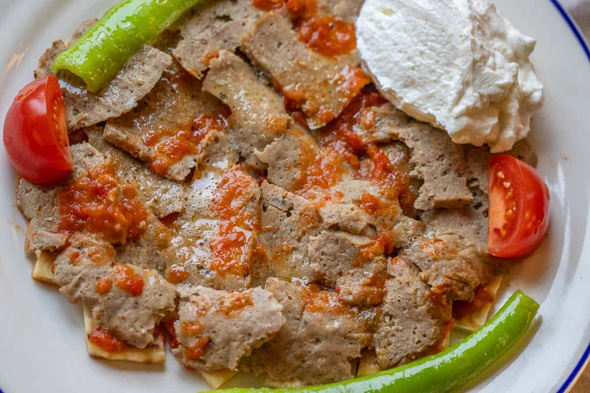

# İskender Kebab

*Turkey's "kebab on bread": thin slices of grilled lamb laid over crispy pita squares, ladled with hot tomato sauce and sizzling browned butter, served with thick yogurt and grilled tomato.*

**Serves:** 4

**Prep Time:** 35 minutes (plus 4 hours marinating)

**Cook Time:** 40 minutes

## Overview
İskender kebab is one of Turkey's most iconic restaurant dishes, named after İskender Efendi, who invented it in the late 19th century in the city of Bursa. The canonical version uses döner-style lamb sliced from a vertical spit; the home version uses lamb leg or shoulder marinated overnight in yogurt, garlic and spices, then grilled or pan-fried in batches and sliced thin. The result is excellent either way. Torn squares of pita fry in butter or toast in the oven till dark golden and crisp (soggy bread ruins the dish), then get layered with the lamb and ladled with a hot fresh tomato sauce cooked down with garlic, butter, salt and a small amount of red pepper paste (biber salçası). The tereyağı finish is essential: butter melted till the milk solids turn nutty-brown, then poured sizzling over the assembled dish at the moment of serving. A study in textures: crisp bread soaked with tomato and butter, tender lamb, cooling yogurt on the side, and a quartered grilled tomato and pepper for sweetness.

## Ingredients

### Lamb and marinade
- 800 g boneless lamb leg or lamb shoulder (thinly sliced; 5 mm thick)
- 200 g plain yogurt (thick Greek-style)
- 6 garlic cloves (crushed)
- 2 tablespoons olive oil
- 2 teaspoons ground cumin
- 2 teaspoons Aleppo pepper (pul biber)
- 1 teaspoon ground sumac
- 1 ½ teaspoons fine sea salt
- 1 teaspoon ground black pepper
- 1 tablespoon Turkish red pepper paste (biber salçası; optional but very Turkish)

### Bread base
- 6 large Turkish pita or flatbread (or 4 large flour tortillas; torn into 5 cm pieces)
- 60 g butter (for frying; or olive oil)

### Tomato sauce
- 6 large ripe tomatoes (about 800 g; peeled and chopped); or use 600 g of canned chopped tomatoes
- 50 g butter
- 6 garlic cloves (crushed)
- 1 tablespoon Turkish red pepper paste (or 2 tablespoons tomato paste)
- 1 ½ teaspoons fine sea salt
- 1 teaspoon ground black pepper
- 1 teaspoon Aleppo pepper (optional, for extra warmth)
- 1 tablespoon dried mint (nane)
- 1 teaspoon caster sugar (to balance acidity)
- 200 ml hot chicken stock (or water)

### Browned butter finish
- 100 g unsalted butter

### To serve
- 400 g thick drained yogurt (Greek-style)
- 4 small fresh tomatoes (halved and grilled)
- 4 long green chillies (grilled; or use bell peppers)
- Fresh flat-leaf parsley (chopped)
- A small bowl of sumac
- 2 lemons (cut into wedges)

## Method

### Stage 1 - Marinate the lamb
1. In a wide bowl, combine the yogurt, crushed garlic, olive oil, cumin, Aleppo pepper, sumac, salt, pepper and red pepper paste.
2. Add the thinly-sliced lamb; toss to coat thoroughly.
3. Cover and refrigerate at least 4 hours (or overnight).

### Stage 2 - Make the tomato sauce
1. Melt the butter in a wide saucepan over medium heat.
2. Add the crushed garlic; cook 30 seconds till fragrant.
3. Add the red pepper paste (or tomato paste); cook 1 minute till deepened in colour.
4. Add the chopped tomatoes; cook 15-20 minutes, stirring occasionally, till the tomatoes break down and the sauce thickens.
5. Add the salt, black pepper, Aleppo pepper, dried mint and sugar.
6. Add the hot chicken stock; bring to a simmer; cook 10 more minutes till thick and glossy.
7. Taste; adjust seasoning.
8. Keep warm.

### Stage 3 - Prepare the bread
1. Preheat the oven to 200°C (400°F).
2. Tear the pita (or tortillas) into rough 5 cm pieces.
3. Spread on a baking sheet; toast in the oven for 8-10 minutes till crisp and lightly browned.
4. Alternatively, fry the pieces in butter in a wide pan over medium heat for 3-4 minutes till crisp.
5. Keep warm.

### Stage 4 - Cook the lamb
1. Heat a wide heavy frying pan (or grill pan) over high heat till smoking.
2. Lift the lamb slices from the marinade; let any excess drip off.
3. Cook the lamb in batches (don't crowd); 2 minutes per side till charred and just cooked through.
4. Transfer to a warm plate.
5. After all the lamb is cooked, slice each piece thinly into long strips (about 5 mm wide).

### Stage 5 - Grill the tomatoes and chillies (optional)
1. Place the halved fresh tomatoes and whole chillies on the grill pan; char briefly for the garnish.
2. Set aside.

### Stage 6 - Assemble each plate
1. Place a generous handful of toasted bread pieces in the bottom of each warm shallow bowl or plate.
2. Lay the sliced grilled lamb over the bread.
3. Ladle hot tomato sauce generously over the lamb and bread; the sauce should soak into the bread.

### Stage 7 - Brown the butter
1. In a small pan, melt the 100 g butter over medium heat.
2. Cook 3-4 minutes till the butter foams, the foam subsides and the milk solids at the bottom turn nutty-brown. The kitchen will smell deeply nutty.
3. Don't let it go past nutty-brown (it goes to burnt quickly).

### Stage 8 - Serve immediately
1. Pour the sizzling browned butter over the assembled plates; the dish will sizzle and the buttery aroma will fill the kitchen.
2. Place a large dollop of thick yogurt on the side of each plate.
3. Add a grilled tomato half and a grilled chilli to each plate.
4. Scatter parsley over.
5. Sprinkle with sumac.
6. Serve immediately with lemon wedges.

## Notes
- **Marinate properly:** the 4-hour minimum (overnight ideal) marination in yogurt-and-spices is essential. The yogurt tenderises the lamb; the spices penetrate. Skipping the marinade gives bland tough lamb.
- **Crispy bread base:** the bread must be properly crisp before assembly. Soggy bread ruins iskender. Either oven-toast or fry in butter.
- **Browned butter is the magic touch:** the moment of pouring hot nutty browned butter over the plate is the canonical iskender moment. Don't skip; don't use raw melted butter (the nutty flavour is essential).
- **Serve immediately:** the dish is best when everything is hot and the bread is just starting to soak up the sauce. Assemble at the table or just before serving.
- **Don't use lean lamb:** the lamb should have some fat for proper juicy slices. Lamb leg can work; lamb shoulder is fattier and better.

## Variations
**Kebab on bulgur:** swap the bread base for cooked bulgur pilaf; gives a heartier grain base. Common variation in central Turkey.
**Chicken iskender:** swap the lamb for marinated chicken thigh; cook the same way. Common variation in modern Turkish restaurants.
**Beef iskender:** swap the lamb for beef ribeye or skirt; less traditional but excellent.
**Mild iskender:** skip the Aleppo pepper and red pepper paste; gives a milder version for children or non-spice-tolerant diners.

## Serving
On warm shallow bowls or plates; the dish is meant to be eaten with a fork and knife. With ayran (salted yogurt drink), a glass of rakı (the canonical aniseed spirit for Turkish meat dishes), or fresh tea after the meal. As the centrepiece of a Turkish restaurant meal or as a special family dinner.

## Storage
- Best eaten immediately; the bread goes off-texture as it sits.
- The components keep separately: marinated lamb refrigerated 2 days before cooking; cooked lamb refrigerated 3 days; tomato sauce refrigerated 4 days and freezes 3 months.
- Reheat lamb gently in a covered pan with a splash of stock; reheat sauce in a covered pan.
- Toast fresh bread each time; soggy reheated bread ruins the dish.
- Don't freeze assembled iskender; the texture suffers.
