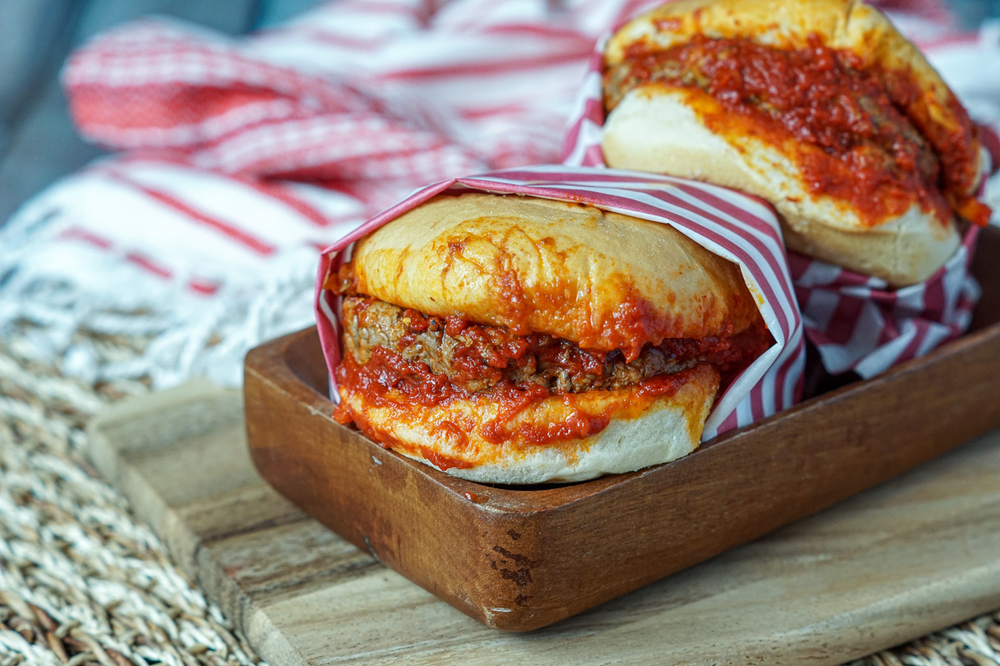

# Islak Burger (Istanbul Wet Burger)

*Istanbul's famous "wet burger": a soft small burger of seasoned beef patty in a buttery tomato-and-garlic sauce, the whole thing steamed in a glass display case till the bun is saturated and silky with sauce. The Taksim Square street food classic; the late-night post-bar tradition of Istanbul.*

**Serves:** 6 (small burgers - 2 per person standard)

**Prep Time:** 20 minutes

**Cook Time:** 30 minutes (plus 30 minutes steaming)

## Overview
The islak burger ("wet burger" in Turkish) is the iconic Istanbul late-night street food, sold from glass-fronted steam cases at the city's most famous fast-food stalls in Taksim Square (Kızılkayalar has been making them since 1965; the queue at 2am is legendary): small bun-sized burgers (each about 12 cm wide, 60 g patty) of seasoned ground beef tucked into a small soft white bun, then bathed in a buttery garlic-and-tomato sauce and stacked into a covered steam case where the heat and humidity slowly saturate the bun till it's soft, glossy and dripping with sauce. The result: not a burger you eat with your hands without getting messy, not a sandwich, something in between - soft, garlicky, slightly sweet from the tomato, with the umami-rich beef patty almost dissolving into the sauce-soaked bread. Eaten in two or three bites, with one or two friends after a long night. Three details: tomato-and-garlic-and-butter sauce poured generously over each (not under), proper steaming time (the bun must saturate), small bun-sized burgers (not American-sized).

## Ingredients

### Patties (makes 12 small)
- 600 g ground beef (80/20)
- 100 g ground lamb (or extra beef)
- 1 medium onion (very finely grated)
- 6 garlic cloves (crushed)
- 1 small bunch fresh parsley (finely chopped)
- 1 teaspoon ground cumin
- 1 teaspoon dried oregano
- 1 teaspoon paprika
- 1 ½ teaspoons fine sea salt
- 1 teaspoon ground black pepper

### Buns
- 12 small soft white burger buns (about 8 cm wide; brioche-style or potato rolls scaled down)

### Tomato-garlic-butter sauce
- 6 tablespoons butter
- 12 garlic cloves (very finely chopped)
- 2 tins (400 g each) chopped tomatoes (or 800 ml passata)
- 4 tablespoons tomato paste
- 1 tablespoon caster sugar
- 1 tablespoon paprika
- 1 teaspoon dried oregano
- 1 teaspoon dried mint
- 1 teaspoon Aleppo pepper (or mild chilli flakes)
- 1 ½ teaspoons fine sea salt
- ½ teaspoon ground black pepper
- 200 ml hot water (or beef stock)
- 100 ml olive oil (the sauce gets generous oil - the surface gloss is the look)

### To serve
- Cold ayran (Turkish yogurt drink) or Coca-Cola
- Pickled green chillies (sivri biber)
- Hot turşu (mixed Turkish pickles)

## Method

### Stage 1 - Mix patties
1. In a wide bowl, combine the ground beef, lamb, grated onion, crushed garlic, chopped parsley, cumin, oregano, paprika, salt, pepper.
2. Mix gently with clean hands.
3. Form into 12 small patties about 8 cm wide and 1 cm thick.

### Stage 2 - Cook patties
1. Heat a wide cast-iron pan or barbecue to high.
2. Cook patties 90 seconds per side till browned (they finish cooking in the sauce).
3. Set aside.

### Stage 3 - Make tomato-garlic-butter sauce
1. Melt butter in a wide saucepan over medium heat.
2. Add chopped garlic; cook 30 seconds till fragrant (don't brown).
3. Add tomato paste; cook 2 minutes.
4. Add chopped tomatoes, sugar, paprika, oregano, dried mint, Aleppo pepper, salt, pepper.
5. Pour in hot water; simmer 8 minutes till slightly thickened.
6. Stir in olive oil; the sauce should be glossy and rich.

### Stage 4 - Assemble in a saucepan
1. Split each bun open at the side (don't cut all the way through; hinge it).
2. Tuck a patty into each bun, leaving the hinge intact.
3. Stack the assembled burgers in a wide saucepan or deep frying pan with a tight lid.
4. Pour the warm tomato-garlic-butter sauce generously over the stacked burgers, drenching them.
5. The sauce should puddle around them.

### Stage 5 - Steam slow
1. Cover the saucepan with a tight lid.
2. Place over the lowest heat for 25-30 minutes.
3. The buns slowly absorb the sauce and become silky and soft.
4. Don't lift the lid more than necessary; the steam is what makes them.

### Stage 6 - Serve
1. Lift each burger carefully out with a slotted spoon or spatula (they're saucy and soft).
2. Place on small plates, 2 per person.
3. Pour any extra sauce around them.
4. Pickled green chillies on the side.
5. A glass of cold ayran or Coca-Cola.

## Notes
- **Small buns essential:** Turkish islak burger is bite-sized, eaten 2 or 3 at a time. American burger buns are too big.
- **Steam slow:** the 25-30 minute steam is what saturates the bun. Don't rush it.
- **Tomato + garlic + butter + olive oil sauce:** this is the wet burger's defining feature. Make it rich.
- **Eat with a fork-and-knife if you have to:** the bun will fall apart in your hands. That's part of the experience.

## Variations
**Cheeseburger islak:** add a slice of soft cheese (kasar) inside the bun before saucing.
**Spicier:** double the Aleppo pepper or add fresh chopped Turkish biber salça (pepper paste).
**Vegetarian islak:** swap the meat patty for a grilled portobello cap or a tucked-in slice of grilled halloumi.
**Mini sliders for parties:** make them even smaller (5cm) and serve a plate of 6.

## Serving
Late at night at a Taksim Square street stall. At a Turkish dinner party as a fun small-plate. With ayran and pickled chillies.

## Storage
- Best eaten immediately after the steam.
- Sauce keeps refrigerated 3 days; freezes 2 months.
- Cooked patties keep refrigerated 2 days.
- Don't store assembled; the buns fall apart.
