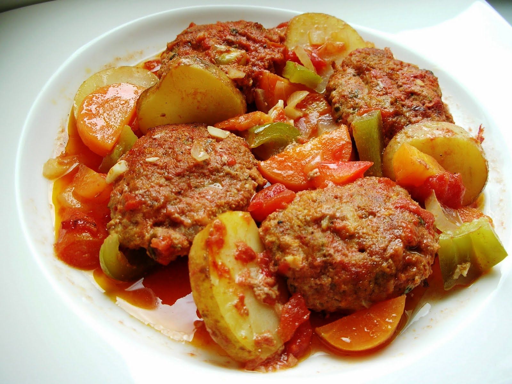

# İzmir Köfte

*Turkey's Aegean meatballs in tomato sauce: small soft lamb-and-beef meatballs slow-baked with cubed potato and green pepper in a rich tomato sauce till everything melts together.*

**Serves:** 4-6

**Prep Time:** 30 minutes

**Cook Time:** 1 hour

## Overview
İzmir köfte is the iconic Aegean-Turkish variation of köfte (Turkish meatballs) and an absolute home-cook Sunday classic across the western coast of Turkey. It distinguishes itself from regular köfte by the softer meatball texture: more bread, slightly less mince: and the baked-in-sauce technique rather than grilled. A 50/50 mix of minced lamb and beef binds with grated onion, soaked bread, parsley, cumin and Aleppo pepper; the meatballs are shaped soft and oval, about 5 cm long, then briefly browned in olive oil to build fond and texture before going in the oven. They slow-bake in a rich tomato-and-stock sauce alongside cubes of potato and chunks of green bell pepper, the sauce loose enough to half-submerge them and cook the potatoes through, till the whole tray has melded into a comforting Mediterranean-style stew. Eat on a Sunday with bread for soaking up the sauce.

## Ingredients

### Meatballs
- 400 g minced lamb
- 400 g minced beef
- 100 g day-old white bread (no crust)
- 150 ml whole milk (for soaking)
- 1 large onion (finely grated)
- 4 garlic cloves (crushed)
- 1 large egg
- 1 small bunch fresh parsley (about 25 g; finely chopped)
- 1 tablespoon ground cumin
- 1 tablespoon Aleppo pepper (pul biber)
- 1 teaspoon ground sumac
- 1 ½ teaspoons fine sea salt
- 1 teaspoon ground black pepper

### Cooking
- 4 tablespoons olive oil (for browning)
- 3 medium potatoes (peeled and cut into 3 cm wedges)
- 2 large green bell peppers (cut into 3 cm pieces)
- 2 medium tomatoes (sliced into thick rounds; for topping)

### Sauce
- 4 tablespoons olive oil
- 1 large onion (finely chopped)
- 6 garlic cloves (crushed)
- 3 tablespoons tomato paste
- 2 tablespoons Turkish red pepper paste (biber salçası)
- 1 tin (400 g) chopped tomatoes
- 600 ml hot beef stock
- 1 tablespoon dried oregano
- 1 tablespoon Aleppo pepper
- 1 teaspoon ground cumin
- 1 ½ teaspoons fine sea salt
- 1 teaspoon ground black pepper

### To finish
- 2 tablespoons fresh parsley (chopped)
- Lemon wedges

### To serve
- Rice pilav
- Plain yogurt
- Pide bread or Turkish flatbread

## Method

### Stage 1 - Soak the bread
1. Tear the day-old white bread into small pieces; place in a wide bowl.
2. Pour the milk over; let stand 5 minutes till the bread is fully saturated.
3. Squeeze gently to remove excess milk; the bread becomes the panada.

### Stage 2 - Make the meatballs
1. In a wide bowl, combine the minced lamb, minced beef, soaked bread, grated onion, crushed garlic, egg, chopped parsley, cumin, Aleppo pepper, sumac, salt and pepper.
2. Mix thoroughly with hands or a wooden spoon for 3 minutes till the mixture becomes slightly sticky and cohesive.
3. Cover and refrigerate 30 minutes (firms up for easier shaping).

### Stage 3 - Shape the meatballs
1. With wet hands, shape the mixture into small oval meatballs about 5 cm long and 2 cm thick.
2. You should have about 24 meatballs.
3. Place on a tray.

### Stage 4 - Brown the meatballs
1. Heat the 4 tablespoons of olive oil in a wide heavy pan over medium-high heat.
2. Brown the meatballs in batches for 2 minutes per side till deeply golden.
3. Lift out and set aside on a plate.

### Stage 5 - Make the sauce
1. Reduce heat to medium; pour off most of the rendered fat (leave 1 tablespoon).
2. Add the 4 tablespoons fresh olive oil to the pan.
3. Add the chopped onion; cook 8 minutes till soft and starting to caramelise.
4. Add the crushed garlic; cook 30 seconds.
5. Add the tomato paste and red pepper paste; cook 2 minutes.
6. Add the chopped tomatoes; cook 5 minutes till they break down.
7. Pour in the hot stock.
8. Add the oregano, Aleppo pepper, cumin, salt and pepper.
9. Bring to a simmer.

### Stage 6 - Assemble in a baking dish
1. Preheat the oven to 200°C (400°F).
2. Spoon a layer of the sauce into a wide ovenproof baking dish.
3. Arrange the browned meatballs over the sauce.
4. Arrange the potato wedges around the meatballs.
5. Add the green pepper pieces.
6. Lay the sliced tomatoes on top of the meatballs (one slice per meatball).
7. Pour the rest of the sauce over everything; the meatballs should be about 2/3 submerged.

### Stage 7 - Bake
1. Cover the dish loosely with foil.
2. Bake at 200°C for 35 minutes.
3. Remove the foil; bake another 15-20 minutes till the potatoes are properly tender, the sauce has reduced to a glossy coating, and the tomato slices are softened.

### Stage 8 - Rest and serve
1. Take out of the oven; let rest 5 minutes.
2. Scatter chopped parsley over.
3. Serve in deep plates with rice pilav, plain yogurt and warm flatbread.
4. Lemon wedges on the side.

## Notes
- **Bread-in-milk panada:** the soaked bread is essential for the soft tender meatballs. Don't substitute with dry breadcrumbs.
- **Mix till sticky:** the 3-minute vigorous mixing develops the proteins. Lazy mixing gives crumbly meatballs.
- **Brown before baking:** the fond and the meatball crust are both essential. The brown gives flavour depth and texture.
- **Plenty of sauce:** the meatballs should be 2/3 submerged. Too little sauce gives dry results; too much gives soup.
- **Don't overcook the meatballs:** the meatballs cook through during the first 20 minutes of baking; the remaining time is for the potatoes and sauce reduction.

## Variations
**With aubergine:** add 1 medium aubergine (cubed and salted) to the tray alongside the potatoes; gives a richer Aegean-style variation.
**Spicier:** double the Aleppo pepper and red pepper paste; gives a fierce version popular in southeast Turkey.
**With chickpeas:** add 1 tin of drained chickpeas to the sauce; turns the dish into a more substantial one-pot meal.
**With lots of garlic:** double the garlic in both the meatballs and the sauce; gives a properly assertive garlic Turkish version.

## Serving
In deep plates over rice pilav, with the sauce ladled generously. A bowl of plain yogurt for each diner. Warm flatbread for mopping. Lemon wedges. Drink: ayran, Turkish red wine, or rakı. As a Sunday family lunch or a comforting weeknight meal.

## Storage
- Keeps refrigerated 4 days; the flavour deepens noticeably overnight.
- Reheat in a covered oven dish at 160°C / 320°F for 20-25 minutes; or microwave individual portions.
- Freezes 3 months in portioned containers; defrost in the fridge.
- Day-old İzmir köfte is excellent for lunch with leftover rice or stuffed into sandwiches.
