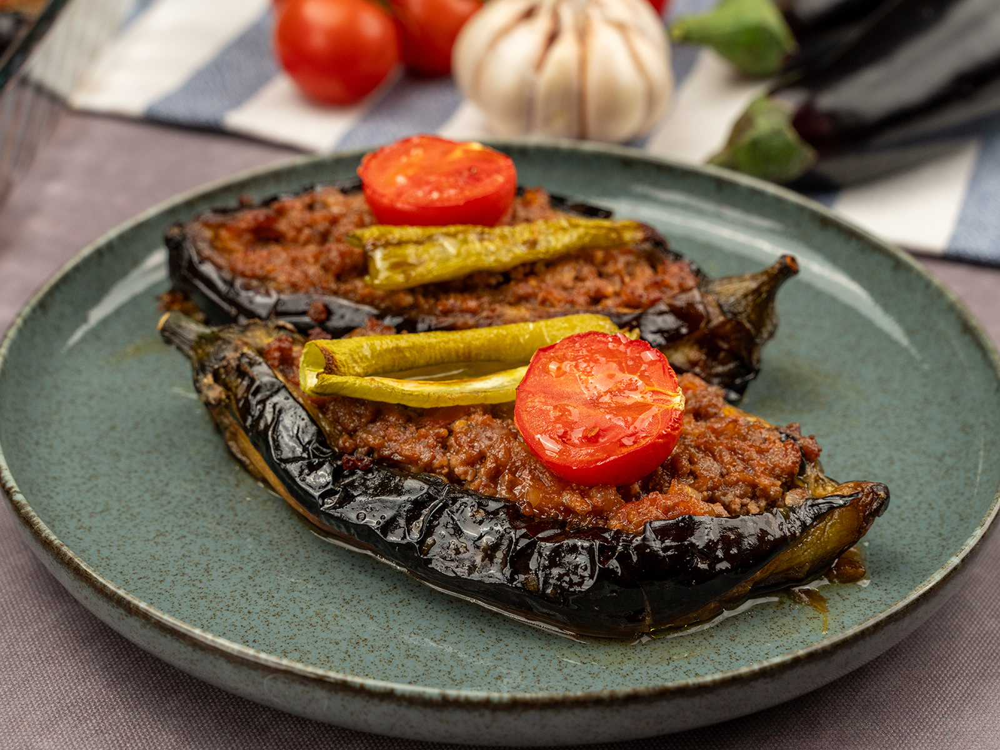

# Karnıyarık

*Turkey's "split belly" stuffed eggplant: whole baby aubergines split open and fried, then stuffed with a fragrant lamb mince filling (onion, garlic, tomato, parsley, Aleppo pepper), topped with sliced tomato and green pepper, and oven-baked in a tomato-and-stock sauce till the eggplant goes silky and the meat tender. The Turkish home-cook classic alongside pilav.*

**Serves:** 4-6

**Prep Time:** 30 minutes

**Cook Time:** 1 hour

## Overview
Karnıyarık (literally "split belly"; karın = belly, yarık = split) is one of Turkey's most beloved home dishes and a staple of Anatolian family cooking: whole baby aubergines (or split medium eggplants) are pre-fried in olive oil till the outsides are deep brown and the flesh is partially cooked, then split lengthwise to create a pocket, stuffed with a fragrant lamb-mince filling (onion, garlic, chopped tomato, parsley, Turkish red pepper paste, Aleppo pepper, cumin and salt), topped with sliced fresh tomato and a strip of green pepper, arranged in a wide roasting tin, doused with a tomato-and-stock sauce, and baked at 200°C for 30-40 minutes till the eggplant is silky, the filling is properly cooked through, and the sauce has reduced into a glossy coating. The dish is closely related to but distinct from the Greek papoutsakia, the Iranian dolmeh-bademjan, and the wider eastern-Mediterranean stuffed-eggplant family; the Turkish karnıyarık distinguishes itself with the lamb-and-pepper-paste filling and the tomato-baked finish. Three details define proper karnıyarık. First, pre-fry the eggplants. The brief shallow-fry in olive oil before stuffing is essential; it cooks the eggplant partway, makes the flesh silky and prevents the eggplant from going woody during the bake. Don't skip; baking raw eggplant gives a different (less Turkish) result. Second, the filling needs proper seasoning. Turkish red pepper paste (biber salçası), Aleppo pepper, cumin, parsley - these are the canonical Turkish ingredients. Without them, you have generic stuffed eggplant. Third, the sauce should be loose. Enough sauce to come halfway up the eggplants during baking; this gives the silky steam-bake finish.

## Ingredients

### Eggplants
- 8 small baby aubergines (about 600 g total); or 4 medium aubergines (split lengthwise)
- 2 teaspoons fine sea salt (for salting the eggplants)
- 8 tablespoons olive oil (for pre-frying)

### Filling
- 400 g minced lamb (or beef; 20% fat)
- 2 large onions (finely chopped)
- 6 garlic cloves (crushed)
- 2 medium tomatoes (finely chopped)
- 2 tablespoons tomato paste
- 2 tablespoons Turkish red pepper paste (biber salçası)
- 1 small bunch fresh parsley (about 25 g; finely chopped)
- 1 tablespoon ground cumin
- 1 tablespoon Aleppo pepper (pul biber)
- 2 teaspoons fine sea salt
- 1 teaspoon ground black pepper
- 1 teaspoon dried oregano
- 4 tablespoons olive oil (for cooking the filling)

### Topping
- 2 medium tomatoes (sliced into rounds)
- 1 large green bell pepper (cut into strips)
- 4 fresh long green chillies (optional; sliced lengthwise)

### Sauce
- 400 ml hot beef or lamb stock (or vegetable stock)
- 2 tablespoons tomato paste
- 1 tablespoon Turkish red pepper paste
- 1 teaspoon fine sea salt
- 1 teaspoon Aleppo pepper
- 1 teaspoon dried oregano

### To finish
- 2 tablespoons fresh parsley (chopped)
- 1 tablespoon fresh dill (chopped, optional)

### To serve
- Pilav (Turkish rice pilaf) or bulgur pilav
- Plain yogurt
- Warm Turkish flatbread
- Cacık (yogurt-cucumber dip)

## Method

### Stage 1 - Salt the eggplants
1. Cut a deep slit lengthwise down each baby aubergine (or each split medium aubergine), going about 70% through but not all the way (you want a pocket, not two halves).
2. Sprinkle with the 2 teaspoons of salt; let stand 20 minutes (draws out moisture and bitterness).
3. Pat dry with kitchen paper.

### Stage 2 - Pre-fry the eggplants
1. Heat the olive oil in a wide heavy frying pan over medium heat.
2. Fry the eggplants in batches for 4-5 minutes per side till deep brown and the flesh has softened (a knife should slide in with some resistance; not fully cooked).
3. Lift out; drain on kitchen paper.

### Stage 3 - Make the filling
1. In a wide pan, heat the 4 tablespoons of olive oil over medium heat.
2. Add the chopped onions; cook 7-8 minutes till soft and starting to caramelise.
3. Add the crushed garlic; cook 30 seconds.
4. Add the minced lamb; break up with a wooden spoon and cook 6-7 minutes till browned and any released liquid has evaporated.
5. Add the tomato paste and red pepper paste; cook 2 minutes till deepened.
6. Add the chopped tomatoes; cook 5 minutes till they break down.
7. Add the cumin, Aleppo pepper, salt, pepper and oregano; cook 1 minute.
8. Take off the heat; stir in most of the chopped parsley (reserve some for garnish).

### Stage 4 - Stuff the eggplants
1. Preheat the oven to 200°C (400°F).
2. Place the pre-fried eggplants in a wide ovenproof baking dish.
3. Use a small knife to open the slit in each eggplant slightly into a pocket (the heat has softened them).
4. Spoon a generous portion of the meat filling into each eggplant; pack firmly.
5. Top each with a slice of tomato and a strip of green pepper.
6. Lay a sliced chilli over each if using.

### Stage 5 - Make the sauce
1. In a small bowl, whisk together the hot stock, tomato paste, red pepper paste, salt, Aleppo pepper and oregano.
2. Pour the sauce gently into the baking dish around the eggplants (not over the top).
3. The sauce should come about halfway up the eggplants.

### Stage 6 - Bake
1. Cover the dish loosely with foil.
2. Bake for 30 minutes covered.
3. Remove the foil; bake another 15-20 minutes till the sauce has reduced to a glossy coating and the topping vegetables are caramelised at the edges.

### Stage 7 - Rest briefly and serve
1. Take out of the oven; let rest 5 minutes.
2. Scatter the reserved parsley and the dill (if using) over.
3. Serve hot with pilav, plain yogurt and warm flatbread.

## Notes
- **Pre-fry the eggplants:** essential step. The brief fry cooks the flesh partway and gives the silky texture. Skipping gives undercooked woody eggplant.
- **Small baby eggplants if you can find them:** smaller eggplants give the canonical Turkish look (a row of small stuffed pockets). Medium eggplants (split lengthwise) also work; the dish is then more like Greek papoutsakia.
- **Red pepper paste (biber salçası):** essential for proper Turkish flavour. Available at Turkish markets. Sweet paprika + tomato paste is the workable substitute.
- **The sauce halfway up:** the sauce level matters. Too little and the eggplants dry out; too much and you have stew-eggplant rather than stuffed-eggplant.
- **Foil for the first 30 minutes:** the steam helps the eggplants finish cooking; the uncovered finish lets the sauce reduce and the topping vegetables caramelise.

## Variations
**Vegetarian karnıyarık:** swap the meat for 300 g of cooked chopped mushrooms + 200 g of cooked drained chickpeas; same seasoning. Common modern vegetarian variation.
**With pine nuts and currants (saray-style):** add 50 g of toasted pine nuts and 50 g of currants to the meat filling; gives a sweeter Ottoman-palace-style variation.
**Spicier:** double the Aleppo pepper and add a generous spoonful of harissa to the filling; gives a fierce southeastern-Turkish version.
**With kashar cheese topping:** add 100 g of grated kashar cheese on top in the last 10 minutes of baking; gives a cheese-crusted variation popular in modern Turkish restaurants.

## Serving
On a warm platter with pilav alongside. A bowl of plain yogurt (or cacık) for each diner to spoon onto their plate. Warm Turkish flatbread for mopping up the sauce. Drink: ayran (canonical), rakı, or a glass of cold beer. As a family Sunday meal or a weeknight dinner.

## Storage
- Keeps refrigerated 4 days; the flavour deepens overnight.
- Reheat in a covered oven dish at 160°C / 320°F for 20-25 minutes till hot through; or microwave individual portions.
- Freezes 3 months in portioned containers; defrost in the fridge.
- Day-old karnıyarık is excellent for lunch; some Turkish cooks deliberately make it the day before.
- Don't aggressively reheat; the eggplant can go to mush.
