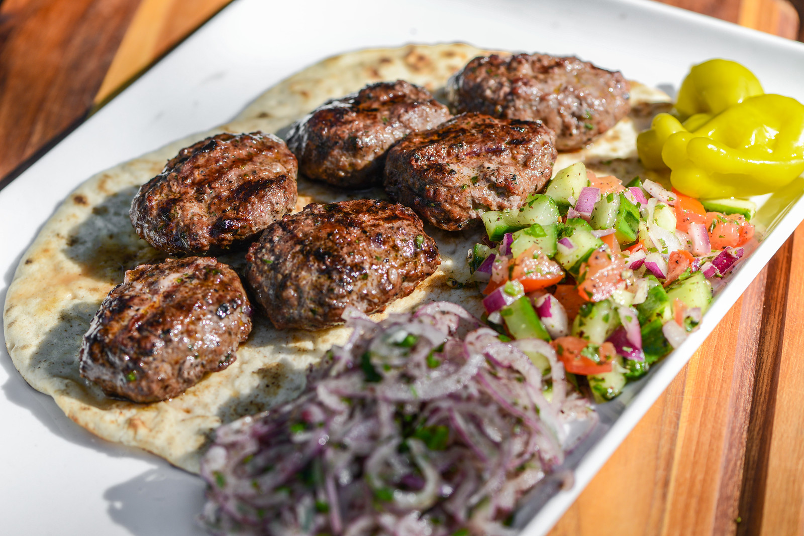

# Turkish Köfte

*Turkey's grilled meatballs: hand-shaped beef-and-lamb patties seasoned with onion, parsley, cumin, dried mint and Aleppo pepper, grilled over charcoal till the outside chars.*

**Serves:** 4 (about 16 köfte)

**Prep Time:** 25 minutes (plus 2 hours marinating)

**Cook Time:** 15 minutes

## Overview
Köfte is Turkey's most beloved meat dish and one of the country's most distinctive contributions to world cuisine. Hand-shaped patties or short fat sausages made from minced beef (or a 50/50 beef-and-lamb mix; sometimes pure lamb) at least 20% fat: lean meat gives dry tough köfte: seasoned with finely chopped onion, garlic, parsley, cumin, dried mint, Aleppo pepper (pul biber, the canonical Turkish dried red pepper, mild and fragrant) and sumac. The seasoning is the dish's identity: those four spices are what mark it as Turkish, and the Aleppo pepper specifically gives the warm fragrant moderate-heat character. The mince kneads with the seasonings for three or four minutes till sticky-elastic; lazy mixing gives crumbly meatballs that fall apart on the grill. Grilled over charcoal (or a hot griddle pan) till the outside chars and the inside stays juicy. Variety across Turkey is enormous: every region has its own shape and seasoning: but the home-cook version of round or oval patties on a hot pan is what most Turkish kitchens make.

## Ingredients

### Köfte mix
- 500 g minced beef (about 20% fat)
- 300 g minced lamb (about 20% fat; or use 800 g beef if you prefer)
- 1 large onion (very finely chopped or grated)
- 6 garlic cloves (finely crushed)
- 1 large bunch fresh flat-leaf parsley (about 50 g; finely chopped)
- 1 tablespoon dried mint (nane)
- 2 teaspoons ground cumin
- 2 teaspoons Aleppo pepper (pul biber; or substitute with sweet paprika + a pinch of cayenne)
- 1 teaspoon sumac
- 1 ½ teaspoons fine sea salt
- 1 teaspoon ground black pepper
- 1 large egg (helps bind; some Turkish cooks omit; both are valid)
- 2 tablespoons breadcrumbs (helps bind and absorb moisture)
- 2 tablespoons cold water

### To grill
- 2 tablespoons olive oil (for brushing the grill or pan)

### To serve
- Warm Turkish flatbread (lavash or pide)
- Sliced tomato and cucumber salad with sumac
- A bowl of plain yogurt (drained thick)
- Lemon wedges
- Sliced red onion sprinkled with sumac
- Fresh parsley and dill

## Method

### Stage 1 - Mix the köfte
1. In a wide bowl, combine the minced beef, minced lamb, finely chopped onion, crushed garlic, chopped parsley, dried mint, cumin, Aleppo pepper, sumac, salt, pepper, egg, breadcrumbs and cold water.
2. Mix thoroughly with your hands or a wooden spoon for 3-4 minutes till the mixture becomes sticky and slightly elastic. This vigorous mixing is essential; the developed proteins give the proper texture.
3. Cover and refrigerate at least 2 hours (or up to 24 hours); this resting period lets the flavours develop and the mince firms up.

### Stage 2 - Test the seasoning
1. Cook a small spoonful of the mix in a hot pan for 1 minute to test the seasoning.
2. Taste; adjust salt and Aleppo pepper before shaping.

### Stage 3 - Shape the köfte
1. Take the mince out of the fridge.
2. Wet your hands lightly with cold water (prevents sticking).
3. Divide the mixture into 16 equal portions.
4. Shape each portion into an oval patty (about 5 cm long, 3 cm wide and 1.5 cm thick) or a short fat sausage shape.
5. Place on a tray; cover and refrigerate till you're ready to cook.

### Stage 4 - Heat the grill or pan
1. Heat a charcoal grill, a gas grill or a heavy ridged grill pan to medium-high heat.
2. Brush with olive oil.
3. The grill must be properly hot; the köfte should sizzle when they hit it.

### Stage 5 - Grill the köfte
1. Place the köfte on the grill or pan, leaving 2 cm between each.
2. Don't move for the first 3 minutes; the surface needs to sear and develop a deep char.
3. Flip with a spatula; cook the second side 3 more minutes till also charred and just cooked through.
4. The total cook time is 6-7 minutes for properly juicy köfte; longer gives dry meat.

### Stage 6 - Rest briefly
1. Transfer to a warm plate; let rest 2-3 minutes before serving (the juices redistribute).

### Stage 7 - Serve
1. Arrange the köfte on warm Turkish flatbread; or on a serving platter.
2. Surround with the tomato-cucumber salad, sliced red onion with sumac, the yogurt and lemon wedges.
3. Garnish with fresh parsley and dill.
4. Serve immediately; eat with the hands using the flatbread to wrap the köfte, salad and yogurt into bites.

## Notes
- **20% fat minimum:** lean meat gives dry tough köfte. Use minced meat with at least 20% fat; you can ask the butcher for "köfte mince" or "kebab mince" which is fattier.
- **Mix till sticky:** the 3-4 minutes of vigorous mixing is essential. Lazy mixing gives köfte that crumble on the grill.
- **Aleppo pepper (pul biber):** the canonical Turkish dried red pepper. Available at Middle Eastern and Turkish markets. Sweet paprika + a pinch of cayenne is a substitute but not the same.
- **Rest the mince:** 2 hours minimum, ideally overnight. The resting period lets the flavours develop and the mince firms up for easier shaping.
- **Don't overcook:** 6-7 minutes total cooking gives properly juicy köfte; longer gives dry meat. Cook to just-done.

## Variations
**Adana köfte:** shape into long sausages around flat metal skewers; grill over charcoal. The İzgara/Adana version is the most iconic; named after the city of Adana in southeast Turkey.
**Urfa köfte:** similar to Adana but milder; less Aleppo pepper, more dried mint. From the city of Şanlıurfa.
**Sulu köfte (köfte in sauce):** simmer the cooked köfte in a tomato sauce with vegetables; common home-cook version that turns the meatballs into a stew.
**İçli köfte (stuffed bulgur shells):** shape bulgur-and-meat dough into hollow ovals; fill with spiced meat mince; deep-fry. The fancy köfte variation for special occasions.

## Serving
On warm Turkish flatbread with all the canonical sides: sliced tomato, sliced cucumber, sliced red onion with sumac, plain thick yogurt, lemon wedges, fresh parsley and dill. Drink: ayran (the salted yogurt drink); rakı (the aniseed spirit; the canonical Turkish pairing); cold beer; or a glass of strong sweet tea after the meal.

## Storage
- Best eaten fresh and warm.
- Keeps refrigerated 3 days; reheat in a hot pan with a little butter for 2 minutes per side, or under a hot grill briefly. Don't microwave (the meat dries out).
- Freezes 3 months cooked or uncooked. For uncooked: shape, freeze on a tray, transfer to a bag. Cook from frozen for 8 minutes per side.
- Day-old köfte make excellent kebab-wrap fillings or are good sliced over a salad.
- The uncooked mince keeps refrigerated 24 hours; flavours develop overnight.
