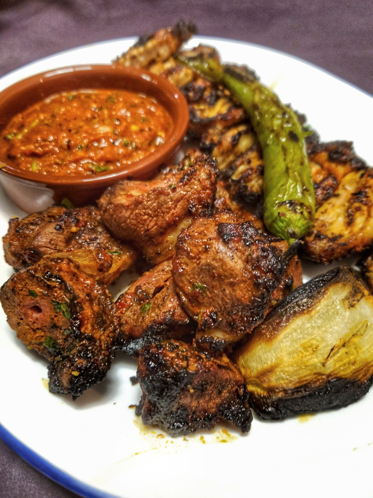

# Kuzu Şiş

*Turkey's lamb skewer: cubes of lamb shoulder marinated in yogurt, garlic, lemon and Levantine spices, threaded onto flat skewers with onion and pepper, then grilled hard over charcoal.*

**Serves:** 6 (12 skewers)

**Prep Time:** 30 minutes (plus 8 hours marinating)

**Cook Time:** 12 minutes

## Overview
Kuzu şiş (literally "lamb skewer"; sometimes called şiş kebab or shish kebab outside Turkey) is the Turkish lamb skewer kebab and a Sunday-asado staple across the country: the dish most often described to visitors as "Turkish kebab", appearing at every kebabci (kebab restaurant) and every Turkish home barbecue. The cut matters: shoulder is fattier and more flavoursome than leg; lean cuts dry on the grill. Cubes of 3 cm meat marinate at least eight hours and ideally twenty-four in a yogurt-based paste with olive oil, garlic, lemon, Levantine seven-spice (baharat), Aleppo pepper, cumin and sumac: the yogurt's enzymes tenderise the lamb during the long rest. Threaded onto flat metal skewers alternating with red onion, green pepper and tomato, grilled hard over hot charcoal till the outside chars and the inside stays pink and juicy. A grill pan works in a pinch but lacks the smoky depth. Plated on a warm wooden platter with pillowy pide bread, grilled tomato and chillies, a bowl of garlic or smoky-eggplant yogurt, sumac onions with parsley, and lemon wedges.

## Ingredients

### Lamb and marinade
- 1.2 kg boneless lamb shoulder or leg (cut into 3 cm cubes)

### Marinade
- 300 g plain yogurt (thick Greek-style)
- 8 garlic cloves (crushed)
- 4 tablespoons olive oil
- 3 tablespoons fresh lemon juice
- 2 tablespoons tomato paste
- 2 tablespoons Turkish red pepper paste (biber salçası)
- 1 tablespoon Levantine [baharat](../../base-ingredients/spices/baharat.md)
- 2 teaspoons Aleppo pepper (pul biber)
- 2 teaspoons ground cumin
- 1 teaspoon ground coriander
- 1 teaspoon ground sumac
- 1 teaspoon dried oregano
- 2 teaspoons fine sea salt
- 1 teaspoon ground black pepper

### Skewers
- 12 flat metal skewers (or 12 wooden skewers soaked in water 30 minutes)
- 2 large red onions (cut into 2 cm wedges)
- 2 large green bell peppers (cut into 3 cm pieces)
- 2 large red bell peppers (cut into 3 cm pieces)
- 12 small cherry tomatoes (or 6 small tomatoes, halved)
- Olive oil for brushing the vegetables

### To serve
- Warm pide bread or lavash flatbread
- Yogurt-garlic sauce: 300 g yogurt + 2 crushed garlic cloves + salt + 1 teaspoon dried mint
- Sumac onions: 1 large red onion (very thinly sliced) tossed with 1 tablespoon sumac, 1 tablespoon olive oil and a pinch of salt
- Grilled tomatoes and chillies
- Fresh parsley (chopped)
- Lemon wedges
- Ayran (the salted yogurt drink)

## Method

### Stage 1 - Marinate the lamb (overnight)
1. Combine all marinade ingredients in a wide bowl; whisk to a smooth paste.
2. Add the lamb cubes; toss thoroughly to coat.
3. Cover and refrigerate at least 8 hours; ideally 24 hours.

### Stage 2 - Prepare the vegetables and accompaniments
1. Cut the onions and peppers as specified.
2. Make the yogurt-garlic sauce; refrigerate till serving.
3. Toss the thinly sliced red onion with sumac, olive oil and salt; set aside.

### Stage 3 - Bring to room temperature
1. Take the marinated lamb out of the fridge 30 minutes before cooking; let warm.

### Stage 4 - Thread the skewers
1. Lift the lamb cubes out of the marinade.
2. Thread onto skewers, alternating with chunks of onion, green pepper, red pepper and cherry tomatoes.
3. Pack the cubes close together (with vegetables between, but the lamb cubes touching) for proper char.
4. Brush the vegetables with olive oil; season lightly with salt.
5. You should have about 12 skewers.

### Stage 5 - Prepare the grill
1. Light a charcoal grill; let burn down to glowing embers (about 30 minutes).
2. Or heat a heavy ridged grill pan over high heat till smoking.
3. The grill should be properly hot; the meat should sizzle aggressively when it hits.

### Stage 6 - Grill the skewers
1. Place the skewers on the hot grill.
2. Cook 3-4 minutes on the first side; don't move them; let the meat char properly.
3. Turn the skewers a quarter turn; cook 3 minutes.
4. Turn again; cook 3 minutes.
5. Turn final time; cook 2-3 minutes.
6. Total cooking time: 11-13 minutes for medium (pink centre); 8-10 minutes for medium-rare; 14-16 minutes for medium-well.
7. The exterior should be deeply charred; the interior just-pink and juicy.

### Stage 7 - Rest briefly
1. Lift the skewers onto a warm platter.
2. Let rest 3-4 minutes (the juices redistribute).

### Stage 8 - Serve
1. Place the skewers on a large platter at the centre of the table.
2. Surround with warm pide, the yogurt-garlic sauce, sumac onions, grilled tomatoes and chillies, chopped parsley and lemon wedges.
3. Pour ayran into glasses.
4. Each diner builds their own bite: tear pide, scoop yogurt, pile lamb and vegetables, add onions and parsley, squeeze lemon, roll up.

## Notes
- **Fatty cuts:** lamb shoulder is fattier and more flavoursome than leg; both work but shoulder is the preferred Turkish choice. Lean cuts (loin, fillet) dry out.
- **8 hours minimum marinade:** the yogurt tenderises through enzymatic action; needs proper time. 24 hours gives the best result.
- **Flat metal skewers preferred:** flat (rather than round) skewers prevent the meat from spinning. If you only have round, use 2 skewers side by side per kebab.
- **Pack the lamb close:** cubes touching give proper char while preserving moisture. Spread-out cubes overcook and dry.
- **Don't overcook:** lamb is best at medium (pink centre); the residual heat continues cooking off the grill. Stop earlier than you think.

## Variations
- **Adana kebab (sausage-style):** swap the cubes for spiced minced lamb (with hot Turkish red pepper paste, Aleppo pepper, parsley); shape into long sausages around flat skewers; grill. The southeastern Turkish equivalent.
- **Çöp şiş (small skewer):** cut the lamb into smaller 1.5 cm cubes; thread onto smaller skewers; cook 6-7 minutes. The Aegean-coast smaller version.
- **Chicken şiş (tavuk şiş):** swap lamb for boneless chicken thigh; marinate the same way; grill 8-10 minutes. Common everyday variation.
- **Mixed grill (karışık ızgara):** combine kuzu şiş with adana kebab and chicken kebab on the same platter; common Turkish restaurant presentation.

## Serving
- On a wooden or heated metal platter at the centre of the table. Drink: ayran (traditional), rakı (the aniseed spirit), Türk kahvesi after the meal. As a Sunday lunch, weekend barbecue, or restaurant dinner.

## Storage
- Best eaten fresh off the grill.
- Cooked lamb keeps refrigerated 3 days; reheat briefly in a hot pan for 1 minute per side; don't overcook.
- The marinade keeps the raw lamb refrigerated for 48 hours; freezes 3 months with the marinade for later cooking.
- Don't freeze cooked lamb; the texture suffers.
- Day-old lamb is excellent sliced thin in wraps with yogurt sauce and fresh herbs.
