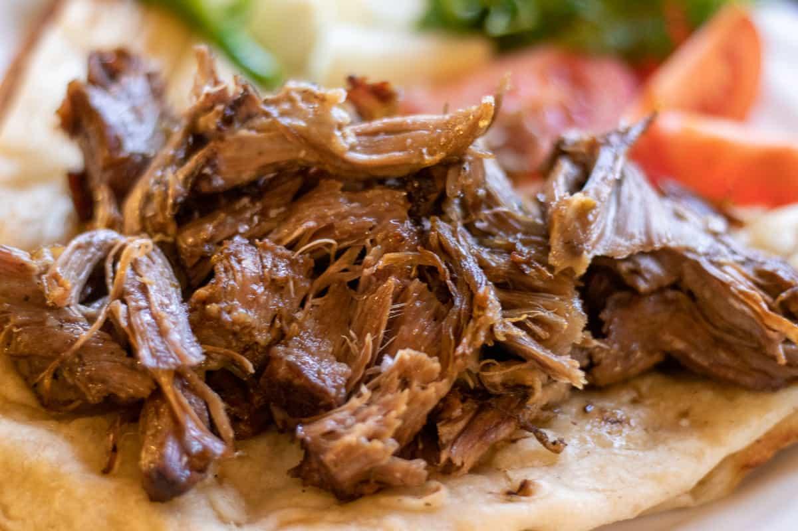

# Kuzu Tandır

*Turkey's slow-roasted lamb shoulder: bone-in lamb marinated overnight in yogurt, garlic and Turkish spices, then slow-roasted sealed for four hours till the meat falls from the bone.*

**Serves:** 6

**Prep Time:** 30 minutes (plus 12 hours marinating)

**Cook Time:** 4 hours

## Overview
Kuzu tandır (literally "tandoor lamb") is Turkey's most luxurious lamb celebration dish, made for major family gatherings, weddings and religious holidays, especially Bayram. Traditionally cooked in a sealed clay oven (the tandır) buried in hot embers; the home kitchen adapts to a covered Dutch oven or roasting tin sealed tight with foil. The sealed slow-roast is the whole point; uncovered roasting dries the meat out. The cut is bone-in lamb shoulder; the bone gives the flavour and the connective tissue dissolves into the sauce over four hours. Leg or boneless cuts give a drier, less interesting result. The marinade is a paste of yogurt, garlic, olive oil, cumin, Aleppo pepper, paprika, dried oregano and lemon, worked in overnight so the yogurt enzymes tenderise the lamb and the spices penetrate. Plated at the centre of the table, shredded onto pilav or bulgur with grilled vegetables, thick yogurt and warm flatbread.

## Ingredients

### Lamb
- 1 bone-in lamb shoulder (about 2.5-3 kg; ask the butcher to score the skin)

### Marinade
- 300 ml plain thick yogurt (Greek-style or Turkish süzme)
- 10 garlic cloves (crushed)
- 4 tablespoons olive oil
- 3 tablespoons fresh lemon juice
- 3 tablespoons Turkish red pepper paste (biber salçası; or 4 tablespoons tomato paste)
- 2 tablespoons sweet paprika
- 1 tablespoon ground cumin
- 1 tablespoon Aleppo pepper (pul biber)
- 1 tablespoon dried oregano
- 1 tablespoon dried thyme
- 1 tablespoon ground sumac
- 2 ½ teaspoons fine sea salt
- 1 teaspoon ground black pepper
- 2 large onions (finely grated; for the marinade)

### Cooking liquid
- 500 ml water (or hot beef/lamb stock)
- 200 ml dry red wine (or omit; not traditional but adds depth)
- 4 bay leaves
- 6 whole black peppercorns

### Pilaf base (to serve)
- 400 g long-grain rice (or 400 g bulgur)
- 50 g butter
- 1 tablespoon olive oil
- 50 g vermicelli noodles (broken into small pieces; for the proper Turkish "şehriyeli pilav")
- 800 ml hot chicken stock (for the rice; 700 ml for bulgur)
- 1 ½ teaspoons fine sea salt

### To serve
- 400 g thick yogurt (drained Greek-style)
- 6 small tomatoes (halved, grilled)
- 6 long green chillies (grilled)
- 1 large red onion (thinly sliced, sprinkled with sumac)
- Fresh flat-leaf parsley
- Warm Turkish flatbread
- Lemon wedges

## Method

### Stage 1 - Marinate the lamb (the night before)
1. Pat the lamb dry with kitchen paper; score the skin in a diamond pattern (this lets the marinade penetrate and the fat render properly).
2. In a wide bowl, combine all marinade ingredients; whisk to a thick paste.
3. Rub the marinade all over the lamb, pushing into the scored skin.
4. Place in a large container; cover; refrigerate 12 hours (or overnight).

### Stage 2 - Bring to room temperature
1. Take the lamb out of the fridge 1 hour before cooking; let come to room temperature.
2. This ensures even cooking.

### Stage 3 - Set up the roasting
1. Preheat the oven to 220°C (425°F).
2. Place the lamb in a large heavy roasting tin or Dutch oven (skin-side up).
3. Sear in the hot oven for 20 minutes till the skin colours and starts to crisp.

### Stage 4 - Add liquid and seal
1. Reduce oven temperature to 140°C (285°F).
2. Pour the water (or stock) and wine into the bottom of the roasting tin (around the lamb, not over the skin).
3. Add the bay leaves and peppercorns.
4. Cover the tin tightly with foil (or use the Dutch oven lid); make a proper seal.

### Stage 5 - Slow-roast
1. Roast at 140°C for 3.5-4 hours till the lamb is properly tender (a fork should slide in easily; the meat should pull from the bone with no resistance).
2. The internal temperature should be 95°C / 200°F (yes, well past medium-rare; you want the connective tissue to dissolve).

### Stage 6 - Brown the skin (optional but recommended)
1. Lift the foil for the last 30 minutes of cooking.
2. Turn the oven up to 220°C / 425°F.
3. Roast uncovered for 25-30 minutes till the skin is deep mahogany and crisp.

### Stage 7 - Make the pilaf
1. While the lamb finishes, make the pilaf.
2. Heat the butter and oil in a wide saucepan over medium heat.
3. Add the broken vermicelli; cook 2-3 minutes till deeply golden.
4. Add the rice; stir to coat.
5. Pour in the hot chicken stock; add the salt.
6. Bring to a boil; reduce to lowest heat; cover with a tight-fitting lid.
7. Cook 15 minutes covered.
8. Let rest off heat (still covered) for 10 minutes.
9. Fluff with a fork.

### Stage 8 - Rest the lamb
1. Lift the lamb out of the tin; transfer to a warm platter.
2. Cover loosely with foil; let rest 15-20 minutes (the juices redistribute and the meat is easier to shred).

### Stage 9 - Reduce the pan juices (optional but worth it)
1. Strain the pan juices into a saucepan.
2. Skim off excess fat.
3. Bring to a hard boil; reduce by half (about 5-10 minutes) till the sauce is intensified and slightly thicker.

### Stage 10 - Assemble and serve
1. Spoon a generous portion of pilaf onto each warm plate.
2. Lift large pieces of lamb (with a fork; the meat will fall apart easily) and place over the pilaf.
3. Drizzle with the reduced pan sauce.
4. Add a large dollop of yogurt to one side.
5. Place a grilled tomato half and a grilled chilli alongside.
6. Scatter the sumac-sprinkled red onion over.
7. Garnish with parsley.
8. Provide warm flatbread and lemon wedges at the table.
9. Eat with the hands or with a fork; the lamb should fall apart at the touch of a spoon.

## Notes
- **Bone-in lamb shoulder is essential:** the bone gives the proper flavour and the connective tissue dissolves over 4 hours to give the unctuous sauce. Boneless cuts don't work.
- **Long marinade is essential:** 12 hours is the minimum; overnight is better. The yogurt tenderises and the spices penetrate.
- **Seal properly during slow-roast:** the covered slow-roast cooks the lamb in its own juices. Steam escape gives dry lamb; tight seal gives moist tender lamb.
- **Sear at the end for the crispy skin:** the last 30 minutes uncovered at high heat gives the proper mahogany-crisp skin. Without this, you have tender lamb with pale fatty skin.
- **Rest before serving:** 15-20 minutes of resting is essential; the meat redistributes its juices and is much easier to shred.

## Variations
**Kuzu tandır with apricot:** add 200 g of dried apricots and 100 g of pearl barley to the cooking liquid; common Anatolian variation with sweet-savoury depth.
**Goat tandır (keçi tandır):** use a kid goat shoulder or leg in place of lamb; cook the same way. Common variation in southeast Turkey.
**Lamb-in-clay (tandır altinda):** for the proper tandır effect, cook in a sealed clay pot at 140°C; the clay retains heat differently and gives a slightly different texture. Worth seeking out a clay roasting pot if you make this often.
**With chestnuts and pomegranate:** add 200 g of peeled chestnuts to the cooking liquid; finish with a drizzle of pomegranate molasses and fresh pomegranate seeds. Festive variation.

## Serving
At the centre of a Turkish celebration table: alongside pilaf, grilled vegetables, yogurt, salads, warm flatbread and ample garnishes. Drink: rakı (the traditional aniseed spirit, slowly sipped over ice with water); red wine; or strong sweet Turkish tea after the meal.

## Storage
- Keeps refrigerated 5 days; the flavour deepens significantly overnight.
- Reheat in a covered oven dish at 160°C / 320°F for 30-40 minutes till hot through.
- Freezes 3 months in portioned containers; defrost in the fridge and reheat slowly.
- The leftover meat is excellent shredded into wraps with flatbread, yogurt and pickled vegetables.
- The cooking juices, when reduced, make excellent sauce for next-day lamb sandwiches.
