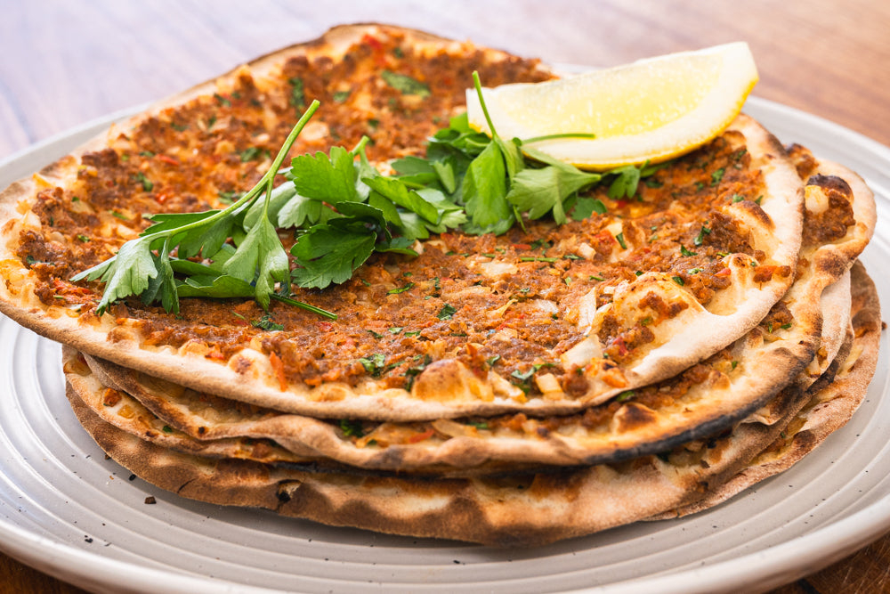

# Lahmacun

*Turkey's thin-crust meat flatbread: a paper-thin round of dough spread with a fragrant paste of minced lamb (or beef), tomato, onion, parsley, garlic, Aleppo pepper and pomegranate molasses, baked at fierce heat for 4 minutes till the edges crisp and the meat just cooks through. Rolled with lemon and parsley and eaten from the hand.*

**Serves:** 6 (6 large lahmacun)

**Prep Time:** 40 minutes (plus 1 hour dough rising)

**Cook Time:** 30 minutes

## Overview
Lahmacun (often translated for tourists as "Turkish pizza" though the comparison sells it short) is one of the most beloved Turkish street foods and a southeastern Anatolian specialty (particularly Şanlıurfa and Gaziantep): a paper-thin round of yeasted flour dough is rolled out to about 20 cm diameter, spread with a thin layer of a fragrant raw paste of finely minced lamb (or beef), grated tomato, very finely chopped onion, parsley, garlic, Aleppo pepper, ground cumin, sumac, tomato paste, pomegranate molasses and salt; the topped flatbread is slid onto a baking stone in a screaming-hot oven (or onto the floor of a wood-fired oven) and cooked for just 3-5 minutes till the dough crisps at the edges, the meat just cooks through, and the whole flatbread takes on a thin char from the heat. Served immediately on a wide plate, sprinkled with chopped parsley, doused with fresh lemon juice, and rolled (or folded) into a thin shawarma-like wrap to eat from the hand. The dish is what every southeastern Turkish family makes on a weekend, what every Turkish bakery sells fresh out of the oven by the dozen for the afternoon meal, and what every tourist to Turkey is encouraged to try. Three details define proper lahmacun. First, the dough must be paper-thin. Lahmacun is not a pizza; it's a thin crispy flatbread with just enough body to support the topping. 2-3 mm at the centre, 1 mm at the edges. Thick dough gives a chewy bread rather than a crisp flatbread. Second, the topping is raw paste, not cooked meat. Lamb (or beef) is mixed raw with the aromatics; the brief 3-5 minute oven blast cooks it through. Pre-cooked meat gives a dry tough topping. Third, screaming-hot oven. 250°C (475°F) minimum, with a preheated baking stone or upturned heavy baking sheet. The high heat is what gives the proper char at the edges and the rapid cook.

## Ingredients

### Dough
- 500 g strong bread flour
- 7 g instant dried yeast
- 1 teaspoon caster sugar
- 1 ½ teaspoons fine sea salt
- 2 tablespoons olive oil
- 300 ml warm water

### Topping (the meat paste)
- 400 g minced lamb (about 20% fat; or minced beef; or a 50/50 mix)
- 1 medium onion (very finely chopped or grated; about 150 g)
- 1 medium tomato (deseeded and finely chopped or grated)
- 1 small red bell pepper (deseeded and very finely chopped)
- 4 garlic cloves (very finely crushed)
- 1 large bunch fresh flat-leaf parsley (about 40 g; finely chopped, half for the topping, half for finishing)
- 3 tablespoons tomato paste
- 2 tablespoons Turkish red pepper paste (biber salçası; or 1 extra tablespoon tomato paste)
- 1 tablespoon pomegranate molasses
- 2 tablespoons olive oil
- 1 ½ teaspoons fine sea salt
- 1 teaspoon Aleppo pepper (pul biber)
- 1 teaspoon ground cumin
- 1 teaspoon ground sumac
- ½ teaspoon ground black pepper
- ½ teaspoon ground paprika

### To serve
- 2 large lemons (cut into wedges)
- Extra chopped parsley
- Sliced red onion (sprinkled with sumac, optional)
- A small bowl of pickled chillies
- Ayran (the salted yogurt drink)

## Method

### Stage 1 - Make the dough
1. In a wide bowl, whisk together the flour, yeast, sugar and salt.
2. Make a well in the centre; pour in the olive oil and warm water.
3. Stir to combine; once a rough dough forms, knead by hand on a lightly floured surface for 8 minutes till smooth and elastic.
4. Place in an oiled bowl; cover with a damp cloth; let rise 1 hour at room temperature till doubled.

### Stage 2 - Make the meat paste
1. In a wide bowl, combine the minced meat, very finely chopped onion, grated tomato, finely chopped red pepper, crushed garlic and half the chopped parsley.
2. Add the tomato paste, red pepper paste, pomegranate molasses, olive oil, salt, Aleppo pepper, cumin, sumac, black pepper and paprika.
3. Mix thoroughly with your hands or a wooden spoon for 2-3 minutes till the mixture is properly combined and slightly sticky.
4. The paste should be loose enough to spread thinly on the dough but cohesive (not a watery slurry).
5. If too dry, add 1 tablespoon of water; if too wet, add 1 tablespoon of breadcrumbs.
6. Cover; refrigerate while you preheat the oven.

### Stage 3 - Preheat the oven
1. Place a pizza stone (or an upturned heavy baking sheet) on the middle shelf of the oven.
2. Preheat to 250°C (475°F) for at least 30 minutes; the stone needs to get properly hot.

### Stage 4 - Roll out the dough
1. Knock back the risen dough; divide into 6 equal pieces (about 130 g each).
2. Roll each piece into a ball; cover with a damp cloth.
3. Working one at a time, roll one ball on a lightly floured surface to a paper-thin circle about 22-25 cm across and 2-3 mm thick. Use plenty of flour to prevent sticking.
4. Lift onto a sheet of parchment paper for easy transfer.

### Stage 5 - Top and bake
1. Take 3-4 tablespoons of the meat paste; spread it in a thin even layer over the dough (about 2-3 mm thick), leaving a 1 cm clear border at the edge.
2. Use the back of a spoon or your fingertips to smooth the paste right to the edges of the border.
3. Slide the parchment with the lahmacun onto the hot stone (use a pizza peel if you have one).
4. Bake at 250°C for 3-5 minutes till the edges of the dough crisp and char slightly and the meat is just cooked through.
5. Watch carefully; lahmacun can burn quickly.
6. Lift out using the parchment.

### Stage 6 - Continue with the rest
1. While the first lahmacun bakes, roll out the next one.
2. Cook 6 lahmacun total, one or two at a time (depending on stone size).

### Stage 7 - Serve immediately
1. Slide each baked lahmacun onto a warm plate.
2. Scatter generously with chopped parsley.
3. Squeeze lemon juice over the whole flatbread.
4. Add a few slices of sumac-onion if using.
5. Roll up tightly (or fold in half) to eat from the hand.
6. Serve with extra lemon wedges and pickled chillies; drink ayran alongside.

## Notes
- **Paper-thin dough:** the most common mistake is rolling the dough too thick. Aim for 2-3 mm at centre, 1 mm at edges. Use plenty of flour to prevent sticking.
- **Raw meat paste:** the topping is mixed raw and cooks during the brief oven blast. Pre-cooking gives dry crumbly topping. Mix thoroughly for sticky cohesion.
- **Screaming-hot stone:** 250°C minimum, with the stone preheated 30 minutes. The high heat is what gives the proper Turkish lahmacun character.
- **Don't overdo the meat layer:** 2-3 mm thick is right. Thick meat layer gives a soggy undercooked centre.
- **Eat immediately:** lahmacun goes from crisp to leathery in 10 minutes. Serve immediately; eat from the hand.

## Variations
**Beef lahmacun:** swap the lamb for beef; less fatty so add 1 extra tablespoon of olive oil to the paste. Less canonical but widely available.
**Vegetarian lahmacun:** swap the meat for 300 g of cooked-and-mashed red lentils or 300 g of finely chopped mushrooms; double the bell pepper. Less traditional but works.
**Spicier lahmacun:** double the Aleppo pepper and add 2 chopped fresh hot chillies to the paste. Common southeastern Anatolian variation.
**With cheese:** sprinkle a small amount of grated kashar (Turkish cheese; or Greek kasseri; or mozzarella) over the meat before baking. Less canonical but increasingly common in modern Istanbul bakeries.

## Serving
Rolled from the hand with a glass of cold ayran. Or open-faced on a plate as a meze. Sliced into wedges as a starter. At lunch with a salad, at dinner alongside a yogurt sauce. Drink: ayran (the proper Turkish pairing), Türk kahvesi after, or a glass of cold beer.

## Storage
- Best eaten fresh and hot; the texture suffers as it cools.
- Keeps refrigerated 2 days; reheat in a hot oven (200°C / 400°F) for 4-5 minutes to re-crisp.
- The dough can be made and refrigerated 24 hours after the first rise; let warm to room temperature before shaping.
- The meat paste keeps refrigerated 2 days; mix fresh dough each time.
- Freezes 2 months cooked; reheat from frozen in a hot oven for 8-10 minutes.
