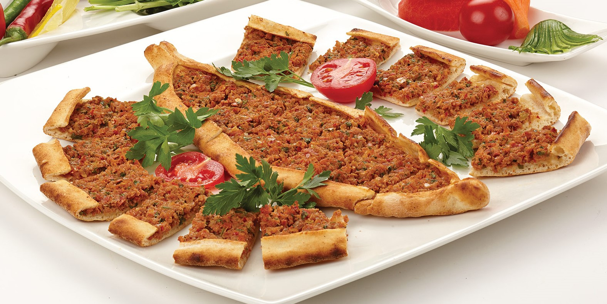

# Pide

*Turkey's boat-shaped flatbread: yeasted dough rolled into long ovals with pinched-up edges, topped with lamb mince, spinach and feta, or cheese and egg, baked at fierce heat till the dough crisps.*

**Serves:** 4 (4 large pide)

**Prep Time:** 40 minutes (plus 1.5 hours dough rising)

**Cook Time:** 25 minutes

## Overview
Pide (pronounced pee-deh) is Turkey's iconic boat-shaped flatbread and one of the most beloved meals across the country: what every Turkish family orders for delivery on a weeknight and what every pideci sells fresh out of the wood-fired oven. A soft yeasted dough rolled into a long oval, the long edges folded up to form a slight raised rim and the two ends pinched to a point. The filling sits in a thin layer down the middle, leaving the rim free; pide is meant to be thin and crispy, not deep-dish pizza. Classic toppings are kıymalı (minced lamb with onion and parsley), ıspanaklı (spinach and feta), peynirli (melted Turkish cheese), sucuklu kaşarlı (spicy Turkish sausage and cheese) or yumurtalı (with a cracked egg on top). A screaming-hot oven on a pizza stone gives the proper crispy bottom. Cut into thick wide strips with kitchen shears, brushed with butter and scattered with parsley or Aleppo pepper.

## Ingredients

### Dough
- 500 g strong bread flour
- 7 g instant dried yeast (1 sachet)
- 2 teaspoons caster sugar
- 1 ½ teaspoons fine sea salt
- 2 tablespoons olive oil
- 280 ml warm water

### Meat filling (kıymalı; the most popular)
- 350 g minced lamb (or beef; 20% fat)
- 1 large onion (finely chopped)
- 4 garlic cloves (crushed)
- 1 medium tomato (finely chopped)
- 1 green bell pepper (deseeded and finely chopped)
- 2 tablespoons tomato paste
- 2 tablespoons Turkish red pepper paste (biber salçası)
- 1 small bunch fresh flat-leaf parsley (about 25 g; finely chopped)
- 1 tablespoon olive oil
- 1 tablespoon Aleppo pepper (pul biber)
- 2 teaspoons ground cumin
- 1 teaspoon dried oregano
- 1 ½ teaspoons fine sea salt
- 1 teaspoon ground black pepper

### Alternative: Spinach-feta filling (ıspanaklı)
- 400 g fresh spinach (chopped); or 200 g frozen spinach (thawed and squeezed dry)
- 200 g feta cheese (crumbled)
- 1 small onion (finely chopped)
- 2 tablespoons olive oil
- 1 small bunch fresh dill (chopped)
- 1 teaspoon Aleppo pepper
- ½ teaspoon ground black pepper

### Alternative: Sucuk and cheese (sucuklu kaşarlı)
- 200 g sucuk (Turkish dry sausage; or substitute with chorizo or pepperoni; sliced thin)
- 250 g kashar cheese (or grated mozzarella + a small amount of Parmesan)

### Egg topping (optional, but very Turkish)
- 4 large eggs (one per pide; cracked over the centre in the last 5 minutes of baking)

### To finish
- 2 tablespoons butter (melted) - brushed over the rim after baking
- 1 tablespoon Aleppo pepper (sprinkled)
- 2 tablespoons fresh parsley (chopped)

### To serve
- Lemon wedges
- Sumac onions
- Plain yogurt
- Ayran

## Method

### Stage 1 - Make the dough
1. In a wide bowl, whisk together the flour, yeast, sugar and salt.
2. Add the olive oil and warm water; stir to combine.
3. Knead for 8-10 minutes on a lightly floured surface till smooth and elastic.
4. Place in an oiled bowl; cover with a damp cloth; let rise 1.5 hours at room temperature till doubled.

### Stage 2 - Make the meat filling (or alternative)
1. In a wide bowl, combine all meat filling ingredients.
2. Mix thoroughly with hands or a wooden spoon for 2 minutes till the mixture is properly combined and slightly sticky.
3. The filling is used raw on the pide; the brief oven blast cooks it.
4. For the spinach filling: sauté the onion in olive oil till soft (5 minutes); combine with squeezed spinach, crumbled feta, dill and seasoning.
5. For the sucuk-cheese: just have the ingredients ready; no pre-mixing needed.

### Stage 3 - Preheat the oven
1. Place a pizza stone (or upturned heavy baking sheet) on the middle shelf of the oven.
2. Preheat to 240°C (465°F) for at least 30 minutes.

### Stage 4 - Shape the pide
1. Knock back the risen dough; divide into 4 equal pieces (about 200 g each).
2. Roll each piece into a ball; cover the others with a damp cloth.
3. Working one at a time, roll one ball on a lightly floured surface into a long oval, about 30-35 cm long and 12 cm wide, 3-4 mm thick.
4. Lift onto a sheet of parchment paper.

### Stage 5 - Top and shape the boat
1. Spread the filling (meat, spinach or cheese) in a thin layer down the centre of the oval, leaving a 2 cm border around the edges.
2. Fold the long edges of the dough inward over the filling, creating a raised rim about 1-1.5 cm wide.
3. Pinch the two short ends to a point, creating the iconic boat shape.

### Stage 6 - Bake
1. Slide the pide (on the parchment) onto the hot pizza stone or baking sheet.
2. Bake for 8-10 minutes at 240°C.
3. If using egg topping: crack an egg in the centre of the pide in the last 5 minutes of baking.
4. The pide is done when the rim is deep golden, the bottom is crispy and the filling is cooked through.

### Stage 7 - Finish and serve
1. Lift the pide out of the oven.
2. Brush the rim generously with melted butter.
3. Sprinkle with Aleppo pepper and chopped parsley.
4. Cut into thick wide strips with kitchen shears (about 3-4 cm wide).
5. Serve immediately on a warm board.

## Notes
- **Boat shape, not flat:** the raised rim is what makes pide distinctive. Don't bake flat like pizza; fold the edges up to form a proper boat.
- **Don't overfill:** a thin layer of filling is the proper Turkish way. Overfilled pide gets soggy and the dough can't crisp.
- **Screaming-hot oven:** 240°C minimum, with the stone preheated 30 minutes. High heat is what gives the crispy proper Turkish pide.
- **Brush with butter at the end:** the canonical Turkish finish is butter on the rim. Skipping gives a less rich result.
- **Cut with shears, not a knife:** kitchen shears cut through the rim and topping cleanly; a knife can compress the dough.

## Variations
**With egg (yumurtalı pide):** crack an egg into the centre of any pide in the last 5 minutes of baking; gives a richer breakfast-friendly version.
**Cheese-only (peynirli pide):** just kashar cheese spread over the dough; simpler kid-friendly version.
**Spicy sucuk pide:** add chopped fresh chillies to the sucuk-cheese filling; gives the properly fierce version.
**With pastırma (cured beef):** swap the sucuk for thinly sliced pastırma (Turkish air-dried cured beef); a luxurious variation.

## Serving
On a long wooden board, cut into thick wide strips. Lemon wedges and sumac onions on the side. With ayran or a cold beer. As lunch, dinner or a late-night Turkish snack. Often shared family-style: a few different pide ordered together (one meat, one spinach, one cheese) and everyone takes wedges.

## Storage
- Best eaten fresh and hot.
- Keeps refrigerated 2 days; reheat in a hot oven (220°C / 425°F) for 4-5 minutes till the dough re-crisps.
- Don't microwave; the dough goes leathery.
- Freezes 2 months cooked; reheat from frozen in a hot oven for 10-12 minutes.
- The dough alone keeps refrigerated 24 hours after the first rise (refresh at room temperature for 30 minutes before shaping).
