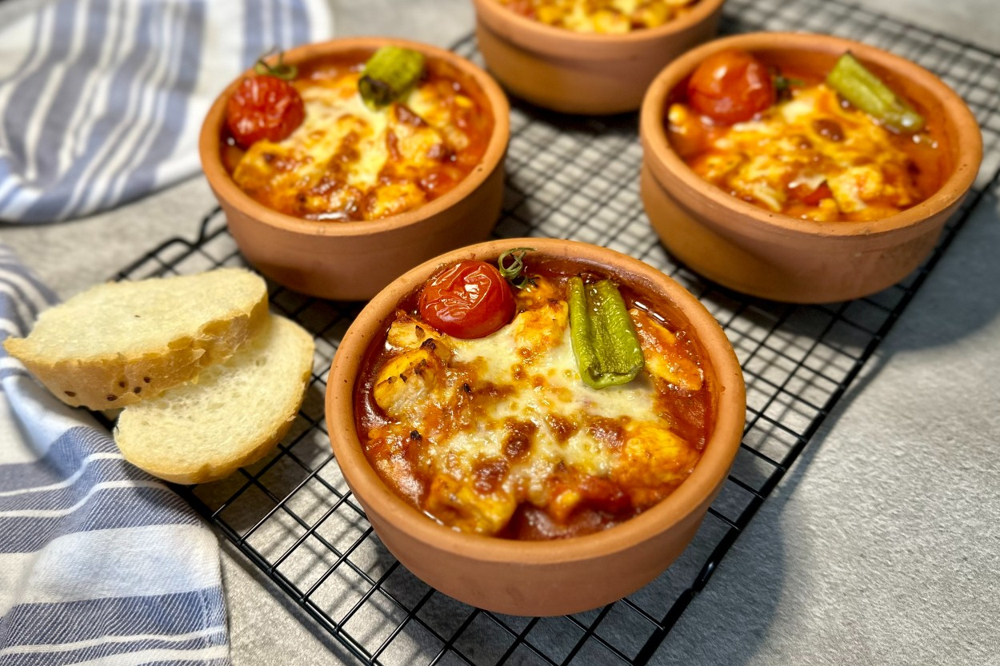

# Piliç Güveç

*Turkey's clay-pot chicken casserole: bone-in chicken pieces slow-baked in an earthenware güveç pot with onion, garlic, tomato, green pepper, mushrooms, kashar cheese and a fragrant tomato-stock sauce till the chicken is tender, the vegetables have melted into the sauce, and the top has a bubbly cheese crust. The Anatolian winter-comfort dish, individually portioned or family-style.*

**Serves:** 4

**Prep Time:** 25 minutes

**Cook Time:** 1 hour

## Overview
Piliç güveç (literally "chicken casserole"; piliç = young chicken, güveç = the traditional Turkish earthenware clay pot that gives the dish its name) is one of Turkey's most beloved Anatolian winter dishes and a staple of family kitchens across the country: bone-in chicken pieces (thighs and drumsticks; the canonical cut; sometimes a whole chicken cut into 8) are layered with sliced onion, crushed garlic, chopped tomato, sliced green bell pepper, sliced mushrooms, fragrant tomato paste and Turkish red pepper paste, doused with a tomato-stock sauce, topped with grated kashar cheese, and baked in a covered clay güveç pot for 50-60 minutes till the chicken falls from the bone, the vegetables have melted into a rich gravy, and the cheese has formed a golden bubbly crust. The dish is traditionally cooked and served in the clay pot (one large family-sized güveç or individual small güveç pots for each diner); outside Turkey, a heavy cast-iron Dutch oven or a deep ceramic baking dish is the workable substitute. Three details define proper piliç güveç. First, bone-in chicken. The bones release flavour into the sauce; the skin protects the meat during the long bake. Boneless cuts dry out. Second, the clay pot (or its equivalent). Clay distributes heat evenly and slowly, giving the proper braise. A Dutch oven is the best substitute; a ceramic baking dish works but the cook time may need adjustment. Third, the cheese topping is canonical. Kashar (Turkish hard cheese), or aged Gruyère, Pecorino or a sharp Cheddar; sprinkled generously and given time to crisp into a golden crust.

## Ingredients

### Chicken
- 1.2 kg bone-in skin-on chicken pieces (thighs and drumsticks; or 1 whole chicken cut into 8)
- 1 ½ teaspoons fine sea salt
- 1 teaspoon ground black pepper
- 1 tablespoon Aleppo pepper
- 1 tablespoon dried oregano
- 2 tablespoons olive oil (for browning)

### Vegetables
- 2 large onions (sliced into half-moons)
- 8 garlic cloves (crushed)
- 2 medium tomatoes (chopped); or 1 small tin chopped tomatoes
- 2 medium green bell peppers (cut into 3 cm pieces)
- 1 medium red bell pepper (cut into 3 cm pieces)
- 300 g mushrooms (button, chestnut or oyster; halved if large)
- 2 medium carrots (peeled and cut into thick rounds)
- 2 medium potatoes (peeled and cubed; optional but common)

### Sauce
- 3 tablespoons olive oil
- 3 tablespoons tomato paste
- 2 tablespoons Turkish red pepper paste (biber salçası)
- 400 ml hot chicken stock
- 1 tablespoon ground cumin
- 1 tablespoon dried oregano
- 1 teaspoon Aleppo pepper
- 1 teaspoon ground paprika
- 1 ½ teaspoons fine sea salt
- 1 teaspoon ground black pepper
- 2 bay leaves

### Cheese topping
- 250 g grated kashar cheese (or aged Gruyère, Pecorino, or sharp Cheddar)

### To finish
- 2 tablespoons fresh parsley (chopped)
- Lemon wedges

### To serve
- Rice pilav or warm pide bread
- Plain yogurt
- Cacık (yogurt-cucumber dip)
- Fresh salad

## Method

### Stage 1 - Season the chicken
1. Pat the chicken pieces dry with kitchen paper.
2. Sprinkle with the salt, pepper, Aleppo pepper and dried oregano.

### Stage 2 - Brown the chicken
1. Heat the 2 tablespoons of olive oil in a heavy casserole or Dutch oven over medium-high heat.
2. Brown the chicken pieces skin-side-down for 5 minutes; flip and brown the other side for 3 minutes.
3. Don't overcrowd; work in batches if needed.
4. Lift out and set aside.

### Stage 3 - Sweat the aromatics
1. Reduce heat to medium; add the 3 tablespoons fresh olive oil to the pot.
2. Add the sliced onions; cook 8-10 minutes till deeply soft and starting to caramelise.
3. Add the crushed garlic; cook 1 minute.

### Stage 4 - Build the sauce
1. Add the tomato paste and red pepper paste; cook 2 minutes till deepened.
2. Add the chopped tomatoes; cook 4-5 minutes till they break down.

### Stage 5 - Add vegetables and seasonings
1. Add the green and red peppers; cook 3 minutes.
2. Add the mushrooms, carrots and potatoes (if using); cook 5 minutes.
3. Add the cumin, oregano, Aleppo pepper, paprika, salt and pepper.
4. Add the bay leaves.

### Stage 6 - Add liquid and chicken
1. Pour in the hot chicken stock.
2. Return the browned chicken pieces to the pot, nestling into the vegetables (skin-side-up).
3. The liquid should come about halfway up the chicken.

### Stage 7 - Bake (covered)
1. Preheat the oven to 180°C (350°F).
2. Cover with the lid.
3. Transfer to the oven; bake 40 minutes.

### Stage 8 - Top with cheese and finish
1. Remove the lid.
2. Sprinkle the grated cheese generously over the chicken and vegetables.
3. Return to the oven uncovered; turn up to 220°C / 425°F.
4. Bake 15-20 minutes more till the cheese is melted, bubbly and deep golden.

### Stage 9 - Rest and serve
1. Take out of the oven; let rest 5 minutes.
2. Scatter chopped parsley over.
3. Serve directly from the pot; the rustic family-style presentation is part of the dish.
4. Provide rice pilav and warm flatbread for mopping up the sauce.

## Notes
- **Bone-in skin-on chicken:** essential for proper flavour and to keep the meat moist during the bake. Don't substitute with boneless skinless cuts.
- **Brown before braising:** the fond gives the proper sauce depth. Skipping gives a flatter sauce.
- **Cover for the long bake; uncover for the cheese crust:** the cover keeps the moisture in for the chicken; the uncover with high heat finishes the cheese.
- **Clay pot or Dutch oven:** clay is canonical but Dutch oven is the practical substitute. A ceramic baking dish works but may need an extra 10 minutes.
- **Plenty of cheese:** the cheese crust is part of the dish's identity. Don't skimp.

## Variations
**Mixed-meat güveç:** add 200 g of diced beef shoulder to the chicken; gives a richer fuller stew. Cook for an extra 20 minutes.
**Vegetarian güveç:** skip the chicken; double the mushrooms and add 1 large cubed aubergine; use vegetable stock. Common Turkish vegetarian dinner.
**With chickpeas:** add 1 tin of drained chickpeas to the pot; gives a more substantial one-pot meal.
**Spicier:** double the Aleppo pepper and add 2 chopped fresh chillies; properly fierce version.

## Serving
Family-style from the pot, or in individual small clay güveç pots (the proper Turkish restaurant presentation). With rice pilav, warm pide bread, cacık and a fresh salad. Drink: Turkish red wine (Öküzgözü, Boğazkere), ayran, or rakı with water.

## Storage
- Keeps refrigerated 4 days; the flavour deepens noticeably overnight.
- Reheat in a covered oven dish at 160°C / 320°F for 25-30 minutes till hot through.
- Freezes 3 months in portions; defrost in the fridge.
- The day-after güveç is famously even better than fresh.
- Don't aggressively reheat; the cheese topping can separate.
