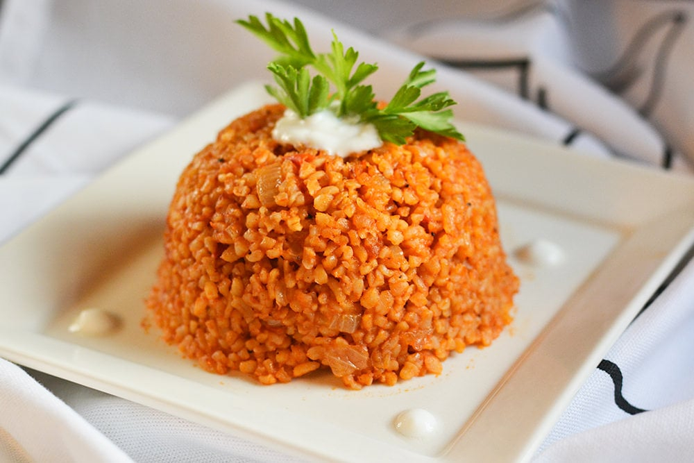

# Bulgur Pilav

*Turkey's cracked-wheat pilaf: medium bulgur wheat cooked in butter and stock with fried onion, chopped tomato, green pepper and Turkish red pepper paste, finished with parsley and pomegranate molasses. The everyday Anatolian rice alternative, eaten alongside grilled meats, stews and yogurt.*

**Serves:** 4-6

**Prep Time:** 15 minutes

**Cook Time:** 30 minutes

## Overview
Bulgur pilav is Turkey's classic cracked-wheat pilaf and a staple of Anatolian home cooking that pre-dates the introduction of rice to the region: medium bulgur (parboiled cracked wheat; the canonical Turkish bulgur is the medium grind) is cooked in a buttery base of fried onion, finely chopped green pepper, chopped fresh tomato, tomato paste and Turkish red pepper paste, then simmered in chicken stock till the bulgur absorbs the liquid and the flavours meld; finished with chopped parsley, a small drizzle of pomegranate molasses, and ground cumin and Aleppo pepper. Bulgur is the older grain in Turkey; rice arrived later from Persia and was historically a luxury food for the wealthy, while bulgur was the everyday grain of Anatolian villages. The pilav today is eaten by everyone across Turkey, often alongside the same dishes that rice pilav accompanies: grilled meats, stews, dolma. Three details define proper Turkish bulgur pilav. First, medium bulgur, not fine or coarse. Fine bulgur is for kısır (the cracked-wheat tabbouleh-style salad); coarse bulgur is too chewy for pilaf. The medium grind is what gives the proper pilaf texture. Second, the aromatic base is essential. Fried onion, green pepper, tomato and Turkish red pepper paste cooked properly in butter before adding the bulgur gives the proper Anatolian depth. Skipping this gives a bland boiled-grain. Third, like rice pilav, the lid stays on. Once the stock goes in, lid on, low heat, 12-15 minutes, then 10 minutes resting off-heat. The bulgur cooks by absorption-and-steam.

## Ingredients

### Bulgur pilav
- 350 g medium bulgur wheat (sometimes labelled "no. 2 bulgur" or "coarse bulgur for pilaf")
- 60 g butter
- 3 tablespoons olive oil
- 1 large onion (finely chopped)
- 1 medium green bell pepper (finely diced)
- 1 medium tomato (finely chopped)
- 2 tablespoons tomato paste
- 2 tablespoons Turkish red pepper paste (biber salçası)
- 700 ml hot chicken stock (or vegetable stock)
- 1 ½ teaspoons fine sea salt
- 1 teaspoon ground cumin
- 1 teaspoon Aleppo pepper (pul biber)
- ½ teaspoon ground black pepper
- 1 teaspoon dried mint
- 1 tablespoon pomegranate molasses (added at the end)

### To finish
- 1 large bunch fresh flat-leaf parsley (about 30 g; finely chopped)
- 2 spring onions (finely sliced; optional)
- Extra pomegranate molasses for drizzling
- A small dollop of yogurt per serve

### To serve
- Plain yogurt
- Grilled chillies
- Lemon wedges

## Method

### Stage 1 - Rinse the bulgur
1. Place the bulgur in a sieve under cold running water for 30 seconds to rinse off surface dust.
2. Drain thoroughly; set aside.

### Stage 2 - Sauté the aromatic base
1. Melt the butter with the olive oil in a wide heavy saucepan (with a tight-fitting lid) over medium heat.
2. Add the chopped onion; cook 6-7 minutes till soft and starting to caramelise.
3. Add the diced green pepper; cook 3-4 minutes more till softened.

### Stage 3 - Add the tomato and pastes
1. Add the tomato paste and red pepper paste; cook 2 minutes till deepened in colour.
2. Add the chopped fresh tomato; cook 3-4 minutes till the tomato breaks down.

### Stage 4 - Toast the bulgur
1. Add the rinsed-and-drained bulgur to the pan.
2. Stir to coat in the buttery vegetable base.
3. Cook 1-2 minutes; the bulgur should be glossy with butter and well-mixed with the aromatics.

### Stage 5 - Add stock and seasonings
1. Pour in the hot chicken stock.
2. Add the salt, cumin, Aleppo pepper, black pepper and dried mint.
3. Stir once.
4. Bring to a gentle simmer.

### Stage 6 - Cover and cook
1. Reduce to lowest heat; cover with the tight-fitting lid.
2. Cook 12-15 minutes covered (don't lift the lid).
3. The bulgur should absorb the liquid completely.

### Stage 7 - Rest off heat
1. Take off the heat; keep the lid on.
2. Let rest 10 minutes; the grains finish steaming.
3. Don't lift the lid early.

### Stage 8 - Finish and serve
1. Uncover; drizzle the pomegranate molasses over the pilav.
2. Fluff gently with a fork, lifting from the bottom and folding the molasses through.
3. Stir in most of the chopped parsley (reserve some for garnish).
4. Tip onto a warm serving platter or into a serving bowl.
5. Scatter the remaining parsley, the sliced spring onions and an extra small drizzle of pomegranate molasses.
6. Serve with yogurt, grilled chillies and lemon wedges.

## Notes
- **Medium bulgur, not fine or coarse:** the proper Turkish pilaf grain is medium-grind bulgur (about the size of cracked rice grains). Fine is for tabbouleh-style salads; coarse is too tough for pilaf.
- **Toast the bulgur briefly in the butter:** 1-2 minutes of coating in the buttery vegetable base gives the proper character. Skipping gives less flavour.
- **Red pepper paste (biber salçası) is essential:** the Turkish red pepper paste gives the proper Anatolian depth. Tomato paste alone gives a flatter flavour. Available at Turkish and Middle Eastern markets.
- **Don't lift the lid:** like rice pilav, the bulgur cooks by absorption-and-steam. 12-15 minutes covered, then 10 minutes resting off-heat.
- **Pomegranate molasses at the end:** the molasses is added after cooking, not in the cooking liquid; this preserves its tartness and freshness.

## Variations
**Plain bulgur pilav:** skip the tomato, pepper and red pepper paste; cook bulgur in butter, onion and stock alone; gives a cleaner more rice-like pilaf.
**Bulgur with chickpeas (nohutlu bulgur pilavı):** add 200 g of cooked chickpeas along with the bulgur; gives a more substantial protein-rich pilaf.
**Bulgur with lamb (etli bulgur pilavı):** brown 300 g of minced lamb in the pan before adding the onion; turns the pilaf into a one-pot main dish.
**Bulgur with eggplant (patlıcanlı bulgur pilavı):** add 200 g of cubed roasted eggplant along with the tomato; gives a richer pilaf with extra body.

## Serving
On warm plates or in a serving bowl as a side alongside grilled meats, stews, dolma, or fish. A spoonful of plain yogurt on the side. Lemon wedges. Often part of a Turkish family dinner with several other dishes. Drink: ayran, water, or a glass of cold beer.

## Storage
- Keeps refrigerated 4 days; the flavour deepens slightly overnight.
- Reheat in a covered pan with a splash of water (or stock) over low heat; or briefly in the microwave covered.
- Freezes 2 months in portioned containers; defrost in the fridge.
- Day-old bulgur pilav is excellent at room temperature as a kısır-style salad: toss with extra parsley, fresh tomato, lemon juice and olive oil.
- Don't aggressively reheat; the bulgur can dry out.
