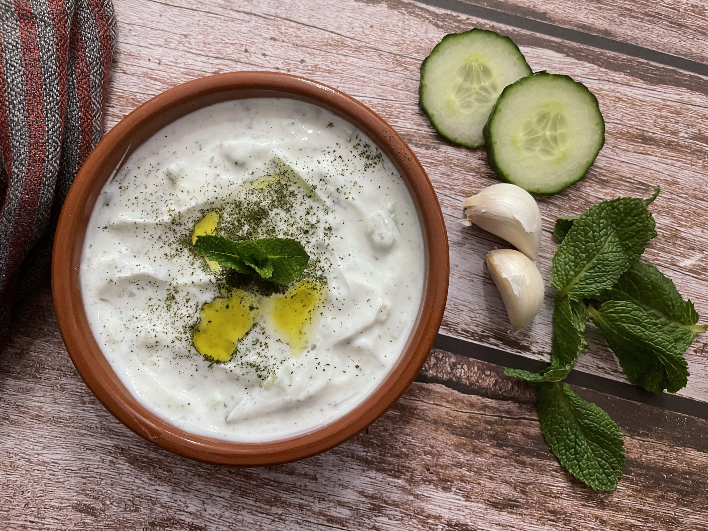

# Cacık

*Turkey's yogurt-cucumber dip: thick strained yogurt thinned with cold water and olive oil, mixed with finely diced cucumber, crushed garlic, dried mint, fresh dill and a pinch of salt, finished with a drizzle of olive oil and a sprinkle of dried mint. The Turkish meze classic, eaten as a small bowl alongside grilled meats, kebabs and rice or as a thicker dip with flatbread.*

**Serves:** 4-6

**Prep Time:** 15 minutes (plus 30 minutes resting)

**Cook Time:** 0 minutes

## Overview
Cacık (pronounced ja-jik) is Turkey's most beloved yogurt-cucumber dip and an iconic meze: thick strained yogurt thinned slightly with cold water and a drizzle of olive oil, combined with finely diced (or sometimes coarsely grated and lightly squeezed) cucumber, crushed garlic, dried mint, fresh dill, fresh chopped mint, and salt; finished with a small pool of olive oil on top and an extra sprinkle of dried mint. The dish exists in nearly identical form across the wider region (Greek tzatziki, Bulgarian tarator, Iranian māst-o-khiar, Indian raita) but the Turkish cacık has its own distinct character: thinner consistency than tzatziki (the Turkish version is often served as a cold soup-like accompaniment rather than a thick spread), heavier on the dried mint, and almost always with dill. There are two distinct serving styles. The "thick cacık" is used as a meze dip with bread (closer in consistency to tzatziki). The "thin cacık" is served in a small bowl at the side of a meal, almost a soup, eaten with a spoon between bites of richer food (the canonical Turkish way). Three details define proper cacık. First, strained yogurt. Süzme yoghurt (strained yogurt; or Greek-style yogurt; or regular yogurt strained through muslin for 1-2 hours) is essential for the proper texture. Watery thin yogurt won't give the proper body. Second, the cucumber must be drained. Salted cucumber sits 10 minutes to release moisture, then drained, before going into the yogurt; un-drained cucumber makes the dip watery. Third, dried mint is canonical. Fresh mint alone gives a different flavour profile; the dried mint provides the proper Turkish character. Both is best.

## Ingredients

### Cacık
- 600 g thick strained yogurt (süzme yoğurt; or Greek-style yogurt; or strained natural yogurt)
- 1 large cucumber (or 2 small Lebanese cucumbers; about 350 g)
- 1 teaspoon fine sea salt (for the cucumber)
- 4 garlic cloves (very finely crushed; or grated on a microplane)
- 2 tablespoons extra virgin olive oil (plus more to drizzle)
- 1 tablespoon fresh lemon juice (optional)
- 100 ml cold water (for thin cacık; or 50 ml for medium consistency; omit for thick dip-style)
- 1 ½ teaspoons dried mint
- 1 small handful fresh dill (about 15 g; finely chopped)
- 1 small handful fresh mint (about 10 g; finely chopped)
- 1 teaspoon fine sea salt (for the yogurt; taste before adding)
- ½ teaspoon ground white pepper (optional)
- ½ teaspoon ground sumac (optional)

### To finish
- 1 tablespoon extra virgin olive oil (drizzled over)
- 1 teaspoon dried mint (sprinkled over)
- 1 teaspoon sumac (optional)
- A few drops of pomegranate molasses (optional)

### To serve
- Warm pide bread or Turkish flatbread
- Sliced raw vegetables (carrot, cucumber, radish) for dipping
- Grilled chillies

## Method

### Stage 1 - Prepare the cucumber
1. Peel the cucumber in strips (leaving some skin for colour and texture).
2. Cut lengthwise; scoop out the seeds with a teaspoon (or skip if the cucumber is small and seedless).
3. Finely dice into 3-4 mm cubes (or coarsely grate on a box grater).
4. Place in a colander; sprinkle with the 1 teaspoon of salt; toss.
5. Let stand 10 minutes; the salt draws out moisture.
6. Squeeze the cucumber gently in your hands (or in a clean tea towel) to remove excess liquid.

### Stage 2 - Mix the cacık base
1. In a wide bowl, whisk together the strained yogurt, crushed garlic, olive oil, and lemon juice (if using).
2. Add the cold water gradually; the amount depends on the consistency you want.
   - 0 ml = thick dip-style (Greek-tzatziki consistency)
   - 50 ml = medium dip
   - 100 ml = thin cacık (canonical Turkish side-bowl)
   - 150 ml = soup-like cacık (rural Turkish style)
3. Whisk till smooth.

### Stage 3 - Add the cucumber and herbs
1. Stir in the drained squeezed cucumber.
2. Add the dried mint, chopped fresh dill, chopped fresh mint, salt and white pepper.
3. Mix gently with a wooden spoon till combined.
4. Taste; adjust salt and lemon.

### Stage 4 - Rest
1. Cover and refrigerate 30 minutes; the flavours marry, the garlic mellows slightly, and the dried mint plumps up.
2. Skip the rest if you're pressed for time; it's better with the rest.

### Stage 5 - Finish and serve
1. Stir the cacık before serving (the cucumber may have settled to the bottom).
2. Tip into a wide shallow serving bowl.
3. Drizzle the surface with the extra olive oil.
4. Sprinkle with dried mint, sumac and a few drops of pomegranate molasses if using.
5. Serve cold alongside grilled meats and rice, or with warm flatbread for dipping.

## Notes
- **Strained yogurt is essential:** thin watery yogurt won't give the proper body. Süzme yoğurt is the canonical Turkish choice; Greek-style yogurt is the easy substitute. To make from regular yogurt: line a sieve with muslin or a clean tea towel; pour in the yogurt; let drain over a bowl in the fridge for 1-2 hours.
- **Salt and drain the cucumber:** the most common mistake is adding wet cucumber. The 10-minute salt-and-squeeze step is essential.
- **Dried mint is canonical:** fresh mint alone gives a different profile. Dried mint (nane) is the proper Turkish flavour; combine with fresh for the best result.
- **Garlic mellows with time:** garlic added fresh is sharp; the 30-minute rest mellows it. Skip the rest only if you're pressed.
- **Adjust water to taste:** Turkish cacık ranges from thick dip (no water) to thin cold-soup (lots of water). The middle (100 ml) is the most common.

## Variations
**Soup-style cacık (cacık çorbası):** add 200-300 ml of cold water; serve in bowls as a chilled summer soup. Common in summer across Anatolia.
**Walnut cacık:** add 50 g of finely chopped walnuts; gives crunch and a nutty depth.
**Mint-heavy cacık:** double the dried and fresh mint; gives a more brightly herbed version.
**Beetroot cacık:** add 1 small cooked beetroot (finely diced) for a pink-tinged variation; common modern Turkish-Levantine variation.

## Serving
In a small bowl alongside the main meal, eaten with a spoon between bites of grilled meat or kebab. As a meze with warm flatbread for dipping. With dolma, kuzu şiş, köfte, or any rich Turkish main. The proper Turkish way is to spoon some cacık onto a bite of meat as you eat. Drink: ayran (which is the closely related drink - cacık without cucumber).

## Storage
- Keeps refrigerated 3 days; the flavour develops over 24 hours.
- The cucumber releases some water over time; stir before serving.
- Don't freeze; the texture suffers completely (the yogurt splits).
- For longest freshness, make the components ahead (drained yogurt, salted-and-squeezed cucumber) and combine 30 minutes before serving.
- Day-old cacık makes excellent dressing for salads or as a marinade for chicken.
