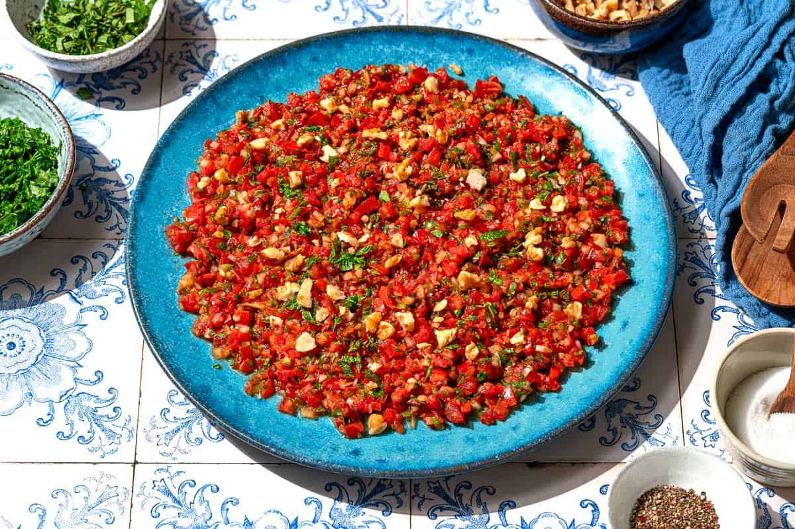

# Ezme

*Turkey's red-pepper-and-tomato relish: finely chopped tomato, red pepper, onion, parsley, garlic and Aleppo pepper, dressed with pomegranate molasses, olive oil and lemon.*

**Serves:** 4-6 (as a side or meze)

**Prep Time:** 20 minutes (plus 30 minutes resting)

**Cook Time:** 0 minutes

## Overview
Ezme (literally "crushed" in Turkish) is Turkey's signature fresh red-pepper-and-tomato relish, a vibrant aromatic side that turns up at every Turkish kebab restaurant and meze table. Sharp, bright, slightly sweet, slightly spicy: it cuts through the richness of grilled lamb, beef or chicken. Chop, don't blend: proper Turkish ezme is hand-chopped to a fine 3-4 mm dice; processed ezme goes watery and lacks the texture. The aromatic mix is tomato, red bell pepper, onion, garlic, fresh parsley and sometimes mint; the seasoning is Aleppo pepper (pul biber), sumac, salt, olive oil, fresh lemon and: non-negotiably: pomegranate molasses (nar ekşisi), the tart-sweet thick syrup that gives ezme its distinctive dark glossy character. Without it you have a generic tomato-pepper salsa. Rested at room temperature for thirty minutes so the salt draws out the vegetable juices and the flavours marry. Eaten alongside grilled meats and flatbread.

## Ingredients

- 6 medium ripe tomatoes (about 600 g; finely diced)
- 2 medium red bell peppers (deseeded and finely diced)
- 1 medium red onion (very finely chopped)
- 6 garlic cloves (very finely crushed)
- 1 large bunch fresh flat-leaf parsley (about 40 g; finely chopped)
- 1 small bunch fresh mint (about 15 g; finely chopped; optional but very Turkish)
- 2-4 fresh hot chillies (Turkish or Aleppo; finely chopped; adjust by taste)
- 3 tablespoons pomegranate molasses (nar ekşisi)
- 4 tablespoons extra virgin olive oil
- 3 tablespoons fresh lemon juice
- 2 tablespoons Turkish red pepper paste (biber salçası; optional but very Turkish)
- 1 tablespoon Aleppo pepper (pul biber)
- 1 tablespoon ground sumac
- 1 teaspoon dried mint (nane)
- 1 teaspoon ground cumin
- 1 ½ teaspoons fine sea salt
- ½ teaspoon ground black pepper

### Optional additions
- 2 tablespoons finely chopped walnuts (for crunch)
- 1 tablespoon olive oil (to drizzle on top before serving)
- A few pomegranate seeds (for garnish)

## Method

### Stage 1 - Chop the vegetables
1. Cut the tomatoes in half; squeeze out the seeds and excess juice into a bowl (discard or use the juice for stock).
2. Finely dice the tomatoes into 3-4 mm pieces.
3. Deseed the bell peppers; finely dice into 3-4 mm pieces.
4. Very finely chop the red onion; the onion pieces should be smaller than the tomato or pepper (about 2 mm) so they don't dominate.
5. Finely crush the garlic.
6. Finely chop the parsley, mint and fresh chillies.

### Stage 2 - Combine
1. In a wide bowl, combine the chopped tomatoes, peppers, onion, garlic, parsley, mint and chillies.
2. Stir gently to mix.

### Stage 3 - Season
1. Add the pomegranate molasses, olive oil, lemon juice and red pepper paste.
2. Add the Aleppo pepper, sumac, dried mint, cumin, salt and pepper.
3. Mix thoroughly with a wooden spoon till the seasonings are evenly distributed.

### Stage 4 - Rest
1. Cover the bowl; let stand at room temperature for 30 minutes.
2. The salt draws out the vegetable juices and the flavours marry.
3. After resting, the ezme will look juicier and the flavours more integrated.

### Stage 5 - Taste and adjust
1. Taste the ezme.
2. Adjust: more salt for seasoning; more lemon for sharpness; more pomegranate molasses for sweetness-tang; more Aleppo pepper for warmth.
3. The proper ezme is loud in every direction: sharp, salty, sweet (from pomegranate molasses), spicy and aromatic.

### Stage 6 - Serve
1. Transfer to a serving bowl.
2. Drizzle with a final tablespoon of olive oil.
3. Sprinkle with chopped walnuts (if using) and a few pomegranate seeds (if using).
4. Serve alongside grilled meats, kebabs, or as part of a meze spread.

## Notes
- **Chop, don't blend:** the proper Turkish ezme has a chunky chopped texture (3-4 mm pieces). Food-processed ezme goes watery and lacks character. If using a processor, pulse very briefly.
- **Pomegranate molasses is essential:** the dark sweet-tart syrup is what makes ezme Turkish. Available at Middle Eastern and Turkish markets; some supermarkets carry it. Don't substitute with regular molasses or balsamic vinegar; the flavour is wrong.
- **Aleppo pepper (pul biber):** the Turkish dried red pepper. Mild-to-moderate heat with a fragrant character. The substitute is sweet paprika + a pinch of cayenne, but the proper flavour comes from real pul biber.
- **Don't skip the resting:** 30 minutes at room temperature is essential. The salt-drawn juices, the marrying flavours and the slightly softened vegetables are what makes proper ezme.
- **Use ripe tomatoes:** the dish depends on tomato flavour. Use the ripest tomatoes you can find; greenhouse winter tomatoes give bland ezme.

## Variations
**Acılı ezme (spicy ezme):** double the fresh chillies and the Aleppo pepper; gives a properly fierce version. Common in southeast Turkey.
**Walnut ezme:** add 60 g of finely chopped walnuts to the mix; gives a richer crunchier ezme. Common in central Anatolia.
**Pepper-heavier ezme:** double the red pepper, halve the tomato; gives a more pepper-forward version. Common Aegean variation.
**Smoky ezme:** char the red peppers over a flame first, peel and chop; gives a smoky depth that's properly delicious.

## Serving
On a meze plate alongside kebabs, köfte, iskender, or any grilled meat. With warm Turkish flatbread; the ezme is for scooping. Often part of a meyhane spread with rakı; the sharpness cuts through the richness of the spirit. With cheese and bread as a light lunch.

## Storage
- Best eaten the day it's made; the flavours peak after 30 minutes of resting and stay good for several hours.
- Keeps refrigerated 3 days; the texture softens but the flavour stays good (in fact, deepens after 24 hours).
- Don't freeze; the texture suffers completely.
- The chopped vegetables alone keep refrigerated 1 day; combine with the dressing 30 minutes before serving for best results.
- Day-old ezme is excellent stirred through rice or used as a sandwich spread.
