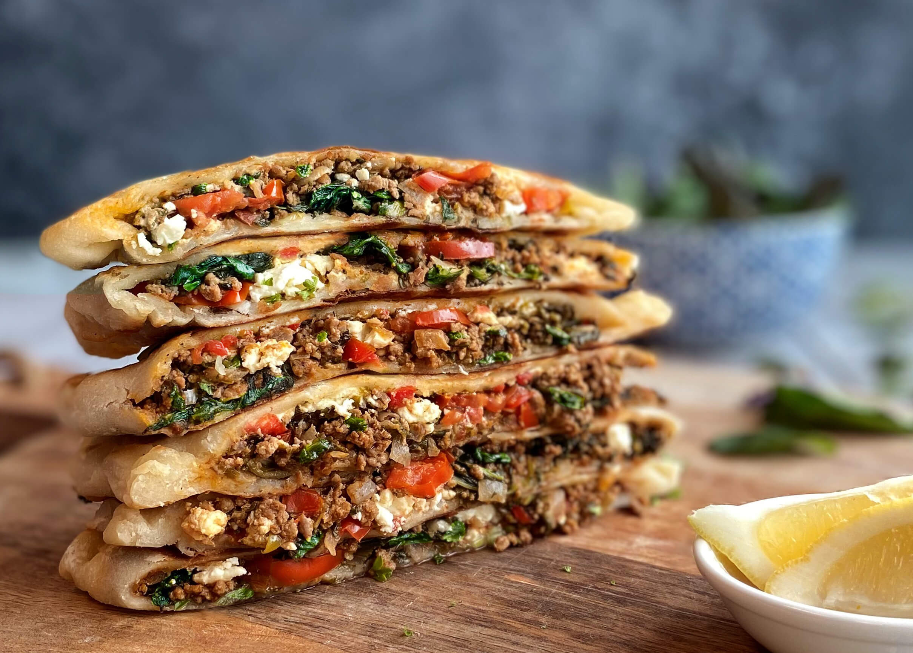

# Gözleme

*Turkey's filled village flatbread: thin discs of unleavened dough wrapped around spinach and feta, minced lamb or potato filling, cooked on a hot griddle till the outside chars in patches.*

**Serves:** 4 (4 large gözleme)

**Prep Time:** 35 minutes (plus 30 minutes resting)

**Cook Time:** 20 minutes

## Overview
Gözleme is Turkey's most iconic village flatbread, originally made by Anatolian women on a saç (the convex iron griddle over a wood fire) and now sold at every farmer's market, street stall and weekend pazar across Turkey. The dough is yufka, the paper-thin unleavened wheat-flour sheet used for börek; roll to 2 or 3 mm or it goes chewy. Traditional fillings are spinach and feta with onion and dill; minced lamb with onion, parsley and Aleppo pepper; potato with onion and cumin; or just melted cheese. The filling must be dry. Un-squeezed spinach or watery onion leaks and ruins the gözleme. Cooked on a hot dry pan (no oil) two or three minutes a side till the outside is patched-charred. Brushed with butter as it comes off the griddle, eaten immediately, cut into wedges.

## Ingredients

### Dough
- 500 g plain flour
- 1 teaspoon fine sea salt
- 280 ml warm water
- 2 tablespoons olive oil
- 1 tablespoon plain yogurt (gives a slight tenderness; optional)

### Spinach and feta filling (the classic)
- 400 g fresh spinach (washed and roughly chopped); or 200 g frozen spinach (thawed and squeezed thoroughly dry)
- 200 g feta cheese (crumbled)
- 1 small onion (finely chopped)
- 2 tablespoons olive oil
- 1 small bunch fresh dill (about 15 g; finely chopped)
- 2 tablespoons fresh parsley (finely chopped)
- 1 teaspoon Aleppo pepper (pul biber)
- ½ teaspoon ground black pepper
- ½ teaspoon ground sumac
- Pinch of fine sea salt (taste; feta is salty)

### Minced lamb filling (alternative)
- 300 g minced lamb (or beef)
- 1 large onion (finely chopped)
- 4 garlic cloves (crushed)
- 1 medium tomato (finely chopped)
- 1 tablespoon olive oil
- 1 tablespoon tomato paste
- 1 tablespoon Turkish red pepper paste (biber salçası)
- 1 small bunch fresh parsley (finely chopped)
- 1 teaspoon Aleppo pepper
- 1 teaspoon ground cumin
- 1 teaspoon dried mint
- 1 teaspoon fine sea salt
- ½ teaspoon ground black pepper

### Potato filling (alternative)
- 600 g boiled mashed potato
- 1 large onion (finely chopped and sautéed in 2 tablespoons butter till soft)
- 100 g grated kashar cheese (or feta; optional)
- 1 teaspoon ground cumin
- 1 teaspoon Aleppo pepper
- 1 ½ teaspoons fine sea salt
- 1 small bunch fresh dill (chopped)

### Cooking and finishing
- 4 tablespoons butter (melted, for brushing on cooked gözleme)
- A pinch of Aleppo pepper for sprinkling

### To serve
- Plain yogurt
- Lemon wedges
- Glass of cold ayran

## Method

### Stage 1 - Make the dough
1. In a wide bowl, whisk together the flour and salt.
2. Add the warm water, olive oil and yogurt (if using); stir to combine.
3. Knead for 6-8 minutes on a lightly floured surface till smooth.
4. Wrap in cling film or cover with a damp cloth; rest 30 minutes at room temperature.

### Stage 2 - Make the spinach-feta filling
1. If using fresh spinach: place the chopped spinach in a colander; pour boiling water over to wilt; once cool enough to handle, squeeze out as much water as possible.
2. If using frozen spinach: ensure it's thoroughly squeezed dry.
3. Heat the olive oil in a pan over medium heat; cook the chopped onion 4-5 minutes till soft.
4. In a wide bowl, combine the squeezed spinach, sautéed onion, crumbled feta, chopped dill, parsley, Aleppo pepper, black pepper, sumac and a tiny pinch of salt (taste before adding).
5. Mix gently; the filling should be moist but not wet.

### Stage 2b - Alternative: make the lamb filling
1. Heat the olive oil in a pan over medium heat.
2. Add the chopped onion; cook 6-7 minutes till soft.
3. Add the garlic; cook 30 seconds.
4. Add the minced meat; break up and cook 6-7 minutes till browned and any released liquid has evaporated.
5. Add the tomato paste, red pepper paste, chopped tomato, cumin, Aleppo pepper, dried mint, salt and pepper.
6. Cook 3-4 minutes till the tomato breaks down and the filling is moist but not wet.
7. Stir in the parsley.
8. Cool to room temperature before filling.

### Stage 3 - Divide and roll
1. Divide the dough into 4 equal pieces (about 200 g each).
2. Roll one piece on a lightly floured surface into a thin oval or circle (about 30 cm long, 25 cm wide, 2-3 mm thick).
3. The dough should be paper-thin; you should see the surface through the dough.

### Stage 4 - Fill and fold
1. Spread about 4 generous tablespoons of filling over half of the rolled dough, leaving a 2 cm border around the edge.
2. Don't overfill; less filling gives a more authentic gözleme.
3. Fold the unfilled half of the dough over the filling.
4. Press the edges firmly to seal.
5. Trim any rough edges with a knife for a tidy rectangle (about 25 cm × 15 cm).

### Stage 5 - Cook on a dry griddle
1. Heat a heavy flat frying pan or griddle over medium-high heat till properly hot (no oil).
2. Place the filled gözleme on the dry pan.
3. Cook 2-3 minutes on the first side; the bottom should develop golden-brown patches and the dough should be cooked through where you can see it.
4. Flip with a wide spatula; cook 2-3 minutes on the second side.

### Stage 6 - Brush with butter
1. Just before lifting off the pan, brush the top with melted butter.
2. Flip briefly; the butter sizzles and gives a richer crispy finish.
3. Lift onto a warm plate.

### Stage 7 - Cut and serve
1. Sprinkle with a pinch of Aleppo pepper.
2. Cut into wedges or strips.
3. Serve immediately with plain yogurt, lemon wedges and a cold ayran.

## Notes
- **Paper-thin dough is essential:** the proper gözleme has thin crispy dough. Thick dough gives chewy bread, not gözleme.
- **Filling must be dry:** wet filling (un-squeezed spinach, watery onion) leaks and ruins the gözleme. Squeeze spinach thoroughly; cook onion first if including.
- **Dry hot pan:** no oil; the pan must be properly hot before the gözleme goes on. Oil gives a fried-bread texture which isn't right.
- **Don't overfill:** 4 tablespoons per gözleme is right. Overfilled gözleme burst at the seams.
- **Eat immediately:** gözleme is best fresh off the griddle. Goes off-texture (chewy and leathery) as it cools.

## Variations
- **Cheese-only gözleme:** 200 g grated kashar + 200 g feta + chopped parsley + dill. Simplest filling, kid-friendly.
- **Mushroom and walnut gözleme:** 300 g chopped mushrooms cooked with onion + 80 g chopped walnuts + chopped parsley. Common vegan-friendly variation.
- **Spicier gözleme:** add 1 tablespoon of Turkish red pepper paste to any filling; gives a properly warm version.
- **Mini gözleme:** divide the dough into 8 smaller pieces; fold into smaller pockets; great for party trays.

## Serving
- Hot off the griddle, cut into wedges or strips, with plain yogurt for dipping and lemon wedges for squeezing. With a cold glass of ayran (the traditional pairing) or hot sweet tea. As breakfast, lunch, or street snack. Often part of a weekend Turkish breakfast spread.

## Storage
- Best eaten fresh and hot.
- Keeps refrigerated 3 days; reheat in a hot dry pan for 1-2 minutes per side to crisp again.
- Don't microwave; the dough goes leathery.
- Freezes 2 months cooked or uncooked. For uncooked: stack with parchment between, freeze flat, transfer to a bag. Cook from frozen in a hot dry pan for 4-5 minutes per side.
- The filling alone keeps refrigerated 3 days; use within or freeze.
