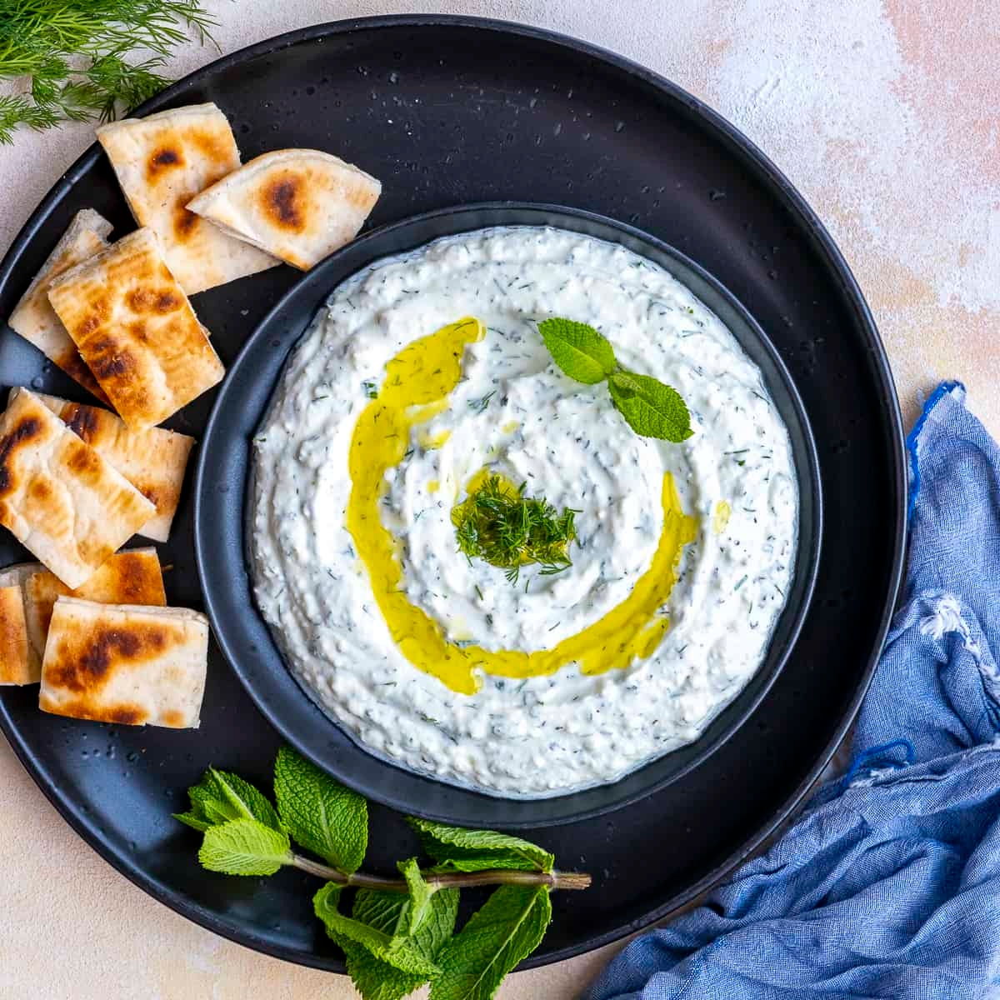

# Haydari

*Turkey's yogurt-feta-mint dip: thick strained yogurt blended with crumbled feta, crushed garlic, dried mint, chopped walnuts, fresh dill and a drizzle of olive oil. The Turkish meze classic with more body than cacık, eaten with warm pide bread, raw vegetables and grilled meat.*

**Serves:** 4-6 (as a meze)

**Prep Time:** 15 minutes (plus 30 minutes resting)

**Cook Time:** 0 minutes

## Overview
Haydari (pronounced hay-da-ree) is Turkey's other great yogurt-based meze and the thicker cousin of cacık: a dense spreadable dip made from thick strained yogurt blended with crumbled feta cheese, crushed garlic, dried mint, finely chopped walnuts, fresh dill and parsley, salt and a drizzle of olive oil; finished with a small pool of olive oil on top and sprinkles of dried mint, Aleppo pepper and sumac. Where cacık is light and often thin (eaten with a spoon as a cooling side), haydari is thick and assertive (eaten with bread or vegetables as a meze dip). The dish appears on every meyhane (traditional Turkish tavern) meze table alongside ezme, hummus, mücver, dolma and the various other small plates; it's also a staple of home meze spreads. Three details define proper haydari. First, the cheese gives the proper Turkish character. Crumbled feta (or properly Turkish "beyaz peynir") is essential. Without the cheese, you have plain garlicky yogurt; with it, you have proper haydari. Second, dried mint is non-negotiable. Fresh mint alone gives a different flavour; dried mint (nane) gives the canonical Turkish profile. Use both for the best result. Third, the walnuts. Finely chopped walnuts give crunch and a slight bitter depth that balances the richness. Some Turkish home cooks skip the walnuts (for a smoother version); the classic meyhane haydari includes them.

## Ingredients

- 500 g thick strained yogurt (süzme yoğurt; or Greek-style yogurt drained extra for 1 hour)
- 200 g feta cheese (drained and crumbled; or Turkish beyaz peynir if available)
- 4 garlic cloves (very finely crushed)
- 4 tablespoons extra virgin olive oil (plus more to drizzle)
- 1 tablespoon fresh lemon juice (optional)
- 60 g shelled walnuts (lightly toasted and finely chopped)
- 2 teaspoons dried mint
- 1 small handful fresh dill (about 15 g; finely chopped)
- 1 small handful fresh mint (about 10 g; finely chopped)
- 1 small handful fresh flat-leaf parsley (about 10 g; finely chopped)
- ½ teaspoon Aleppo pepper (pul biber)
- ½ teaspoon ground sumac
- ½ teaspoon ground black pepper
- Pinch of fine sea salt (taste; feta is salty)

### To finish
- 2 tablespoons extra virgin olive oil
- 1 teaspoon dried mint
- 1 teaspoon Aleppo pepper
- 1 teaspoon sumac
- A few small extra walnut pieces

### To serve
- Warm pide bread
- Sliced raw vegetables (carrot, cucumber, radish, celery)
- Olives
- Sliced raw red onion sprinkled with sumac

## Method

### Stage 1 - Toast the walnuts
1. Heat a dry pan over medium heat.
2. Add the walnuts; toast 2-3 minutes, shaking the pan, till slightly golden and fragrant.
3. Tip onto a board; cool slightly; chop finely (some texture is good).

### Stage 2 - Strain the yogurt extra (if needed)
1. If your yogurt isn't already süzme (extra-strained): line a sieve with muslin or a clean tea towel.
2. Tip the yogurt in; let drain over a bowl in the fridge for 1 hour.
3. Discard the drained whey; transfer the yogurt to a wide bowl.

### Stage 3 - Combine the base
1. In a wide bowl, mash the crumbled feta with a fork to a rough paste.
2. Add the strained yogurt, crushed garlic, olive oil and lemon juice (if using).
3. Whisk vigorously till smooth and combined.

### Stage 4 - Add herbs, walnuts and seasoning
1. Stir in most of the chopped walnuts (reserve a small handful for garnish).
2. Add the dried mint, fresh dill, fresh mint, parsley, Aleppo pepper, sumac and black pepper.
3. Mix gently with a wooden spoon till everything is evenly distributed.
4. Taste; add salt if needed (carefully; the feta and yogurt are already salty).

### Stage 5 - Rest
1. Cover and refrigerate 30 minutes; the flavours marry and the dried mint plumps.

### Stage 6 - Finish and serve
1. Spoon the haydari into a wide shallow serving bowl.
2. Use the back of a spoon to make swirls in the surface; create wells to hold the olive oil.
3. Drizzle the surface with the extra olive oil; let it pool in the wells.
4. Sprinkle with dried mint, Aleppo pepper, sumac, and the reserved chopped walnuts.
5. Serve with warm pide bread, raw vegetables and olives.

## Notes
- **Strained yogurt for thickness:** haydari should be thick enough to scoop with bread without dripping. Süzme yoğurt (the Turkish extra-strained variety) is the canonical choice; otherwise drain Greek-style yogurt for an additional hour.
- **Feta is essential:** the cheese gives the proper Turkish character. Don't skip; substitute with goat cheese or ricotta salata only if feta is unavailable.
- **Both dried and fresh mint:** dried mint (nane) gives the proper Turkish character; fresh mint adds brightness. Use both.
- **Rest before serving:** 30 minutes lets the dried mint hydrate and the garlic mellow. Don't rush.
- **The walnut crunch:** finely chopped toasted walnuts give the canonical texture. Skip for a smoother version, but include for the classic meyhane experience.

## Variations
**Smoked-eggplant haydari (közlemeli haydari):** add 1 small charred eggplant (peeled and chopped) to the dip; gives a smoky depth common in Aegean kitchens.
**Roasted red pepper haydari:** add 1 chopped roasted red pepper to the dip; gives a slightly sweet pink-tinged variation.
**Vegan haydari:** swap the yogurt for thick cashew cream and the feta for crumbled tofu marinated in lemon juice and salt; less canonical but increasingly common.
**Spicy haydari:** add 1-2 tablespoons of harissa or doubled Aleppo pepper; gives a fierce version.

## Serving
On a meyhane meze plate alongside ezme (the tomato-pepper relish), hummus, mücver (zucchini fritters), dolma (stuffed grape leaves), olives, and warm pide bread. As a dip with raw vegetables. As a sauce alongside grilled meats. Drink: rakı (the canonical meze pairing), Türk kahvesi after, or cold beer.

## Storage
- Keeps refrigerated 4 days in a sealed container; the flavour deepens noticeably overnight.
- Don't freeze; the texture suffers (the yogurt splits and the walnuts go off).
- Bring to room temperature 20 minutes before serving for the best flavour.
- The walnuts may soften over time; add fresh chopped walnuts at the top before serving for fresh crunch.
- Day-old haydari makes excellent sandwich spread or dressing thinned with extra olive oil.
