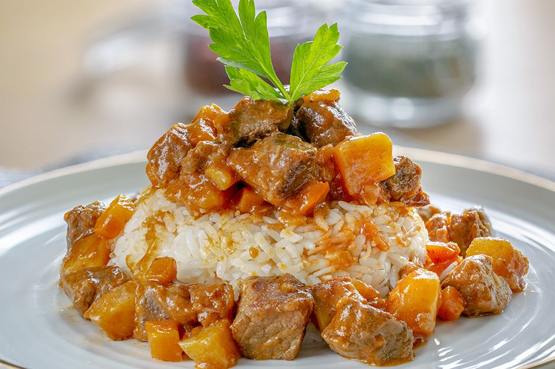

# Tas Kebabı

*Turkey's "pot kebab" lamb stew: cubed lamb shoulder slow-braised with onion, mushroom, tomato, green pepper and Turkish red pepper paste till the sauce reduces to a glossy rich gravy.*

**Serves:** 4-6

**Prep Time:** 20 minutes

**Cook Time:** 1 hour 45 minutes

## Overview
Tas kebabı (literally "pot kebab"; tas = bowl/pot, kebab = grilled or roasted meat: here referring to the slow-cooked pot version) is one of Turkey's most beloved home-cook stews and a staple of Anatolian winter cooking. It appears on the menu of every esnaf lokantası (the working-people's lunch restaurants) as the daily-stew option. Lamb shoulder is the cut: lean cuts dry out, while shoulder gives the rich fatty result. The cubes brown hard first: the fond at the bottom of the pot is what gives the sauce its depth: then a layered base builds: onion, then garlic, then tomato paste, then peppers, then mushrooms, each cooked briefly before the next addition. Tomato, Turkish red pepper paste (biber salçası) and warm spices go in for the braise. Ninety minutes minimum till the meat is fork-tender and the whole pot has reduced to a glossy rich gravy with the mushrooms soaked through. Served in deep bowls over rice pilav or with chunks of pide bread for mopping up the sauce.

## Ingredients

### Lamb
- 1 kg boneless lamb shoulder (cut into 3 cm cubes)
- 1 tablespoon plain flour (for dusting the meat)
- 1 teaspoon fine sea salt
- ½ teaspoon ground black pepper

### Cooking base
- 3 tablespoons olive oil
- 2 tablespoons butter
- 3 large onions (finely sliced into half-moons)
- 8 garlic cloves (crushed)
- 3 tablespoons tomato paste
- 2 tablespoons Turkish red pepper paste (biber salçası)
- 4 medium tomatoes (chopped); or 1 tin (400 g) chopped tomatoes
- 2 medium green bell peppers (deseeded and cut into 2 cm pieces)
- 400 g mushrooms (button, chestnut or oyster; halved or quartered if large)

### Liquid and seasoning
- 600 ml hot beef or lamb stock
- 200 ml dry red wine (optional but adds depth; substitute with extra stock)
- 1 teaspoon ground cumin
- 1 teaspoon ground allspice
- 1 teaspoon Aleppo pepper (pul biber)
- 1 teaspoon dried oregano
- 2 teaspoons fine sea salt (taste; the pastes are salty)
- 1 teaspoon ground black pepper
- 4 bay leaves
- 1 cinnamon stick

### To finish
- 2 tablespoons fresh flat-leaf parsley (chopped)
- 1 tablespoon fresh dill (chopped, optional)
- Lemon wedges

### To serve
- Rice pilav (the canonical accompaniment) or warm pide bread
- Plain yogurt
- Pickled chillies (optional)

## Method

### Stage 1 - Brown the lamb
1. Pat the lamb cubes dry with kitchen paper.
2. Toss with the flour, 1 teaspoon salt and 1/2 teaspoon black pepper.
3. Heat the olive oil and butter in a heavy casserole over medium-high heat.
4. Brown the lamb in batches for 3-4 minutes per side till deeply golden. Don't overcrowd.
5. Transfer the browned lamb to a plate.

### Stage 2 - Sweat the onions
1. Reduce heat to medium.
2. Add the sliced onions to the same pot; cook 10 minutes till deeply soft and starting to caramelise (use the fond from browning).
3. Add the crushed garlic; cook 1 minute.

### Stage 3 - Build the tomato base
1. Add the tomato paste and red pepper paste; cook 2 minutes till deepened.
2. Add the chopped fresh tomatoes; cook 5-7 minutes till they break down.
3. Add the green peppers; cook 3 minutes.

### Stage 4 - Add mushrooms and spices
1. Add the mushrooms; cook 5 minutes till they release their liquid and the liquid evaporates.
2. Add the cumin, allspice, Aleppo pepper, oregano, salt and pepper; cook 1 minute.

### Stage 5 - Add liquid and lamb
1. Return the browned lamb (and any juices) to the pot.
2. Pour in the red wine (if using); let bubble for 1 minute.
3. Add the hot stock.
4. Add the bay leaves and cinnamon stick.
5. Stir well; bring to a simmer.

### Stage 6 - Slow-cook
1. Cover with the lid slightly ajar.
2. Reduce to lowest heat.
3. Cook 90 minutes till the lamb is fork-tender and the sauce has reduced to a glossy gravy.
4. Stir occasionally.
5. If the sauce reduces too much, add a splash of hot stock; if too thin, simmer uncovered for 10 more minutes.

### Stage 7 - Finish
1. Taste and adjust salt and pepper.
2. Lift out the bay leaves and cinnamon stick.
3. Stir in most of the chopped parsley and dill.

### Stage 8 - Serve
1. Spoon rice pilav into deep bowls.
2. Ladle generous portions of tas kebabı over.
3. Scatter the remaining parsley.
4. A small dollop of yogurt on the side.
5. Lemon wedges.
6. Eat with a spoon; have pide bread for mopping up the sauce.

## Notes
- **Brown the lamb properly:** the fond is essential for sauce depth. Don't skip the browning step; cook in batches if needed.
- **Lamb shoulder, not leg:** shoulder has more fat and connective tissue; leg goes dry. The proper Turkish stew uses shoulder.
- **Layered cooking:** each ingredient cooked briefly before the next gives proper depth. Don't dump everything in together.
- **Cinnamon stick is the secret:** the small amount of cinnamon gives the proper Turkish warm-spice profile. Don't skip; it's not enough to make the dish "sweet" but it provides the canonical depth.
- **Slow-cook properly:** 90 minutes minimum for lamb to go tender. Don't rush.

## Variations
**Beef tas kebabı:** swap the lamb for beef chuck or stewing steak; cook 100-110 minutes for tenderness. Common everyday variation.
**With chestnuts:** add 200 g of peeled chestnuts to the pot in the last 30 minutes; gives a sweet-nutty depth common in autumn Turkish cooking.
**Spicier:** double the Aleppo pepper and add 2 chopped fresh chillies; properly fierce version.
**With dried apricots:** add 100 g of dried apricots to the pot in the last 30 minutes; gives a sweet-savoury Anatolian variation.

## Serving
In deep bowls over rice pilav, with the rich sauce ladled over and parsley scattered. Pide or any Turkish flatbread on the side. A dollop of yogurt and lemon wedges. Drink: a glass of Turkish red wine (Öküzgözü or Boğazkere), rakı, or ayran.

## Storage
- Keeps refrigerated 5 days; the flavour deepens noticeably overnight (better the next day, as with most stews).
- Reheat gently in a covered pan over low heat with a splash of stock if needed.
- Freezes 3 months in portioned containers; defrost in the fridge.
- Day-old tas kebabı is excellent over pasta or rice for lunch the next day.
