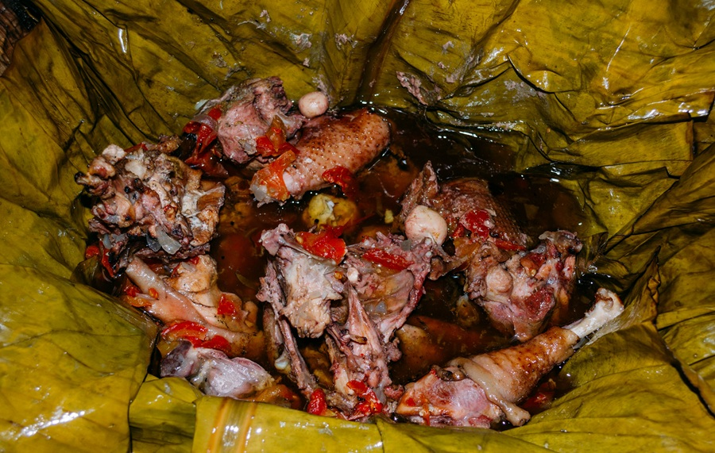

# Luwombo

*Uganda's celebration parcel: chicken or beef wrapped tight in banana leaves and steamed slow over matoke until the meat falls apart.*

**Serves:** 4

**Prep Time:** 30 minutes

**Cook Time:** 2 hours

## Overview
Chicken thighs are marinated briefly in onion, garlic, ginger, tomato and a sprinkle of curry powder, then sealed in a banana-leaf parcel along with chopped onion, tomato and a knob of butter. The parcels steam in a covered pot for 90 minutes to 2 hours, the leaves perfuming the meat, the juices concentrating into a glossy sauce. Each diner unwraps their own parcel. Baking parchment and foil stand in if banana leaves are unobtainable.

## Ingredients

### Chicken filling
- 8 bone-in chicken thighs, skin on (about 1.2 kg)
- 1 teaspoon salt
- 1 teaspoon ground black pepper
- 2 teaspoons mild curry powder
- 1 Royco or Maggi cube (crumbled)
- Juice of 1 lemon

### Aromatics for the parcels
- 2 onions (large, finely chopped)
- 4 garlic cloves (crushed)
- 2 cm piece of ginger (grated)
- 4 tomatoes (medium, chopped)
- 1 green chilli (finely chopped, seeds removed)
- 2 tablespoons tomato purée
- 40 g unsalted butter, in 4 knobs
- Small bunch coriander (roughly chopped)

### Wrapping
- 4 banana leaves (large, about 40 x 50 cm each), passed briefly over an open flame until they soften and turn glossy (see Notes for alternative)
- Kitchen string

## Method

### Stage 1 - Marinate the chicken
1. Combine the salt, pepper, curry powder, crumbled stock cube and lemon juice in a large bowl.
2. Add the chicken thighs and toss to coat. Leave to sit for 20 minutes while you prepare the leaves and filling.

### Stage 2 - Make the aromatic mix
1. In a separate bowl, combine the onions, garlic, ginger, tomatoes, chilli, tomato purée and coriander. Mix well; this is the wet aromatic that will surround the chicken in the parcel.

### Stage 3 - Soften the banana leaves
1. Wipe each leaf clean.
2. Hold each leaf above a gas flame or a hot dry frying pan, moving it slowly. Within 20 seconds it shifts from matte to glossy and becomes pliable instead of brittle. Set aside.

### Stage 4 - Wrap the parcels
1. Lay a softened leaf, glossy side up, on the worktop with the grain running away from you.
2. Place 2 chicken thighs in the centre.
3. Spoon a generous quarter of the aromatic mix over and around the chicken.
4. Tuck a knob of butter on top.
5. Fold the bottom of the leaf up over the chicken, then the top down, then both sides in, making a tight rectangular bundle.
6. Tie firmly with kitchen string in two directions, like a parcel.
7. Repeat for the remaining three parcels.

### Stage 5 - Steam
1. Set a large steamer or a deep pot fitted with a steamer insert over the hob. Pour in 4 cm of water and bring to a steady boil.
2. Stack the parcels in the steamer, seam side down. They can sit close but not crushed.
3. Cover tightly and steam over medium heat for 1 ½ to 2 hours. Top up with boiling water every 30 minutes so the pot does not run dry.
4. The chicken is done when it slides off the bone at a poke; the leaves will have darkened from green to deep olive brown.

### Stage 6 - Serve
1. Lift each parcel out carefully (they will be heavy with sauce).
2. Place straight onto each diner's plate. Snip the string and open at the table; the steam release is part of the ritual.
3. Spoon the sauce that has pooled in the leaf over the chicken.

## Notes
- **Banana leaves give the flavour:** They contribute a green, tea-like aroma that is unmistakable. Frozen banana leaves are sold in Asian and African supermarkets and need only a quick flame-pass to soften.
- **Foil-and-parchment substitute:** If no banana leaves at all, lay a 35 cm square of foil, top with the same size square of baking parchment (so the parchment touches the food, not the foil), fill, fold and crimp tightly. You lose the leaf aroma but keep the steamed concentration. Add a small splash of stock to each parcel to make up for the moisture the leaves would have contributed.
- **Steaming, not boiling:** Water must not touch the parcels. A trivet or a folded tea towel underneath keeps them clear if your steamer is shallow.
- **The sauce is short:** Luwombo is meant to be intensely concentrated, not soupy. The sauce in each parcel is just enough to coat the meat and soak into matoke or rice on the side.

## Variations
**Beef luwombo:** Use 800 g chuck cut in 4 cm pieces. Add 30 minutes to the steaming time.
**Smoked fish luwombo:** Use 600 g smoked mackerel or smoked tilapia. Steam for just 45 minutes; the fish is already cooked and only needs to absorb the aromatics.

## Serving
Serve with: Matoke (steamed green plantain) or plain steamed rice, plus a side of sukuma wiki (greens).
Garnish with: A wedge of lemon and a few fresh coriander leaves.

## Storage
- Best eaten the day it is cooked; the leaves continue to release tannins and the dish can turn slightly bitter.
- Keeps 2 days refrigerated; reheat the unwrapped contents gently in a covered pan with a splash of water.
- Not recommended for freezing.
