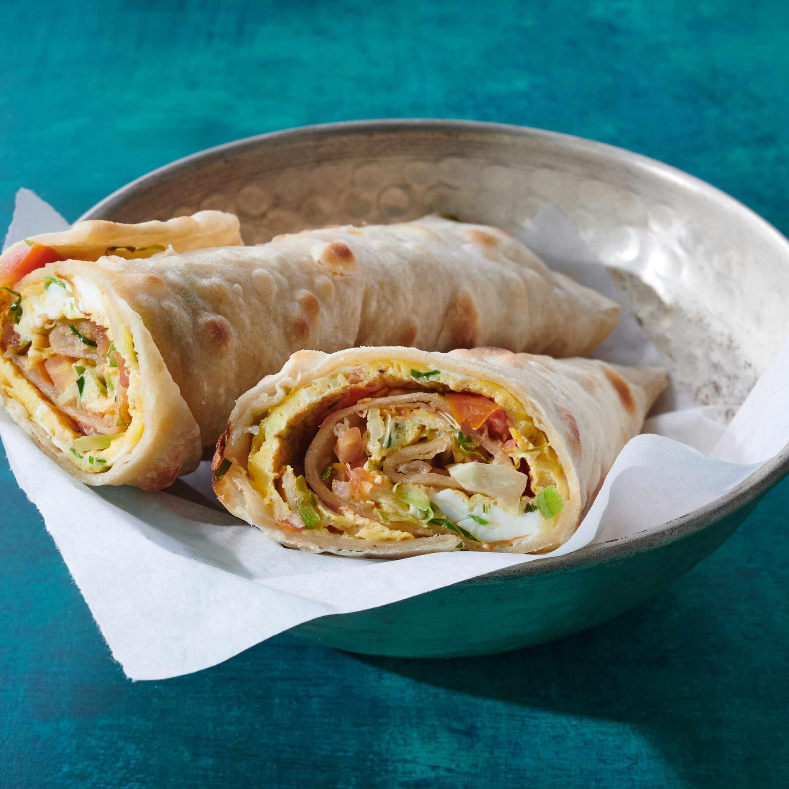

# Rolex

*Uganda's iconic street food: a thin chapati wrapped tightly around a vegetable omelette of egg, tomato, onion and cabbage. Cooked on roadside grills across Kampala and named for "rolled eggs" rather than the watch.*

**Serves:** 2 (makes 2 rolexes)

**Prep Time:** 15 minutes

**Cook Time:** 10 minutes

## Overview
Rolex is Uganda's beloved street food: a fresh-cooked vegetable omelette wrapped tightly in a thin chapati and eaten warm by hand from the wooden roadside stands that line every street in Kampala from morning till late night. The name has nothing to do with the watch; it comes from "rolled eggs", and the dish was invented at university campuses near Makerere in the early 2000s as a student meal. Now eaten by everyone from schoolchildren to government ministers. The chapati matters more than the filling. A proper Uganda chapati is thicker and stretchier than its Indian cousin, made with a small amount of oil worked into the dough so it stays pliable enough to wrap tightly around the eggs without tearing. The omelette is laid into a hot oiled pan, a hot fresh chapati pressed onto it while it cooks, then the whole thing flipped so the chapati ends up underneath, rolled tight into a cigar and wrapped in greaseproof paper or foil. Two rolexes is a meal; one is lunch on the go.

## Ingredients

### Chapati (makes 2)
- 200 g plain flour (plus extra for dusting)
- ½ teaspoon fine sea salt
- 2 tablespoons vegetable oil (plus extra for cooking)
- 120 ml warm water

### Omelette filling (per rolex)
- 3 large eggs
- 2 tablespoons finely chopped onion
- 2 tablespoons finely chopped tomato (deseeded)
- 2 tablespoons finely shredded cabbage
- 1 tablespoon finely chopped green pepper (optional)
- ¼ teaspoon fine sea salt
- 1 pinch ground black pepper
- 1 tablespoon vegetable oil (for the pan)

### To finish
- 2 tablespoons fresh coriander (chopped)
- 1 fresh green chilli (finely chopped, optional)
- Hot pepper sauce (chilli sauce of choice, to serve)

## Method

### Stage 1 - Make the chapati dough
1. Tip the flour into a wide bowl with the salt.
2. Pour in 2 tablespoons of oil and rub through the flour with your fingertips.
3. Add the warm water gradually, mixing with one hand till the dough comes together into a soft pliable mass. Don't overhydrate; you want a soft but not sticky dough.
4. Knead on a lightly floured surface for 5-6 minutes till smooth and elastic.
5. Cover with a damp cloth and rest 30 minutes.

### Stage 2 - Roll and cook the chapatis
1. Divide the dough into 2 equal balls.
2. Roll each ball out on a lightly floured surface into a thin circle about 25 cm across; the chapati should be thin enough to be flexible but not see-through.
3. Heat a heavy frying pan or tawa over medium-high heat. When hot, brush lightly with oil.
4. Lay a chapati in the pan and cook 30-40 seconds till bubbles form on the surface.
5. Flip, brush the top with a little oil and cook the second side another 30-40 seconds till lightly browned in spots.
6. Stack the cooked chapatis on a plate covered with a clean cloth to keep them warm and soft. Cook the second chapati the same way.

### Stage 3 - Beat the egg filling
1. For each rolex, crack 3 eggs into a small bowl.
2. Add the finely chopped onion, tomato, cabbage and green pepper (if using).
3. Season with salt and pepper.
4. Beat with a fork till the eggs are uniform and the vegetables are evenly distributed.

### Stage 4 - Cook the omelette
1. Wipe the chapati pan clean and add a tablespoon of vegetable oil over medium heat.
2. When the oil is hot, pour in the egg mixture and immediately tilt the pan in a slow circle so the egg spreads into a thin even round the size of the chapati.
3. Let the omelette cook 30-40 seconds till the bottom is set but the top is still slightly wet.

### Stage 5 - The fold (the rolex trick)
1. Immediately lay a fresh hot chapati on top of the cooking omelette, pressing down lightly so the chapati sticks to the still-wet egg surface.
2. Cook another 30 seconds for the omelette to set fully against the chapati.
3. Slide a spatula under the whole thing and flip it onto a board, chapati-side down now with the omelette facing up.

### Stage 6 - Fill and roll
1. While still hot, scatter the chopped coriander and chopped chilli (if using) over the omelette surface.
2. Drizzle a teaspoon of hot pepper sauce across the centre if you want it spicy.
3. Starting from one edge, roll the chapati-omelette tightly into a fat cigar shape, tucking as you go so the filling stays inside.
4. Cut in half on the diagonal or leave whole.
5. Wrap the bottom half in greaseproof paper or foil to hold it together while eating.

### Stage 7 - Serve
1. Eat immediately, warm in the hand. A small dish of extra hot pepper sauce on the side for dipping.

## Notes
- **Soft chapatis matter:** the chapati needs to be soft enough to roll without cracking. The 30-minute dough rest plus the oil rubbed through the flour gives the right stretchy pliable texture. Day-old or hard chapatis split when you try to roll them around the omelette.
- **Thin omelette not thick:** beat the eggs well so the omelette spreads thin in the pan, and use a wide pan so the diameter matches the chapati. A thick omelette makes a fat lopsided rolex.
- **Bond chapati to omelette while wet:** the omelette's surface must still be a touch wet when you press the chapati on top. The egg seizes onto the chapati and holds the rolex together when rolled. A fully set omelette won't bond to the chapati and the whole thing falls apart.
- **Roll tight:** Kampala rolex sellers roll them properly tight so the rolex holds its shape and the customer doesn't lose filling out the back. Tuck and squeeze as you roll.
- **Vegetable variations:** the standard Kampala filling is onion, tomato and cabbage. Some stalls add carrot, green pepper, hot chilli or even cooked beans. Stay light on quantities; too much vegetable and the egg won't bind into a coherent omelette.

## Variations
- **Beef rolex:** add 2 tablespoons of pre-cooked diced beef or minced beef to the egg mixture. Common at lunch counters.
- **Avocado rolex:** sliced ripe avocado laid on top of the omelette before rolling. A modern Kampala upgrade.
- **Double rolex (kikomando):** two rolexes wrapped together with a generous layer of cooked beans between them. The properly enormous version sold near Makerere University.
- **Banana rolex:** chopped sweet matoke or banana folded into the omelette. A regional variation from rural Buganda; sweet and savoury at once.

## Serving
- Eat warm by hand, the paper wrap protecting your fingers from the hot oil and egg juices. Best with a hot chilli sauce on the side. Late-night Kampala rolex is one of the great street meals; it's also a brilliant weekend brunch made at home.

## Storage
- Best eaten immediately. A rolex doesn't reheat well; the omelette gets rubbery and the chapati goes leathery.
- Leftover chapatis keep wrapped in foil at room temperature for a day and can be refreshed on a dry pan for 30 seconds a side.
- Don't freeze.
