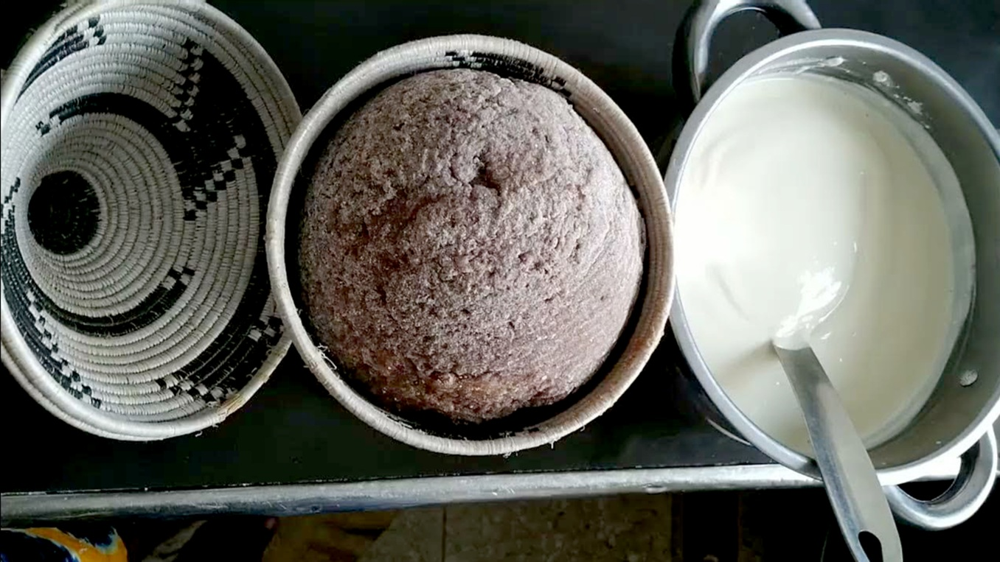

# Kalo

*The dense millet-cassava staple of eastern Uganda: brown millet flour and cassava flour boiled together into a dark stiff porridge, then shaped into smooth flat discs. The Mt Elgon counterpart to posho, eaten with smoked-fish stews and groundnut sauces.*

**Serves:** 4

**Prep Time:** 5 minutes

**Cook Time:** 25 minutes

## Overview
Kalo is the dense dark millet-and-cassava staple of eastern Uganda, particularly the Bagisu and Iteso peoples around Mount Elgon, where it counts as the traditional cousin to the whiter maize-meal posho of central Buganda. Brown finger-millet flour and cassava flour are stirred together into boiling water and worked hard with a wooden paddle till the porridge stiffens into a dense earthy chocolate-coloured mass, then shaped into smooth flat discs the size of a side plate. Diners tear pieces off, roll them into small balls and scoop stew with the right hand. The flavour is distinctive and acquired: faintly fermented, slightly sour, deeply earthy from the millet, with a slight elastic stretch from the cassava flour. Eats best with groundnut sauces and smoked-fish stews. Use proper finger-millet flour (bulo in Luganda, wimbi in Swahili); brown sorghum substitutes, wholemeal wheat can't. The millet-to-cassava ratio varies by family; 70:30 is a workable middle.

## Ingredients

- 350 g brown finger-millet flour (bulo flour; or substitute brown sorghum flour at a push)
- 150 g cassava flour
- 1.3 litres water
- ¼ teaspoon fine sea salt (optional)

## Method

### Stage 1 - Sift the flours
1. Combine the millet and cassava flours in a wide bowl and whisk through to break up any lumps. Sift through a coarse sieve if you have one; finger-millet flour sometimes has small clumps.

### Stage 2 - The slurry
1. Take 150 g of the combined flour mixture and whisk into 400 ml of cold water in a heavy-bottomed saucepan till smooth and lump-free.
2. Add the remaining 900 ml of water.
3. Place the pan over medium-high heat and bring to a gentle boil, stirring constantly.

### Stage 3 - First cook
1. Once boiling, reduce to medium-low.
2. Stir constantly with a wooden spoon for 5-6 minutes till you have a thick loose dark porridge. The colour will deepen to a deep chocolate brown as the millet hydrates.

### Stage 4 - Build to kalo
1. Begin adding the remaining flour mixture a small handful at a time, stirring hard with a wooden paddle or sturdy spoon between each addition.
2. After each handful the porridge stiffens significantly; keep working steadily.
3. Continue till you've added most or all of the flour and the kalo pulls cleanly from the sides of the pan in a glossy dense ribbon. You may not need every last gram of flour.
4. The texture should be dense, dark and stretchy; harder to stir than posho and slightly more elastic from the cassava.

### Stage 5 - Steam-finish
1. Smooth the top with the back of the spoon.
2. Drop the heat to the absolute lowest setting.
3. Cover the pan tightly with a lid.
4. Cook 5 minutes for the steam to finish the inside and cook off any raw-flour taste.

### Stage 6 - Shape
1. Wet your hands with cold water.
2. Take a handful of warm kalo and shape between your wet palms into a smooth flat disc about 12 cm across and 1.5 cm thick.
3. Place on a wooden board or warm plate. Repeat with the rest of the kalo.
4. Cover with a clean cloth to keep warm.

### Stage 7 - Serve
1. Bring the discs to the table on a wooden board.
2. Each diner tears off pieces with the right hand, rolls between thumb and fingers into a small ball, presses a dent into the ball with the thumb, and uses it to scoop stew or sauce off the shared plate.

## Notes
- **Use proper finger-millet flour:** the dish absolutely depends on the brown colour and earthy flavour of finger millet (bulo, wimbi, eleusine coracana). Brown sorghum is the closest substitute in flavour but lacks the slight bitterness. Wholemeal wheat flour gives a completely different texture and taste; don't use it.
- **The cassava component is what gives kalo its stretchiness:** without cassava flour, the porridge would be gritty and crumbly. The cassava flour binds and adds a slight chew. Don't reduce it below the 30 percent ratio.
- **Work hard with the spoon:** kalo is denser than posho and requires more arm work. A flat wooden paddle (the East African mwiko) is the proper tool; a sturdy wooden spoon works for home quantities.
- **The bitter-earthy flavour is acquired:** if you're new to finger millet, kalo can taste challenging at first; the flavour grows on you over a few meals. Pair with strongly flavoured stews like smoked-fish-and-groundnut sauces that match its character; a delicate stew gets lost against the kalo.
- **Don't refrigerate longer than a day:** kalo dries out and gets unpleasant when chilled. If you have leftovers, eat them by the next day.

## Variations
**Kalo with red sorghum:** the eastern Uganda variant where red sorghum flour replaces the millet for an even darker porridge with a more pronounced sourish-fermented note. Common during sorghum harvests.
**Kalo with millet and maize:** some households mix millet flour with maize meal instead of cassava for a lighter-coloured kalo with a slightly sweeter character. The blend ratio is the same.
**Sourdough kalo:** fermenting the millet flour with water for 12-24 hours before cooking gives a noticeably sour-funky character; the most traditional Bagisu version, served at celebration meals. Skip the salt if making this.

## Serving
Eat with the right hand, using rolled balls of kalo to scoop stew off a shared plate. The canonical partners are beef and groundnut stew, smoked-fish-and-tomato sauce, or any rich Bagisu celebration dish. Plain kalo is undressed; the flavour comes from what you scoop with it.

## Storage
- Best eaten warm the day it's made; the discs harden and dry as they cool.
- Wrap in cling film if you must keep till the next day; reheat briefly in a steamer to soften the texture back.
- Doesn't refrigerate or freeze well.
