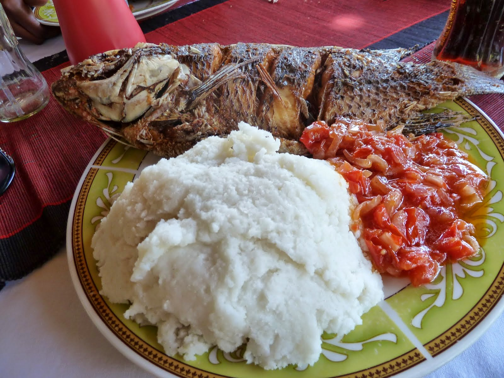

# Posho

*Uganda's stiff maize porridge: white cornmeal stirred into boiling water and worked hard with a wooden spoon till it pulls cleanly from the sides of the pot. Eaten with the hands across East Africa to scoop up stews and groundnut sauces.*

**Serves:** 4

**Prep Time:** 5 minutes

**Cook Time:** 25 minutes

## Overview
Posho is Uganda's daily staple, the stiff white maize porridge that anchors most family meals across the country and across much of East Africa under different names (ugali in Kenya and Tanzania, nsima in Malawi, mealie pap in southern Africa, sadza in Zimbabwe). It's white cornmeal stirred steadily into boiling water and then worked hard with a wooden mwiko (paddle) till the porridge stiffens into a smooth glossy mass that pulls cleanly from the sides of the pot in clean ribbons. The finished posho is dense and slightly chewy, sliced or scooped into balls, and eaten with the right hand by tearing off a piece, rolling it gently between thumb and fingers into a small ball, pressing a dent into it with the thumb, and using it to scoop stew, groundnut sauce or greens off the plate. The technique looks simple but the work is in the stirring. Underworked posho is sticky, lumpy and pale; properly worked posho is glossy, dense and stretches cleanly into ribbons that pull from the pan in one piece. Most home cooks build the posho in two stages. First a slurry of maize meal whisked into cold water in the bottom of the pan, brought to the boil with stirring to give a thin loose porridge; then the rest of the dry maize meal added a handful at a time while you stir hard with a wooden paddle. Each handful makes the porridge stiffen; you keep adding and stirring till the mass pulls cleanly from the sides of the pot in a glossy ribbon. Smooth the top, cover tight, drop to the lowest heat and steam-finish for 5 minutes so the inside cooks through and the raw maize taste cooks off.

## Ingredients

- 500 g white maize meal (mealie meal; medium or fine grind for Ugandan-style)
- 1.2 litres water
- ¼ teaspoon fine sea salt (optional; some cooks salt, some don't)

## Method

### Stage 1 - The slurry
1. Tip 150 g of the maize meal into a heavy-bottomed saucepan.
2. Whisk in 400 ml of the cold water to make a smooth slurry (no lumps; whisking dry meal into cold water first prevents the lumps you'd otherwise get throwing dry meal into boiling water).
3. Add the remaining 800 ml of water.
4. Place the pan over medium-high heat and bring to the boil, stirring constantly.

### Stage 2 - First cook
1. Once boiling, reduce the heat to medium-low.
2. Stir constantly with a wooden spoon for 4-5 minutes till you have a thick loose porridge.
3. This first thickening stage is sometimes eaten as a breakfast porridge in its own right (ugali nzungu in some regions).

### Stage 3 - Build to posho
1. Begin adding the remaining maize meal a small handful at a time, stirring hard with a wooden spoon or proper mwiko paddle between each addition.
2. After each handful, the porridge stiffens noticeably; keep working with the spoon.
3. Continue till you've added about another 350 g of maize meal (you may not need every gram) and the posho pulls cleanly from the sides of the pot in a smooth dense mass that holds its shape.
4. The posho should be glossy, not dry or crumbly. If it goes dry, add a small splash of hot water.

### Stage 4 - Steam-finish
1. Smooth the top of the posho with the back of the spoon.
2. Drop the heat to the absolute lowest setting.
3. Cover the pan tightly with a lid.
4. Steam-finish for 5 minutes; the trapped heat finishes cooking the inside and the raw-meal taste cooks off.

### Stage 5 - Serve
1. Take the lid off and stir the posho one more time to bring it together.
2. Tip out onto a wooden board or large plate (a quick whack with the pan upside-down releases it in one mound), or scoop into balls with a wet hand.
3. Cut into thick wedges or shape into balls.
4. Eat warm, scooping stew, groundnut sauce or greens off the plate with the right hand.

## Notes
- **Slurry first to avoid lumps:** the single most important step. Whisking maize meal into cold water makes a smooth lump-free base; tipping dry meal into boiling water creates immediate hard lumps that won't smooth out no matter how long you stir.
- **Stirring is the work:** posho doesn't taste right unless it's been properly worked. The stirring develops the starch and gives the finished porridge its glossy stretchy texture. Underworked posho is pale, sticky and crumbly; properly worked posho is glossy and pulls in clean ribbons.
- **Use a wooden paddle if you have one:** a proper mwiko (flat wooden paddle) is the canonical tool because it handles the stiffness of the porridge much better than a regular wooden spoon, which can break under the pressure. A sturdy-handled wooden spoon works for home quantities.
- **No salt traditionally:** plain posho has no salt in Uganda traditionally; the salt comes from whatever stew or sauce it's eaten with. Add a pinch if you want, but it's not necessary.
- **Eats well cold:** leftover posho is sliced and pan-fried in oil for the next day's breakfast (mukene-and-posho is a common village breakfast), or rolled into small balls and dropped into clear soups.

## Variations
**Posho with cassava flour:** mix half maize meal and half cassava flour for a denser stretchier porridge (kalo-style). Common in some regions.
**Yellow maize posho:** use yellow maize meal instead of white for a deeper-coloured posho with a slightly sweeter flavour. Less traditional in Uganda but common in some Kenyan and Tanzanian variants (called ugali yellow).
**Fortified posho:** stir in a handful of dried small fish (mukene) or a beaten egg towards the end of cooking for added nutrition. Common in family meals for children.

## Serving
The traditional partner for almost any Ugandan stew or sauce: luwombo, groundnut greens, fish in tomato sauce, beef stew with peanut. Eat with the right hand by tearing off a piece, rolling into a ball, pressing a dent and scooping the stew into the dent. Drink: cold water, ginger tea or bissap.

## Storage
- Best eaten fresh; the texture goes dense and dry as it cools.
- Keeps wrapped in cling film at room temperature for 24 hours; reheat by slicing and frying in oil for breakfast, or by steaming briefly to soften.
- Don't refrigerate longer than a day; the posho dries out and reheats poorly.
- Doesn't freeze.
