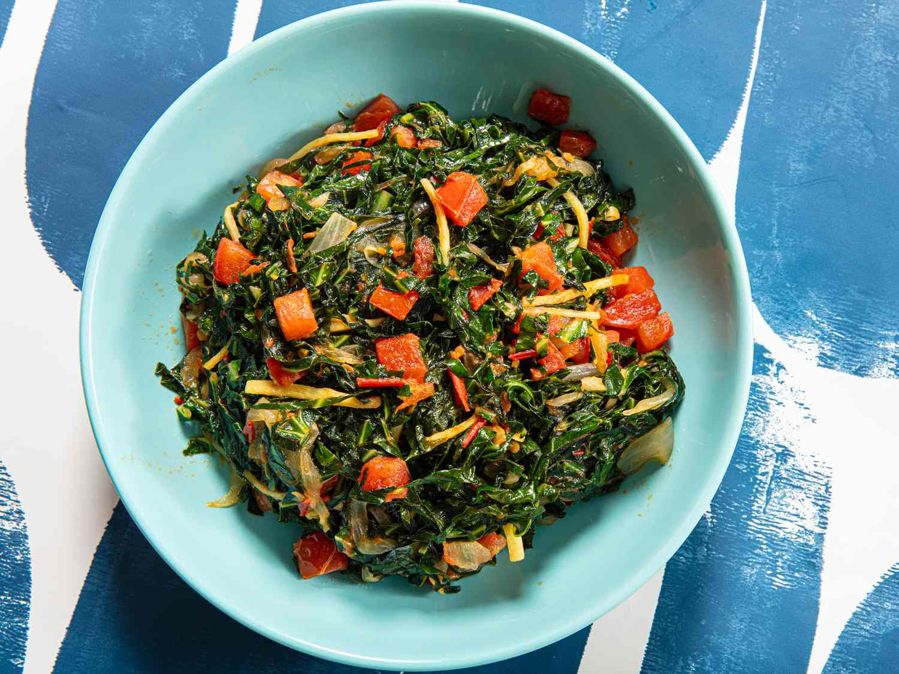

# Sukuma Wiki

*The East African greens dish: collard greens (or kale) finely shredded and sautéed with onion, tomato and a splash of stock. The name means "push the week" - the dish stretches a small meat budget to cover the days till payday.*

**Serves:** 4

**Prep Time:** 10 minutes

**Cook Time:** 15 minutes

## Overview
Sukuma wiki is the everyday greens dish of East Africa, eaten across Uganda, Kenya and Tanzania as the vegetable side to almost any meat or starch meal: collard greens (the proper sukuma) or kale finely shredded and sautéed with onion, tomato and a splash of stock till the leaves wilt and the gravy reduces to a glossy coat. The name translates roughly as "push the week" or "stretch the week", and the dish earned its name as a everyday cooked-greens side that costs almost nothing and stretches a small meat budget across the days till payday. It's served everywhere from village kitchens to upmarket Nairobi restaurants, eaten with ugali or posho, rice, chapati or roast meat. Two ingredient details matter. First, use proper greens. Collard greens (covo, sukuma) is the canonical East African choice; kale (cavolo nero, lacinato) is the closest UK substitute and works beautifully; spinach is wrong here because it bleeds water and collapses, while sukuma wiki should hold its texture and stay slightly chewy. Second, slice the greens fine. The leaves are stacked, rolled into a tight cigar and cut across with a sharp knife into 5 mm ribbons (chiffonade). The fine cut means the greens cook quickly and absorb the tomato gravy without going stringy. Soften chopped onion in oil, add chopped tomato and cook till the tomato breaks down and the oil splits at the edges, season with salt and pepper, then add the shredded greens in two or three handfuls so they wilt down before you add more. A small splash of stock to keep things moving, then cover and cook 5-8 minutes till the greens are tender but still slightly chewy. Taste, adjust salt, finish with a squeeze of lemon or chilli sauce if you want. Serve hot alongside the main meal.

## Ingredients

### Greens
- 500 g collard greens (sukuma, covo) or kale (cavolo nero or curly kale); stems removed, leaves stacked, rolled and shredded into 5 mm ribbons

### Base
- 2 tablespoons vegetable oil
- 1 large onion (finely chopped)
- 2 garlic cloves (crushed)
- 2 large tomatoes (chopped; or ½ tin chopped tomatoes)
- ½ fresh red chilli (deseeded and finely chopped, optional)
- ½ teaspoon ground cumin (optional, traditional in some Ugandan variants)
- ½ teaspoon fine sea salt
- ¼ teaspoon ground black pepper

### Liquid
- 100 ml vegetable stock (or water)

### To finish
- ½ lemon (juice)

## Method

### Stage 1 - Prepare the greens
1. Strip the stems from the collard greens or kale (run your hand down the stem to pull the leaves off; the thick lower stem goes to compost, the upper thinner stem can stay attached to the leaf).
2. Stack 4-5 leaves on top of each other, roll the stack into a tight cigar, and slice across with a sharp knife to make fine 5 mm ribbons. Continue with the rest of the leaves.
3. You should have a generous pile of finely shredded greens.

### Stage 2 - Soften the aromatics
1. Heat the oil in a wide heavy pan over medium heat.
2. Add the chopped onion and sweat for 6-7 minutes till soft and pale gold.
3. Stir in the crushed garlic and chopped chilli (if using) and cook another 30 seconds.

### Stage 3 - Build the tomato base
1. Add the chopped tomatoes to the pan.
2. Cook for 4-5 minutes till the tomatoes break down and the oil splits at the edges.
3. Stir in the cumin (if using), salt and pepper.

### Stage 4 - Wilt the greens
1. Add the shredded greens to the pan in two or three batches, stirring each batch in till it wilts down before adding the next. The mountain of greens reduces to a fraction of its volume as they cook.
2. Pour in the stock or water.
3. Stir to coat the greens in the tomato base.

### Stage 5 - Cook through
1. Reduce the heat to medium-low.
2. Cover the pan and cook 5-8 minutes, stirring once halfway through. The greens should turn tender but stay slightly chewy and bright green-dark; not collapsed into mush.
3. If the pan looks too wet at the end, take the lid off and bubble briefly to drive off excess liquid; the dish wants a glossy coat, not a soup.

### Stage 6 - Finish and serve
1. Off the heat, squeeze in the lemon juice and stir through.
2. Taste; adjust salt and pepper.
3. Tip into a warm serving bowl and serve alongside the main meal.

## Notes
- **Collards or kale, not spinach:** the dish needs greens that hold their structure. Collards (covo, sukuma) are the proper East African choice; lacinato kale (cavolo nero) is the best UK substitute; curly kale also works. Spinach collapses to mush and bleeds water, ruining the texture. Skip it.
- **Slice fine:** the chiffonade ribbons are 5 mm wide. Finer is fine; coarser gives stringy greens that don't take the tomato well.
- **Tomato should split the oil:** before adding the greens, the tomato base should have cooked long enough that you can see oil pooling at the edges and the tomato has broken down into a thick pulp. Adding greens to undercooked tomato gives a watery thin sauce.
- **Don't overcook:** sukuma wiki should be tender but still slightly chewy and properly green; not grey or mushy. 5-8 minutes covered cooking is enough.
- **Lemon at the end:** the final squeeze of lemon brightens the whole dish; without it the flavour can read flat. Cider vinegar in a pinch.

## Variations
**With peanut paste:** stir 2 tablespoons of unsweetened peanut butter loosened with stock into the sauce in the last 2 minutes of cooking. Common Ugandan variant.
**With smoked fish:** flake 100 g of smoked tilapia into the greens in the last 5 minutes. Lakeside village version.
**With coconut milk:** replace the stock with 150 ml of coconut milk for a Kenyan coastal variant (Mombasa-style sukuma).
**Spicier version:** add a teaspoon of harissa or 2 chopped Scotch bonnets to the tomato base for heat.

## Serving
The everyday side. Eat with posho or ugali (the canonical pair), nyama choma (grilled meat), pilau, rice, or roasted chicken. Also a good filling for chapati wraps or rolex variations.

## Storage
- Keeps refrigerated 3 days. Reheat in a covered pan with a splash of water to loosen.
- Freezes 2 months. Defrost in the fridge and reheat gently.
- The flavour is best on the day of cooking; the greens go slightly drabber in colour by day 2 but still taste good.
