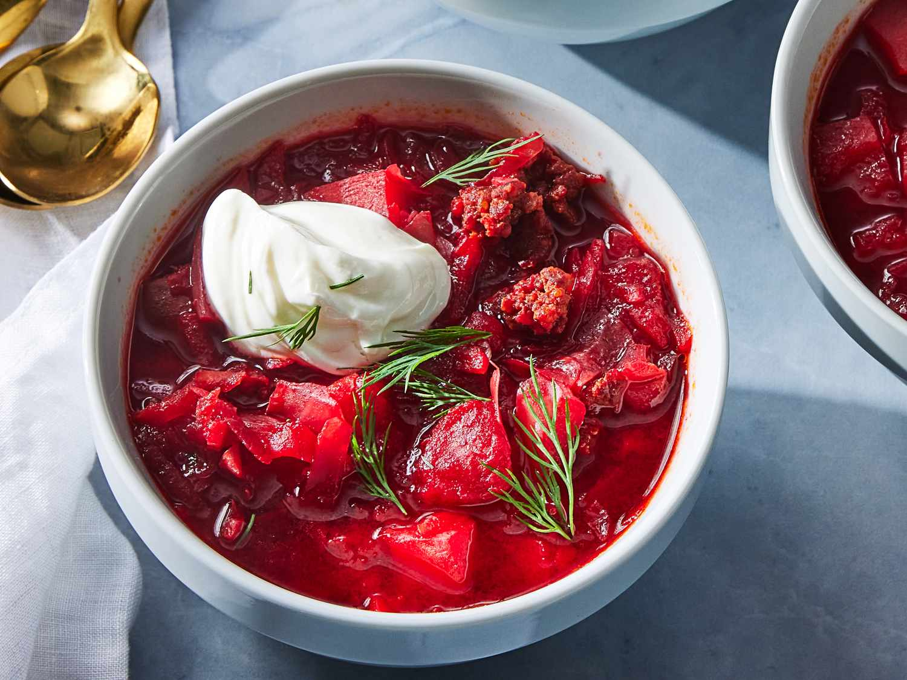

# Borscht

*Ukraine's red soup: beetroot, beef, potato, carrot and cabbage simmered for hours into a deep crimson broth, brightened with vinegar and finished with a heavy spoonful of soured cream and fresh dill. The national dish, recognised by UNESCO as Ukrainian cultural heritage.*

**Serves:** 6-8

**Prep Time:** 30 minutes

**Cook Time:** 2 hours 30 minutes

## Overview
Borscht is Ukraine's national dish, the deep crimson beetroot-and-beef soup that UNESCO inscribed as Ukrainian cultural heritage in 2022. Every Ukrainian family has its own recipe, but the canonical Ukrainian (not Russian) borscht has clear elements: a beef-stock base with beef chunks simmered to tenderness, sweet red beetroot grated and added a specific way to keep the brilliant red colour, sautéed onion-carrot-tomato sofrito, potato and cabbage cubed and simmered separately, finished with vinegar, topped with smetana (soured cream) and chopped fresh dill. A substantial soup that eats like a main course. The beetroot technique is the first key: grate the beetroot raw and sauté it briefly with vinegar or lemon juice before adding it to the soup; the acid sets the red colour and the brief sauté concentrates the flavour. Vegetables go in at different stages so each comes out at its proper tenderness. Raw garlic crushed in off the heat at the very end is the Ukrainian touch; cooked garlic loses the bite.

## Ingredients

### Beef and stock
- 600 g beef shin (or beef brisket; cut into 4 cm cubes)
- 2.5 litres cold water
- 1 large onion (halved, skin on for colour in the stock)
- 2 bay leaves
- 1 teaspoon black peppercorns (whole)
- 1 ½ teaspoons fine sea salt

### Sautéed vegetable sofrito
- 3 tablespoons sunflower oil (or vegetable oil; not olive oil; the flavour is wrong)
- 1 large onion (finely chopped)
- 2 medium carrots (peeled and grated coarsely)
- 1 large tomato (chopped; or 2 tablespoons tomato purée + 1 tomato chopped)

### Beetroot
- 3 large beetroots (about 600 g; peeled and grated coarsely; wear gloves to avoid staining hands)
- 1 ½ tablespoons white wine vinegar (for the beetroot sauté)
- 1 teaspoon caster sugar

### Vegetables to add to the soup
- 3 medium potatoes (peeled and cut into 2 cm cubes)
- 200 g green cabbage (white or green, not red; finely shredded)
- 1 small can chopped tomatoes (200 g, optional, for extra body)

### Finishing
- 4 garlic cloves (crushed; added off-heat)
- 1 ½ tablespoons white wine vinegar (additional, for the final acid balance)
- 1 teaspoon caster sugar (taste and adjust)
- Salt and black pepper to taste

### To serve
- 200 ml smetana (Ukrainian soured cream; or thick crème fraîche; or full-fat sour cream)
- 3 tablespoons fresh dill (chopped)
- Pampushky (Ukrainian garlic-bread rolls) or fresh dark rye bread
- Extra crushed garlic to spread on the pampushky

## Method

### Stage 1 - Build the beef stock
1. Place the beef cubes, halved onion (skin on), bay leaves and peppercorns in a wide deep saucepan.
2. Pour over the cold water.
3. Bring to the boil over high heat; skim any foam that rises.
4. Reduce to a gentle simmer.
5. Add the 1.5 teaspoons of salt.
6. Cover with the lid slightly ajar and simmer 90 minutes till the beef is properly tender (fork should slide in with very little resistance).
7. Lift out and discard the onion halves, bay leaves and any peppercorns you can find. Leave the beef in the stock.

### Stage 2 - Make the sautéed vegetable sofrito
1. While the beef simmers, heat 2 tablespoons of the sunflower oil in a wide frying pan over medium heat.
2. Add the chopped onion; sweat for 6-7 minutes till soft and gold.
3. Add the grated carrot; cook for 5-6 minutes till the carrot softens and the mixture deepens in colour.
4. Stir in the chopped tomato (or tomato purée + tomato); cook 4-5 minutes till the mixture darkens and thickens.
5. Tip the sofrito into a bowl; set aside.

### Stage 3 - Sauté the beetroot
1. Wipe the same pan clean and return to medium heat with the remaining 1 tablespoon of oil.
2. Add the grated beetroot.
3. Stir in the 1.5 tablespoons of vinegar and the teaspoon of sugar.
4. Cook for 8-10 minutes, stirring frequently, till the beetroot has softened slightly and the colour has set to a bright red. The vinegar fixes the colour; this is the proper Ukrainian technique.
5. Set aside.

### Stage 4 - Build the soup
1. Bring the beef stock back to a gentle simmer.
2. Add the cubed potatoes.
3. Cook 10 minutes.
4. Add the shredded cabbage; cook 8 minutes more.
5. Add the canned chopped tomatoes (if using).

### Stage 5 - Add the sautéed vegetables and beetroot
1. Stir in the sautéed onion-carrot-tomato sofrito.
2. Stir in the sautéed beetroot.
3. The soup should turn properly crimson at this point; the colour should be vivid red rather than dull.
4. Simmer 8-10 minutes more for the flavours to marry.

### Stage 6 - Final acid balance
1. Add the additional 1.5 tablespoons of vinegar to the soup; this final acid sharpens the flavour and brightens the colour further.
2. Taste; adjust salt, pepper and add the teaspoon of sugar if the soup tastes too sharp.
3. The proper borscht balance is: noticeably tangy from the vinegar, sweet from the beetroot and the sugar, salty from the meat and salt, and earthy-aromatic from the beef and vegetables.

### Stage 7 - Add the garlic and rest
1. Take the pan off the heat.
2. Stir in the crushed raw garlic.
3. Cover and let stand 10-15 minutes for the garlic to perfume the soup and for the flavours to marry. The borscht actually improves with a brief rest off the heat.

### Stage 8 - Serve
1. Ladle the hot borscht into deep bowls.
2. Top each bowl with a generous spoonful of smetana (soured cream) in the centre; diners stir it in.
3. Scatter chopped fresh dill over each portion.
4. Serve with warm pampushky (garlic rolls) or dark rye bread on the side; a small dish of extra crushed garlic for those who want to smear it on the bread.

## Notes
- **Grated raw beetroot, sautéed with vinegar:** the proper Ukrainian technique. Whole-boiled beets give a duller soup; cubed raw beets cook unevenly. Grated raw beetroot briefly sautéed with vinegar gives the brilliant red colour and the right texture (some softened, some still slightly textured).
- **Layered vegetable adds:** potato first (longest cooking), cabbage second (medium), sautéed vegetables last (already cooked). Each comes out at its proper texture. Throwing everything in at the start gives mushy vegetables.
- **Vinegar in two stages:** once with the beetroot sauté (sets the colour), once at the end (brightens the flavour). The two-stage acid is essential to the Ukrainian style.
- **Raw garlic at the very end:** stirred in off the heat just before resting. Cooking the garlic loses the sharp note that defines Ukrainian borscht.
- **Pampushky on the side:** the proper accompaniment is the small Ukrainian garlic-bread rolls smeared with extra raw garlic. The garlic-on-garlic experience is intentional and traditional.
- **Improves overnight:** borscht is famously better the next day. The flavours marry, the meat absorbs more of the broth, the vegetables soften slightly into the soup. Make ahead if possible.

## Variations
**Borscht with kidney beans:** add 200 g of cooked kidney beans to the soup in the last 5 minutes; a regional variation from western Ukraine.
**Vegetarian borscht:** skip the beef; build a stock from a piece of celeriac, leek, carrot and parsnip simmered with bay leaves; reduce by half before using as the soup base. Add an extra splash of vinegar at the end.
**Mushroom borscht:** add 200 g of sautéed mushrooms to the soup with the cabbage; common in lent and Christmas Eve Ukrainian tradition (Sviata Vecheria).
**Cold borscht (kholodnyk):** the summer cold version, blended smooth and served chilled with hard-boiled egg, cucumber and dill. Different dish but related.
**Borscht z vushkamy:** Christmas Eve version with small mushroom-stuffed dumplings (vushka, "little ears") floating in the soup.

## Serving
In deep warmed bowls with a swirl of smetana and a scatter of fresh dill on top. Pampushky (the small garlic bread rolls) on the side, with a small dish of extra crushed garlic to smear on. A glass of horilka (Ukrainian vodka) on the side, or sweet kompot (the fruit drink) for non-drinkers.

## Storage
- Keeps refrigerated 4 days; the flavour deepens dramatically overnight. Day-after borscht is genuinely better than day-of, and most Ukrainian families make a big pot specifically to eat over several days.
- Freezes 3 months. Defrost in the fridge overnight and reheat gently. The colour fades very slightly on freezing.
- Don't microwave; it splits.
