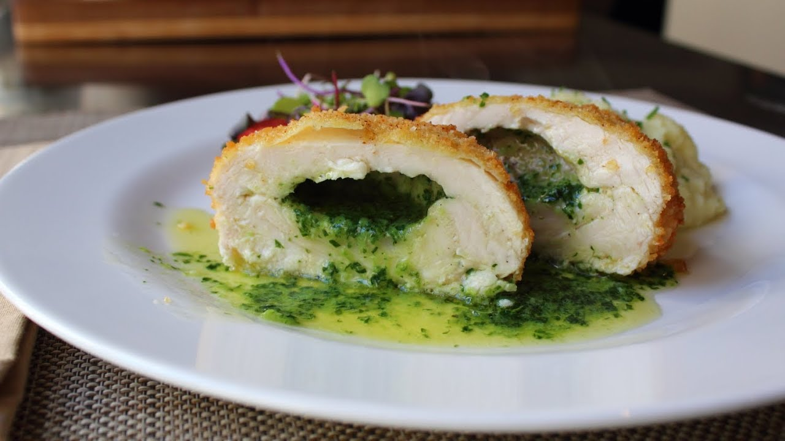

# Chicken Kyiv

*Ukraine's most famous export: a pounded chicken breast wrapped around a piece of cold herb-and-garlic butter, breaded twice and deep-fried till the outside is deep gold and the cold butter inside has melted into a hot sauce that bursts when cut. The dish of the Kyiv hotel kitchens turned national emblem.*

**Serves:** 4

**Prep Time:** 40 minutes (plus 1 hour butter chilling and 1 hour final chill before frying)

**Cook Time:** 15 minutes

## Overview
Chicken Kyiv (Chicken Kiev in older English texts) is Ukraine's most famous culinary export, originated in the hotel kitchens of Kyiv in the late 19th century as a refined French-influenced restaurant dish: a chicken breast pounded thin, wrapped tightly around a piece of cold compound butter (butter beaten with parsley, garlic, lemon and dill), double-breaded, deep-fried till the outside is deep gold and the butter inside has melted into a hot herb-and-garlic sauce that bursts dramatically when the diner cuts in. The dramatic burst is the dish's signature; if your chicken kyiv doesn't release a flood of melted butter when cut, you've made something else. The butter must be properly cold before wrapping; warm or soft butter leaks during shaping. The chicken must be properly pounded to about 5 mm so it wraps cleanly around the butter. The double breading is what gives the substantial golden crust and seals the seam against the molten butter inside.

## Ingredients

### Compound butter
- 150 g unsalted butter (very soft, room temperature)
- 4 garlic cloves (very finely crushed)
- 4 tablespoons fresh parsley (very finely chopped)
- 2 tablespoons fresh dill (very finely chopped; or substitute with extra parsley)
- 1 lemon (zest only, finely grated)
- 2 teaspoons fresh lemon juice
- ½ teaspoon fine sea salt
- ¼ teaspoon ground white pepper (or black pepper)

### Chicken
- 4 boneless skinless chicken breasts (about 200 g each; the largest you can buy, since they'll be pounded thin)
- 1 teaspoon fine sea salt (for seasoning)
- ½ teaspoon ground black pepper

### Breading
- 100 g plain flour
- 3 large eggs (beaten with 2 tablespoons milk and a pinch of salt)
- 200 g dry breadcrumbs (panko works; or homemade from stale white bread blitzed fine)

### For frying
- 1 litre vegetable oil (or sunflower oil; for deep-frying)

### To serve
- Lemon wedges
- A simple green salad
- Mashed potato or boiled new potatoes
- Steamed seasonal vegetables (peas, asparagus, green beans)

## Method

### Stage 1 - Make the compound butter (an hour ahead)
1. In a wide bowl, beat the soft butter with a wooden spoon till creamy.
2. Add the very finely crushed garlic, chopped parsley, chopped dill, lemon zest, lemon juice, salt and pepper.
3. Beat together till the herbs and seasonings are evenly distributed through the butter; the mixture turns pale green.
4. Tip the herb butter onto a piece of cling film.
5. Shape into a log about 4 cm thick and 16 cm long.
6. Wrap tightly in cling film, twisting the ends like a sweet wrapper.
7. Freeze for at least 1 hour (or up to 24 hours; longer chilling makes the wrapping easier).

### Stage 2 - Prepare the chicken
1. Place each chicken breast between two pieces of cling film or in a large zip-top bag.
2. Use a meat mallet (or a heavy rolling pin) to pound the chicken gradually from the centre outwards into a thin even sheet about 5 mm thick. Don't pound so hard that you tear holes; steady firm pressure works better than violent whacks.
3. Each pounded breast should be roughly 20 cm by 16 cm; thin enough to be flexible but still holding together.
4. Season each piece with salt and pepper on both sides.

### Stage 3 - Cut the butter
1. Take the frozen butter log out of the freezer.
2. Cut into 4 equal pieces (about 4 cm long each).
3. Work fast; the butter softens quickly.

### Stage 4 - Wrap the chicken around the butter
1. Lay one pounded chicken breast on a clean work surface, smooth side down.
2. Place one piece of cold butter in the centre of the chicken, parallel to the long edge.
3. Fold the two long edges of the chicken over the butter to enclose it.
4. Fold the short ends in over the top, like wrapping a parcel.
5. Roll firmly so the chicken seals tightly around the butter; the seams should be on the underside.
6. The finished parcel should be a tight rectangular package about 10 cm by 5 cm.
7. Repeat with the remaining chicken and butter pieces.

### Stage 5 - Double bread
1. Set up three shallow dishes: flour in the first, beaten egg-and-milk in the second, breadcrumbs in the third.
2. Roll one chicken parcel in the flour, pressing to coat thoroughly; shake off excess.
3. Dip into the beaten egg, turning to coat fully.
4. Place into the breadcrumbs, press the crumbs firmly onto all sides to coat thoroughly.
5. Now back into the egg again (this is the double-breading step that gives the proper substantial crust).
6. Then back into the breadcrumbs, pressing again firmly so the second coat adheres.
7. Lay the breaded parcel on a tray; repeat with the rest.

### Stage 6 - Chill before frying (essential)
1. Place the breaded chicken kyivs on a tray and refrigerate uncovered for at least 30 minutes, ideally 1 hour. This chill firms the breading and the butter, which is what stops the kyiv exploding open during frying.

### Stage 7 - Heat the oil
1. Heat the vegetable oil in a wide deep heavy pan to 170 C (test with a thermometer; or drop a small cube of bread in, which should turn deep gold in 50 seconds).
2. Have a wire rack lined with kitchen paper ready alongside the pan for drained kyivs.

### Stage 8 - Fry
1. Carefully lower 2 kyivs at a time into the hot oil (don't crowd).
2. Fry for 7-8 minutes, turning gently with tongs every 2 minutes, till the breadcrumb crust is deep gold all over.
3. Lift onto the wire rack to drain briefly.
4. Repeat with the remaining 2 kyivs.

### Stage 9 - Rest and serve
1. Let the cooked kyivs rest for 2-3 minutes before serving. This rest is short but important; it lets the molten butter inside settle slightly so it doesn't completely flood out the moment you cut.
2. Plate each kyiv whole on a warmed plate.
3. The diner cuts into the kyiv at the table; the proper hot butter sauce bursts out and pools around the meat.
4. Serve with mashed potato to soak the butter, a small pile of buttered peas or green beans, and lemon wedges.

## Notes
- **Cold butter is the whole secret:** the compound butter must be properly cold (ideally frozen) before wrapping. Soft butter leaks out during shaping and breading; cold butter resists till the frying stage when it melts dramatically inside the sealed crumb shell.
- **Pound evenly and not too thin:** 5 mm is the target. Thinner and the chicken tears or won't hold the butter; thicker and the dish takes too long to cook through and the butter overcooks.
- **Tight wrapping with no gaps:** the chicken parcel must fully enclose the butter with no gaps where it could leak. Press the seams firmly; the final shape should be a tight rectangular package.
- **Double breading is essential:** the flour-egg-crumb single coat doesn't seal well enough to hold molten butter. The second pass through egg-and-crumbs gives the proper substantial crust that holds the butter inside till the cut. Don't skip this step.
- **Chill the breaded kyivs before frying:** the 30-60 minutes in the fridge is essential. The chill firms the breading and the butter; skipping it gives kyivs that explode open in the hot oil and lose all their butter.
- **170 C is the right temperature:** higher and the breading scorches before the chicken cooks through. Lower and the crumbs soak oil and go greasy. A thermometer is worth using.

## Variations
- **Chicken kyiv with mushroom butter:** swap the herb butter for a mushroom butter (50 g of finely chopped sautéed mushrooms folded into the soft butter with the garlic and parsley). Different flavour profile; still works.
- **Lemon-and-tarragon kyiv:** swap the parsley and dill for chopped fresh tarragon; the resulting kyiv has a properly French note. A modern restaurant variation.
- **Baked kyiv:** for a lighter version, brush the breaded kyivs with melted butter and bake on a tray at 200 C for 25-30 minutes. The crust is less crisp than the fried version but works for a less indulgent dinner.
- **Cheese-and-ham kyiv (Pozharsky-style):** add a thin slice of ham and a slice of cheese alongside the butter inside the chicken parcel. Less traditional but popular as a restaurant variant.

## Serving
- On a warm plate, with mashed potato (to catch the butter that flows out when cut), a small mound of buttered peas or steamed asparagus, and a lemon wedge for squeezing. Drink: a glass of dry white wine (Chardonnay or Sauvignon Blanc), or chilled vodka for the proper Ukrainian touch. The drama at the table when the kyiv is cut is the whole point; don't pre-cut in the kitchen.

## Storage
- Best eaten the moment they come out of the fryer.
- Uncooked breaded kyivs keep refrigerated 1 day; fry to order.
- Uncooked breaded kyivs freeze 2 months on a tray (lay flat to freeze; then transfer to a bag once solid). Fry from frozen at 160 C for 12-15 minutes.
- Cooked leftover kyiv keeps refrigerated 2 days; reheat in a 180 C oven for 8 minutes (don't microwave; the crust softens and the butter leaks).
