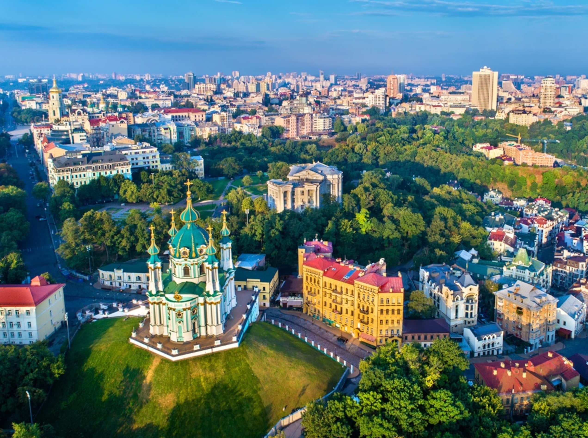

# Ukrainian Cuisine

Hearty Eastern European cooking with deep echoes of Polish, Russian and Tatar traditions. Wheat, buckwheat, beetroot, cabbage, potato and pork sit at the centre; soured cream, dill, garlic and bay finish nearly every plate. Borscht (each family with its own version), holubtsi (stuffed cabbage), varenyky (filled dumplings), salo (cured pork fat) and pampushky (garlic rolls) define the tradition; the table is communal, generous and built around a slow Sunday lunch.
