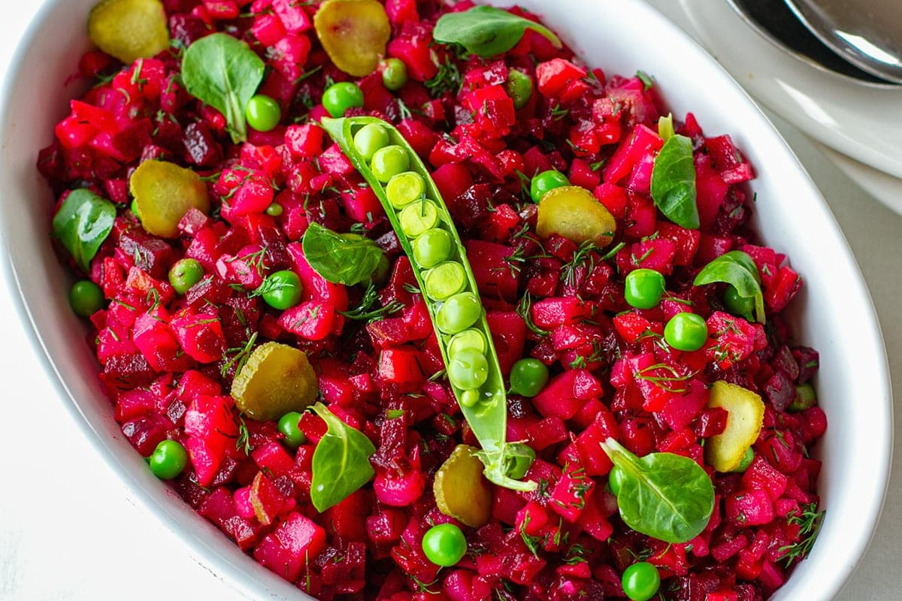

# Vinegret

*Ukraine's beetroot salad: cooked beetroot, potato, carrot, sauerkraut, dill pickles and red onion diced uniformly, tossed with sunflower oil and dill. The cold salad that turns up at every Ukrainian celebration table, named for the vinegar in the dressing.*

**Serves:** 6-8

**Prep Time:** 25 minutes (plus 1 hour 30 minutes for cooking vegetables; can be done a day ahead)

**Cook Time:** 1 hour 30 minutes (vegetable cooking)

## Overview
Vinegret is Ukraine's everyday cold beetroot salad, the side dish that turns up at every birthday, holiday and gathering across the country and the Eastern European diaspora: cooked beetroot, potato, carrot and onion all diced into uniform 1 cm cubes and tossed cold with chopped sauerkraut, sliced dill pickles, fresh dill and a simple dressing of sunflower oil, vinegar and salt. The result is properly red-pink (the beetroot dyes everything as it sits), refreshing, sharp from the pickles and sauerkraut, sweet from the beetroot, and the classic Eastern European cold-side that pairs with anything from grilled meats to fried fish to roast chicken. The name comes from the French "vinaigrette" (the dressing); the dish itself developed in the 18th-century court of Catherine the Great as a French-influenced Russian-Ukrainian cold salad that has long since become wholly Ukrainian and Russian household food. Three details define proper vinegret. First, the vegetables must be cooked separately and cooled before chopping. Boiling them together saves time but the vegetables end up dyed red by the beets and the flavours blur. The proper approach: boil beetroot, potato and carrot in separate pans (or together in one pan if you can keep them apart), drain, cool fully (ideally overnight in the fridge), then peel and dice. Cold cooked vegetables hold their shape when diced; warm ones smear. Second, uniform 1 cm dice. The visual character of vinegret is the small uniform cubes that look like a confetti salad. Sloppy chopping gives sloppy salad. Take time with the knife work. Third, the order of mixing. Add the beetroot last, after dressing the other vegetables, and stir gently. This stops the beetroot bleeding red into everything else and gives a properly multi-coloured salad rather than a uniform pink one. The classical mix: cooked vegetables tossed with oil and seasoning first; chopped pickle, sauerkraut and onion mixed in; beetroot folded in gently at the end.

## Ingredients

### Vegetables to cook
- 3 medium beetroots (about 500 g total)
- 4 medium potatoes (about 500 g; floury or waxy, both work)
- 2 large carrots (about 250 g)

### Pickled and raw vegetables
- 200 g sauerkraut (drained well; squeeze out excess brine)
- 4-5 large dill pickles (kosher dill or Polish ogórki; about 200 g; drained and finely diced)
- 1 small red onion (peeled and finely chopped)

### Dressing
- 5 tablespoons sunflower oil (or vegetable oil; not olive oil, the flavour is wrong)
- 2 teaspoons white wine vinegar (or apple cider vinegar)
- 1 teaspoon fine sea salt
- ½ teaspoon ground black pepper
- 1 teaspoon caster sugar (optional, to balance the acidity)

### To finish
- 3 tablespoons fresh dill (chopped)
- 200 g cooked green peas (frozen-and-thawed peas work; or canned, drained)
- 1 tablespoon flat-leaf parsley (chopped, optional)

## Method

### Stage 1 - Cook the vegetables (do this a day ahead if possible)
1. Boil the beetroots in their skins in a pan of unsalted water for 50-60 minutes till tender when pierced with a knife. The skin keeps the colour locked in.
2. Boil the potatoes in their skins in a separate pan for 25-30 minutes till just tender.
3. Boil the carrots whole in a third pan (or in the potato water once the potatoes come out) for 20 minutes till tender.
4. Drain everything; cool completely. Refrigerate the cooled cooked vegetables overnight if possible (cold cooked vegetables dice cleanly without smearing).

### Stage 2 - Peel and dice
1. Once the vegetables are completely cold, peel each one.
2. Beetroot: wear thin disposable gloves so your hands don't stain. Peel with a small knife; the skin slips off cooked cold beetroots easily.
3. Dice each vegetable into uniform 1 cm cubes (the visual character of vinegret is the small uniform dice). Keep the beetroot in a separate bowl from the other vegetables till the final mix.

### Stage 3 - Prepare the other ingredients
1. Drain the sauerkraut thoroughly; press hard to squeeze out excess brine. Roughly chop if the strands are very long.
2. Drain the dill pickles and dice into 1 cm cubes.
3. Finely chop the red onion.

### Stage 4 - Mix the dressing
1. In a small bowl, whisk together the sunflower oil, vinegar, salt, pepper and sugar (if using). Taste; adjust seasoning.

### Stage 5 - Combine (the order matters)
1. In a wide mixing bowl, combine the cooked diced potato, diced carrot, chopped sauerkraut, diced pickle, chopped red onion, cooked peas and most of the chopped dill.
2. Pour over the dressing; toss gently to coat everything evenly.
3. Now add the diced beetroot to the bowl and fold in very gently with a wooden spoon or rubber spatula. Don't stir vigorously; the goal is to distribute the beetroot through the salad while keeping the colours somewhat distinct rather than dying everything uniformly pink.

### Stage 6 - Rest
1. Cover the salad with cling film and refrigerate at least 30 minutes (or up to 4 hours) before serving. The rest lets the flavours marry and the dressing penetrate the vegetables.

### Stage 7 - Serve
1. Bring to room temperature for 15 minutes before serving (cold-from-the-fridge vinegret tastes flat).
2. Taste and adjust salt or vinegar if needed.
3. Tip into a wide serving bowl.
4. Scatter the remaining chopped dill over the top.
5. Serve as a cold side dish with bread on the side.

## Notes
- **Cook vegetables separately and cool before chopping:** the absolute key to proper vinegret. Boiling them all together saves time but gives a uniformly red-stained salad. Cooling them fully (ideally overnight in the fridge) is what lets you dice them cleanly without smearing.
- **Uniform 1 cm dice is the visual signature:** vinegret looks like confetti or stained-glass cubes. The visual character matters; sloppy chopping gives a sloppy-looking salad. Take time with the knife work.
- **Beetroot in last:** add the diced beetroot to the bowl only after the other vegetables are dressed. Fold in gently. Adding the beetroot first dyes everything uniformly pink; adding it last gives the proper multi-coloured look.
- **Sunflower oil, not olive oil:** the proper Eastern European dressing uses neutral-flavoured oils (sunflower or vegetable). Olive oil is wrong; the flavour profile is Mediterranean and clashes with the dill and sauerkraut.
- **Salt the sauerkraut and pickles drained:** wet sauerkraut adds too much liquid and the salad goes soggy. Drain pickles and sauerkraut well; squeeze the sauerkraut hard.
- **Rest 30 minutes minimum:** the flavours need time to marry. Eating vinegret straight after mixing tastes raw and disjointed; after 30 minutes in the fridge, it's properly unified.

## Variations
**Vinegret with kidney beans:** add 200 g of cooked kidney beans (or red beans) to the salad; gives extra protein and a Ukrainian regional touch.
**Vinegret with apple:** add 1 tart eating apple, peeled and diced, for a fresh fruit note. Non-traditional but lovely with rich meats.
**Vinegret with herring (vinegret z seledem):** add 200 g of diced pickled herring (the salt-cured herring sold in jars); turns the salad into a more substantial dish. Common Christmas Eve variant.
**Without sauerkraut:** for a less-sour version, double the dill pickles and skip the sauerkraut. The salad will be milder but still recognisably vinegret.

## Serving
As a cold side dish on a buffet table or alongside a hot main; particularly beautiful next to roast chicken, grilled fish, baked salmon, or pelmeni. With dark rye bread or pumpernickel on the side. Drink: a cold lager, vodka, or just a glass of fizzy water with lemon.

## Storage
- Keeps refrigerated 3 days; the flavour deepens overnight and day-after vinegret is actually preferred by many cooks.
- Don't freeze; the potato and beetroot textures go off.
- Bring to room temperature before serving each time.
- The beetroot continues to bleed colour into the rest of the salad as it sits; by day 2 the whole salad is uniformly pink-red. This is fine; just visually different from day 1.
