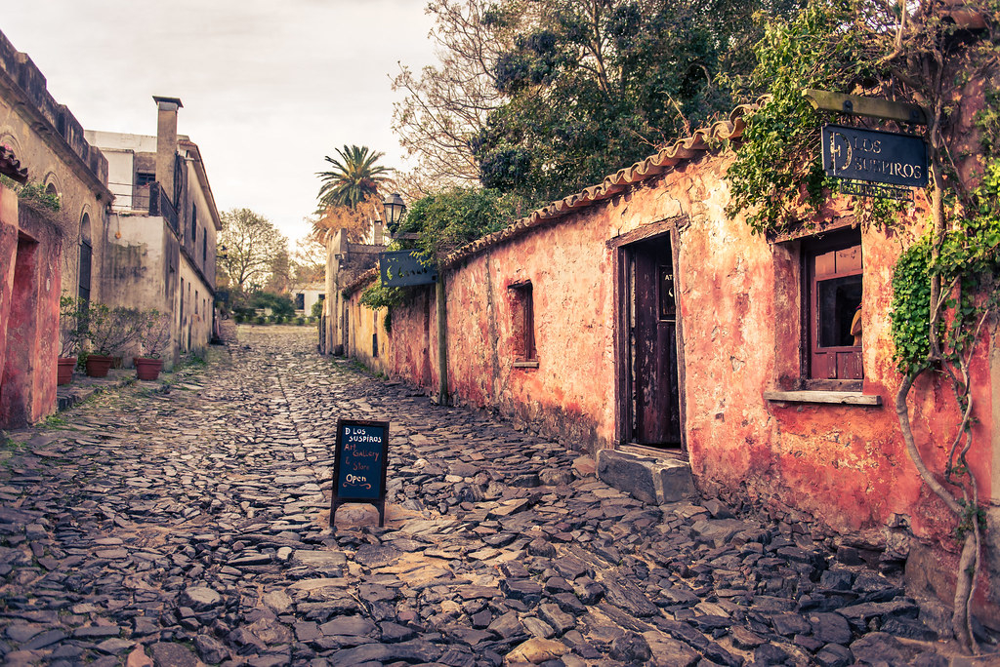

# Uruguayan Cuisine

Uruguay's grill-driven table: the chivito national-dish steak sandwich loaded with ham, bacon, egg and cheese; asado that competes with Argentina for primacy of South American grilling; dulce-de-leche on everything sweet; Italian-Uruguayan classics like milanesa a la napolitana; and the national mate addiction (drunk hot from the gourd, all day). Smaller and less famous than Argentina, but with its own deeply specific food identity.
