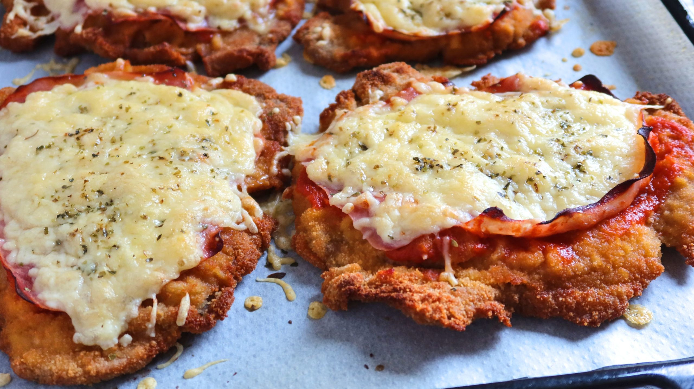

# Milanesa a la Napolitana

*Breaded beef cutlet topped with ham, tomato sauce and melted mozzarella, finished under the grill with a sprinkle of oregano. The Italo-Uruguayan classic that fills every Montevideo cantina at lunchtime.*

**Serves:** 4 people

**Prep Time:** 20 minutes

**Cook Time:** 25 minutes

## Overview
Milanesa a la napolitana is the Italo-Uruguayan dish that travelled with immigrants from Naples to Buenos Aires and Montevideo in the early twentieth century and never went home. The base is a thin, pounded beef cutlet, breaded and fried until golden, then topped with a slice of ham, a spoonful of tomato sauce, a slice of mozzarella and a sprinkle of oregano, finished under a hot grill until the cheese melts and the tomato bubbles at the edge. Served with chips, a wedge of lemon and sometimes a fried egg on top. The "napolitana" name comes not from Naples directly but from a Buenos Aires restaurant called Nápoli where the first recorded version was served in the 1940s. In Uruguay it is the everyday cantina lunch, the workers' canteen plate and the Sunday family meal when the parrilla is too much trouble.

## Ingredients

### For the milanesa
- 4 thin beef cutlets (top round or sirloin), 120 g each, pounded to 5 mm thick
- 2 large eggs
- 2 garlic cloves, finely grated
- 1 tbsp finely chopped flat-leaf parsley
- 1 tsp salt, plus more for the breadcrumbs
- Black pepper
- 200 g fine dried breadcrumbs (or pangrattato)
- Sunflower oil for shallow frying

### For the topping
- 200 g tinned chopped tomatoes
- 2 tbsp olive oil
- 1 garlic clove, sliced
- 1 tsp dried oregano, plus more to finish
- Pinch of sugar
- Salt
- 4 slices of cooked ham
- 200 g mozzarella, sliced (4 generous slices)

### To serve
- Hot chips
- Lemon wedges
- Optional: 4 fried eggs (milanesa a caballo)

## Method

### Stage 1 - The quick tomato sauce
1. Warm the olive oil in a small pan with the sliced garlic over medium heat. Cook 1 minute until fragrant, do not brown.
2. Add the tomatoes, oregano, sugar and a pinch of salt.
3. Simmer 8-10 minutes until thickened to a spoonable sauce. Taste, adjust salt.

### Stage 2 - Bread the cutlets
1. Pound the beef between two sheets of clingfilm to 5 mm thick.
2. Beat the eggs in a wide bowl with the grated garlic, parsley, salt and pepper.
3. Spread the breadcrumbs on a plate with a pinch of salt.
4. Dip each cutlet into the egg, let the excess drip off, then press firmly into the breadcrumbs on both sides. Set aside on a board.
5. Rest 5 minutes before frying so the coating sets.

### Stage 3 - Fry the milanesas
1. Heat 1 cm of sunflower oil in a wide pan to 175 C.
2. Fry the cutlets one or two at a time, 90 seconds per side, until deep gold.
3. Drain on a rack (not paper, the bottom goes soggy).

### Stage 4 - Top and finish
1. Heat the oven grill to high.
2. Lay the milanesas on a baking sheet.
3. Spread a heaped tablespoon of tomato sauce over each.
4. Lay a slice of ham on top.
5. Add a slice of mozzarella to cover.
6. Sprinkle a pinch of oregano on each.
7. Grill 3-4 minutes until the cheese is melted and bubbling and the edges of the ham are crisp.

### Stage 5 - Serve
1. Slide each milanesa onto a warm plate.
2. Pile chips alongside, lemon wedge on the rim.
3. Top with a fried egg if using.
4. Eat immediately while the cheese is still molten.

## Notes
- **Pound thin.** A thick cutlet steams under the cheese and ruins the texture. 5 mm is right.
- **Bread crumbs not panko.** Fine dried breadcrumbs give the classic golden Italo-Uruguayan crust. Panko is too crunchy here.
- **Rack-drain.** Drain the fried milanesa on a wire rack, not paper, or the bottom crust softens.
- **Oregano matters.** The finishing sprinkle is the Italian fingerprint; do not skip.

## Variations
- **Milanesa a caballo.** Top with a fried egg (a caballo means "on horseback"). Almost obligatory in Montevideo.
- **Milanesa de pollo.** Use a pounded chicken breast in place of the beef cutlet. The most common version in homes today.
- **Milanesa Suiza.** Skip the ham and tomato; just cheese and a sprinkle of oregano under the grill.
- **Milanesa al pan.** Stuff a cooked milanesa napolitana into a soft roll with mayonnaise and lettuce. The sandwich-shop classic.

## Serving
Hot chips piled alongside · a wedge of lemon to squeeze · a simple mixed-leaf salad · ice-cold Pilsen lager.

## Storage
- Eat the assembled milanesa fresh; the breading goes soft once cheese sits on it.
- Fried plain milanesas (no topping) keep 2 days refrigerated; reheat in a hot dry pan.
- Tomato sauce keeps 4 days refrigerated; freezes 2 months.
